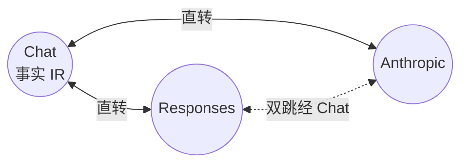
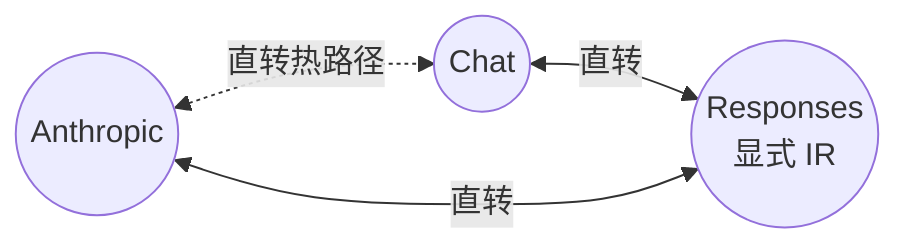

# 《ai-aggregs × sub2api：协议转换功能深度对比报告》

> 本报告**只聚焦协议互转（Protocol Translation）本身**，不再讨论整体架构、Provider 抽象、Streaming 工程化等周边话题（这些已在综合架构报告中覆盖）。
>
> 评测对象：
> - **项目 A（Rust）**：`ai-aggregs`，协议转换代码集中于 `src-tauri/src/gateway/converter.rs`（1258 行）+ `stream.rs`（1581 行）
> - **项目 B（Go）**：`sub2api/backend/internal/pkg/apicompat/`（14 个非测试文件，约 9000 行）
>
> 全部结论均带源码行号锚点。

---

## 一、协议转换的边界与定义

"协议转换"在 LLM 网关中特指：把客户端以协议 A 形态发出的请求，转换为协议 B 形态发送给上游；上游以协议 B 形态返回的响应，再转回协议 A 形态返回给客户端。完整链路涉及：

| 维度 | 子问题 |
|------|--------|
| **请求体** | messages / input / tools / tool_choice / max_tokens / temperature / system / instructions / metadata / reasoning |
| **响应体（非流式）** | choices / output / content / message / tool_calls / usage / finish_reason / stop_reason / status |
| **流式事件** | SSE 事件名、delta 增量、content block 生命周期、终止事件、usage 携带方式 |
| **鉴权头** | Authorization Bearer / x-api-key / anthropic-version |
| **URL 路径** | `/v1/chat/completions` / `/v1/responses` / `/v1/messages` |

两个项目的覆盖范围：

| 协议方向 | Rust 支持 | Go 支持 |
|----------|-----------|---------|
| Chat ↔ Chat | ✓（透传） | ✓（透传） |
| Responses ↔ Responses | ✓（透传） | ✓（透传） |
| Anthropic ↔ Anthropic | ✓（透传） | ✓（透传） |
| Chat ↔ Responses（请求/响应/流式） | ✓（直转） | ✓（直转） |
| Chat ↔ Anthropic（请求/响应/流式） | ✓（直转） | ✓（直转 + 双跳经 Responses） |
| Responses ↔ Anthropic（请求/响应/流式） | ✓（**双跳经 Chat**） | ✓（直转） |
| Chat ↔ Gemini | ✗ | ✓ |
| Anthropic ↔ Gemini | ✗ | ✓ |
| Antigravity（Google 内部） ↔ Anthropic | ✗ | ✓ |

> **关键观察**：6 个核心方向（Chat/Responses/Anthropic 两两组合）两者都覆盖，但**IR 选择相反**——Rust 选 Chat，Go 选 Responses。

---

## 二、三种协议的字段语义对照

下表是协议转换的字段基础，必须先建立这张"语义同义表"才能讨论转换正确性。

| 语义 | Chat 字段 | Responses 字段 | Anthropic 字段 |
|------|-----------|----------------|----------------|
| 模型 ID | `model: string` | `model: string` | `model: string` |
| 系统提示 | `messages[role=system].content` | `instructions: string` 或 `input[role=developer]` | `system: string \| Block[]` |
| 用户输入 | `messages[role=user].content: string \| Part[]` | `input[role=user].content: [input_text]` | `messages[role=user].content: string \| Block[]` |
| 助手历史 | `messages[role=assistant].content` | `input[role=assistant].content: [output_text]` | `messages[role=assistant].content` |
| 工具历史调用 | `messages[role=assistant].tool_calls[]` | `input[type=function_call]` | `content[type=tool_use]` |
| 工具结果 | `messages[role=tool].content + tool_call_id` | `input[type=function_call_output].output` | `content[type=tool_result].content` |
| 工具定义 | `tools: [{type:function, function:{name, parameters, description, strict}}]` | `tools: [{type:function, name, parameters, description, strict}]` | `tools: [{name, input_schema, description}]` |
| tool_choice | `"auto"/"none"/"required"` 或 `{type:function, function:{name}}` | 同 Chat，具名用 `{type:function, name}` | `{type:auto/any/none/tool, name}` |
| 最大 token | `max_tokens` 或 `max_completion_tokens` | `max_output_tokens` | `max_tokens` |
| 采样参数 | `temperature`, `top_p` | 同 Chat（reasoning model 拒绝） | 同 Chat |
| 停止词 | `stop: string \| string[]` | — | `stop_sequences: string[]` |
| 流式 | `stream: bool` | `stream: bool` | `stream: bool` |
| 流式用量 | `stream_options.include_usage` | 终止事件自带 | `message_delta.usage` |
| 推理控制 | `reasoning_effort: "low/medium/high"` | `reasoning: {effort, summary}` | `thinking: {type, budget_tokens}` + `output_config.effort` |
| 推理历史 | `messages[].reasoning_content`（非标准） | `input[type=reasoning].summary: [summary_text]` 或 `encrypted_content` | `content[type=thinking]` + `signature` |
| 多模态图片 | `content: [{type:image_url, image_url:{url, detail}}]` | `content: [{type:input_image, image_url}]` | `content: [{type:image, source:{type:base64, media_type, data}}]` 或 `{type:url, url}` |
| 元数据 | — | `metadata` | `metadata`（OAuth 必需 `user_id`） |
| 会话续接 | — | `previous_response_id` | — |
| 服务等级 | `service_tier` | `service_tier` | — |
| 并行工具 | `parallel_tool_calls: bool` | `parallel_tool_calls: bool` | — |
| 响应格式 | `response_format: {type: json_schema, ...}` | `text: {format: {...}, verbosity}` | — |

**核心难点**：

1. **System 表达不一致**：Chat 在 messages 数组中（多个 system message 可叠加），Responses 是顶层 `instructions` 字符串或 `input[role=developer]`，Anthropic 是顶层 `system` 字段。多 message → 单字段需要 join。
2. **Tool 历史的位置**：Chat 把 `tool_calls` 嵌入 assistant message；Responses 把每个 `function_call` 拆成独立 input item；Anthropic 把 `tool_use` 嵌入 assistant content blocks。三者拆/合逻辑不同。
3. **Tool 结果归属**：Chat 的 `tool` 角色消息带 `tool_call_id`；Responses 的 `function_call_output` 带 `call_id`；Anthropic 的 `tool_result` 块带 `tool_use_id`。ID 字段名都不同。
4. **Reasoning 历史的完整性**：Anthropic 4.5+ 的 `thinking.signature` 必须多轮回传；Responses 有 `encrypted_content`；Chat 没有标准字段（非标准扩展 `reasoning_signature`）。
5. **`system` 的合并 vs 拆分**：往返过程中多个 system message 与单一 instructions 字符串之间的边界（换行符、空 system message、developer role 等）。

---

## 三、转换路径拓扑（IR 选择）

### 3.1 Rust：Chat 作为事实 IR

Rust 把 Chat 当作中心节点，所有非 Chat 协议两两组合都"经 Chat 中转"。



具体实现（`gateway/converter.rs:8-25`）：

```rust
pub fn req_convert(src: &Value, s: Protocol, d: Protocol) -> Result<Value, AppError> {
    match (src, d) {
        (Protocol::Responses, Protocol::Anthropic) => {
            let chat = responses_to_chat_req(src);
            Ok(chat_to_anthropic_req(&chat))
        }
        (Protocol::Anthropic, Protocol::Responses) => {
            let chat = anthropic_to_chat_req(src);
            Ok(chat_to_responses_req(&chat))
        }
        // ...其余 4 个方向直转
    }
}
```

**流式**：同样的双跳逻辑，但通过泛型 `Chained<A, B>` 串联（`stream.rs:289-309`）：

```rust
struct Chained<A: StreamConverter, B: StreamConverter>(A, B);

impl<A: StreamConverter, B: StreamConverter> StreamConverter for Chained<A, B> {
    fn on_event(&mut self, event: Option<&str>, data: &str) -> Vec<String> {
        let mid = self.0.on_event(event, data);  // Responses → Chat
        let mut out = Vec::new();
        for p in mid {
            out.extend(self.1.on_event(None, &p));  // Chat → Anthropic
        }
        out
    }
}

// make_converter 中
(Protocol::Responses, Protocol::Anthropic) => Box::new(Chained(
    ResponsesToChatStream::new(),
    ChatToAnthropicStream::new(),
)),
```

**优点**：N 个协议只需要 N 个 `Protocol ↔ Chat` 转换器（不是 N² 个），代码量 O(N)。
**缺点**：Responses↔Anthropic 转换要走两次转换，某些字段在 Chat 中无法表达（如 Anthropic 的 `cache_control`、Responses 的 `previous_response_id`）会丢失。

### 3.2 Go：Responses 作为显式 IR + 直转热路径

Go 把 Responses 当作中心节点，**但额外手写了 Anthropic↔Chat 直转路径**作为热路径优化。



`chatcompletions_anthropic_bridge.go:11-31` 的设计注释说明得很清楚：

> "The existing chat-fallback path (forwardAnthropicViaRawChatCompletions) chains two Responses-anchored bridges — Anthropic→Responses→ChatCompletions on the request side and CC→Responses→Anthropic on the response side — so every streaming token runs through two state machines. For force-chat accounts ... the Responses layer is pure overhead."

也就是说 Go 项目**同时维护两套等价路径**：

| 路径 | 使用场景 | 实现 |
|------|----------|------|
| Anthropic → Responses → Chat | OAuth 账号、OpenAI 原生 APIKey | `AnthropicToResponses` + `ResponsesToChatCompletionsRequest` |
| Anthropic → Chat（直转） | DeepSeek / Kimi / GLM 等只支持 `/v1/chat/completions` 的上游 | `AnthropicToChatCompletionsRequest` |

路由判定在 `openai_gateway_messages.go:36`：

```go
if account.Type == AccountTypeAPIKey && !openai_compat.ShouldUseResponsesAPI(account.Extra) {
    return s.forwardAnthropicViaRawChatCompletions(ctx, c, account, body, defaultMappedModel)
}
```

**优点**：每条路径都针对该方向的语义深度优化（如直转路径处理 namespace、tool_search、custom 工具的特殊情况）。
**缺点**：6 个方向 = 6 个状态机 + 6 组非流式函数，代码量 O(N²)。

### 3.3 IR 选择的设计权衡

| 选择 | 优点 | 缺点 | 适用场景 |
|------|------|------|----------|
| **Chat 为 IR**（Rust） | 简单、普及度高；每个 LLM 都有 Chat 兼容 | Chat 表达力弱（无 `previous_response_id`、无 `cache_control`） | 桌面端、个人使用、统一接入 |
| **Responses 为 IR**（Go） | 表达力强（reasoning、encrypted_content、namespace、tool_search）；Codex 原生 | 复杂；很多上游不支持 Responses | SaaS、需要 ChatGPT OAuth、接入 Codex |

---

## 四、请求体转换深度剖析

### 4.1 System / Instructions 转换

**Rust 实现**（`converter.rs:354-360`，Chat→Anthropic 方向）：

```rust
"system" => {
    let text = chat_content_to_text(&m["content"]);
    if !text.is_empty() {
        system_parts.push(text);
    }
}
// 最后
if !system_parts.is_empty() {
    out["system"] = json!(system_parts.join("\n\n"));
}
```

策略：**多个 system message 用 `\n\n` 连接**为单一字符串，赋给 Anthropic `system` 字段。

**Go 实现**（`anthropic_to_responses.go:124-137`）：

```go
if len(system) > 0 {
    sysParts, err := parseAnthropicSystemContentParts(system)
    if len(sysParts) > 0 {
        content, _ := json.Marshal(sysParts)
        out = append(out, ResponsesInputItem{
            Type:    "message",
            Role:    "developer",  // 注意：不是 system
            Content: content,
        })
    }
}
```

策略：把 Anthropic `system` 转为 Responses 的 `input[role=developer]` message（保留为数组形式），同时**过滤掉 Claude Code 的 `x-anthropic-billing-header:` 块**（`anthropic_to_responses.go:152-175`）。

**差异**：

| 维度 | Rust | Go |
|------|------|----|
| 表达形式 | 单字符串 | input item 数组（保留 block 结构） |
| 多 system message 合并 | `\n\n` join | 各自成为独立 input item |
| Codex 特殊处理 | 无 | 过滤 billing header |
| 系统 prompt 作为 cache 锚点 | 无 | 通过 `cache_control` 支持 |

### 4.2 Content 多模态块转换

**Rust Chat → Anthropic**（`converter.rs:86-150`）：

```rust
fn chat_content_to_anthropic_blocks(content: &Value) -> Vec<Value> {
    match content {
        Value::Array(arr) => {
            for b in arr {
                match t {
                    "text" => blocks.push(json!({"type":"text","text":txt})),
                    "image_url" => {
                        let url = b.get("image_url")...;
                        if let Some(img) = url_to_anthropic_image(url) {
                            blocks.push(img);
                        }
                    }
                }
            }
        }
    }
}

fn url_to_anthropic_image(url: &str) -> Option<Value> {
    if let Some(rest) = url.strip_prefix("data:") {
        // data:<media_type>;base64,<data> → base64 source
    } else {
        // http(s) URL → url source
        Some(json!({"type":"image","source":{"type":"url","url":url}}))
    }
}
```

策略：data URI → base64 source；http(s) URL → url source。**两种形态都支持**。

**Go Anthropic → Responses**（`anthropic_to_responses.go:231-243`）：

```go
for _, b := range blocks {
    switch b.Type {
    case "text":
        parts = append(parts, ResponsesContentPart{Type: "input_text", Text: b.Text})
    case "image":
        if uri := anthropicImageToDataURI(b.Source); uri != "" {
            parts = append(parts, ResponsesContentPart{Type: "input_image", ImageURL: uri})
        }
    }
}
```

策略：Anthropic base64 source → data URI；Anthropic url source → 不处理（仅 base64 形式被转换）。`anthropicImageToDataURI` 只对 `src.Type == "base64"` 有效，**url source 会被丢弃**。

**差异**：

| 维度 | Rust | Go |
|------|------|----|
| data URI 解码 | ✓（完整 media_type + base64） | ✓（反向：base64 → data URI） |
| http(s) URL 支持 | ✓ 双向 | 仅 Chat→Anthropic 方向支持 |
| url source 入站 | N/A（Rust 不接 Anthropic 上游） | ✗（被丢弃） |

### 4.3 Tool Definition 转换

**Rust Chat → Anthropic**（`converter.rs:419-430`）：

```rust
let tools = src.get("tools").and_then(|t| t.as_array()).map(|arr| {
    arr.iter().filter_map(|t| {
        let f = t.get("function")?;
        Some(json!({
            "name": f["name"],
            "description": f["description"],
            "input_schema": f["parameters"],
        }))
    }).collect::<Vec<_>>()
});
```

策略：极简，直接换字段名（`function.parameters` → `input_schema`）。`strict` 字段被丢弃，`type` 字段被丢弃（默认 function）。

**Go Anthropic → Responses**（`anthropic_to_responses.go:424-441`）：

```go
func convertAnthropicToolsToResponses(tools []AnthropicTool) []ResponsesTool {
    for _, t := range tools {
        if strings.HasPrefix(t.Type, "web_search") {
            out = append(out, ResponsesTool{Type: "web_search"})
            continue
        }
        out = append(out, ResponsesTool{
            Type:        "function",
            Name:        t.Name,
            Description: t.Description,
            Parameters:  normalizeToolParameters(t.InputSchema),
            Strict:      boolPtr(false),
        })
    }
}
```

策略：

1. **Anthropic 服务端工具**（`web_search_20250305`）→ Responses 的 `web_search` 类型；
2. 普通 function 工具 → Responses function；
3. **`normalizeToolParameters`**（`anthropic_to_responses.go:461`）：如果 input_schema 是 `type=object` 但缺 `properties`，自动补 `properties: {}`，避免 Responses API 报错。
4. **`Strict` 显式设为 `false`**（Anthropic 工具没这字段，但 Responses 强制要求语义对齐）。

**差异**：

| 维度 | Rust | Go |
|------|------|----|
| strict 字段 | 丢弃 | 显式 false |
| 服务端工具 | 不识别 | web_search → web_search |
| Schema 校验/补全 | 无 | `normalizeToolParameters` 补 `properties: {}` |
| namespace / tool_search / custom | 不支持 | 支持（含摊平、代理、降级） |

### 4.4 tool_choice 转换

| 输入 | Rust 输出（C→A） | Go 输出（A→R） |
|------|------------------|----------------|
| `"auto"` | `{type: auto}` | `"auto"` |
| `"none"` | `{type: none}` | `"none"` |
| `"required"` | `{type: any}` | `"required"` |
| `{type:function, function:{name:X}}` | `{type:tool, name:X}` | `{type:function, name:X}` |
| `{type:tool, name:X}`（Anthropic） | `{type:function, function:{name:X}}`（反向） | — |

注意 Anthropic 的 `{type: any}` 与 Responses/Chat 的 `"required"` 是**等价语义但不同表达**，两者都正确处理。

**Rust 实现**（`converter.rs:273-294`）：

```rust
fn map_tool_choice_chat_to_anthropic(tc: &Value) -> Value {
    match tc {
        Value::String(s) => match s.as_str() {
            "auto" => json!({"type":"auto"}),
            "none" => json!({"type":"none"}),
            "required" => json!({"type":"any"}),
            _ => json!({"type":"auto"}),
        },
        Value::Object(_) => {
            if let Some(name) = tc.get("function").and_then(|f| f.get("name")).and_then(|n| n.as_str()) {
                json!({"type":"tool","name":name})
            } else {
                json!({"type":"auto"})
            }
        }
        _ => json!({"type":"auto"}),
    }
}
```

**Go 实现**（`anthropic_to_responses.go:89-114`）：

```go
switch tc.Type {
case "auto":
    return json.Marshal("auto")
case "any":
    return json.Marshal("required")
case "none":
    return json.Marshal("none")
case "tool":
    return json.Marshal(map[string]any{
        "type": "function",
        "name": tc.Name,
    })
}
```

**关键差异**：

- Go **会校验声明的工具是否存在**（`chatcompletions_responses_bridge.go:52-62`），未声明的具名 tool_choice 会被丢弃（避免上游 400）。
- Rust **不校验**，直接透传。

---

## 五、响应体转换深度剖析

### 5.1 文本 + Tool Call 合并

**Rust Anthropic → Chat 响应**（`converter.rs:903-1032`）：

```rust
pub fn anthropic_to_chat_resp(src: &Value) -> Value {
    let mut text_parts = Vec::new();
    let mut tool_calls = Vec::new();
    if let Some(blocks) = src.get("content").and_then(|c| c.as_array()) {
        for b in blocks {
            match btype {
                "text" => text_parts.push(...),
                "thinking" => reasoning_parts.push(...),  // 单独收集
                "tool_use" => {
                    let args = serde_json::to_string(&input).unwrap_or_default();
                    tool_calls.push(json!({
                        "id": id, "type":"function",
                        "function":{"name":name,"arguments":args}
                    }));
                }
                // ...
            }
        }
    }
    // 构造 message
    message["content"] = if text_parts.is_empty() { json!("") } else { json!(text_parts.join("")) };
    if !tool_calls.is_empty() { message["tool_calls"] = json!(tool_calls); }
}
```

策略：把 Anthropic content blocks 按类型分桶（text/thinking/tool_use），分别合并到 Chat 的 `message.content`、`message.reasoning_content`、`message.tool_calls`。

**Go Responses → Chat 响应**（`responses_to_chatcompletions.go:19-87`）：

```go
func ResponsesToChatCompletions(resp *ResponsesResponse, model string) *ChatCompletionsResponse {
    for _, item := range resp.Output {
        switch item.Type {
        case "message":
            for _, part := range item.Content {
                if part.Type == "output_text" && part.Text != "" {
                    contentText += part.Text
                }
            }
        case "function_call":
            toolCalls = append(toolCalls, ChatToolCall{
                ID:   item.CallID,
                Type: "function",
                Function: ChatFunctionCall{
                    Name:      item.Name,
                    Arguments: item.Arguments,
                },
            })
        case "reasoning":
            for _, s := range item.Summary {
                if s.Type == "summary_text" && s.Text != "" {
                    reasoningText += s.Text
                }
            }
        case "web_search_call":
            // silently consumed
        }
    }
}
```

策略类似，但 **Go 区分 message/function_call/reasoning/web_search_call 为独立 output item**（Responses 设计如此），Rust 把所有块塞在 `content` 数组里（Anthropic 设计如此）。这是两种协议的**根本性结构差异**——Rust 是"块列表"，Go 是"项列表"。

### 5.2 finish_reason / stop_reason / status 三方映射

这是协议转换最容易出错的字段，因为三者枚举值不完全对齐。

**枚举值对照**：

| 语义 | Chat `finish_reason` | Responses `status` + `incomplete_details.reason` | Anthropic `stop_reason` |
|------|---------------------|--------------------------------------------------|-------------------------|
| 正常停止 | `stop` | `status: completed` | `end_turn` / `stop_sequence` |
| 长度限制 | `length` | `status: incomplete` + `reason: max_output_tokens` | `max_tokens` / `model_context_window_exceeded` |
| 工具调用 | `tool_calls` | `status: completed` + 存在 function_call output | `tool_use` |
| 内容过滤 | `content_filter` | `status: incomplete` + `reason: content_filter` | `refusal` / `unsafe_content` |
| 失败 | — | `status: failed` | — |

**Rust 映射函数**（`converter.rs:241-260`）：

```rust
pub fn map_stop_reason_anthropic_to_chat(sr: &str) -> String {
    match sr {
        "end_turn" | "stop_sequence" | "pause_turn" => "stop",
        "tool_use" => "tool_calls",
        "max_tokens" | "model_context_window_exceeded" => "length",
        "refusal" | "unsafe_content" => "content_filter",
        _ => sr.into(),
    }
}

pub fn map_finish_reason_chat_to_anthropic(fr: &str) -> String {
    match fr {
        "stop" => "end_turn",
        "tool_calls" => "tool_use",
        "length" => "max_tokens",
        "content_filter" => "refusal",
        "function_call" => "tool_use",
        _ => fr.into(),
    }
}
```

**Go 映射函数**（`responses_to_anthropic.go:116-131`）：

```go
func responsesStatusToAnthropicStopReason(status string, details *ResponsesIncompleteDetails, blocks []AnthropicContentBlock) string {
    switch status {
    case "incomplete":
        if details != nil && details.Reason == "max_output_tokens" {
            return "max_tokens"
        }
        return "end_turn"
    case "completed":
        if containsAnthropicToolUseBlock(blocks) {
            return "tool_use"
        }
        return "end_turn"
    default:
        return "end_turn"
    }
}
```

**关键差异**：

| 维度 | Rust | Go |
|------|------|----|
| 完整性判定依据 | 仅看 stop_reason 字符串 | 看 status + 检查是否有 tool_use block |
| content_filter 映射 | `refusal` ↔ `content_filter` | `content_filter` → `end_turn`（Go 项目不映射 content_filter） |
| 失败处理 | 无 | `failed` → `end_turn`（避免空 stop_reason） |
| Anthropic `pause_turn` | 映射为 `stop` | 不处理 |

### 5.3 id 生成

| 协议 | id 前缀 |
|------|---------|
| Chat | `chatcmpl-...` |
| Responses | `resp-...` |
| Anthropic | `msg-...` |

**Rust**（`converter.rs:48-55`）：

```rust
pub(super) fn rand_id() -> String {
    let n = SystemTime::now().duration_since(UNIX_EPOCH).map(|d| d.as_nanos()).unwrap_or(0);
    format!("{n:x}")
}
```

简单用纳秒时间戳十六进制，每个响应自己生成 `chatcmpl-`、`resp_`、`msg_` 前缀。

**Go**（`responses_to_chatcompletions.go:22`）：

```go
id := resp.ID
if id == "" {
    id = generateChatCmplID()
}
```

**优先保留上游原 id**，仅在上游缺失时才生成。

**差异**：Go 保留上游 id 利于日志关联；Rust 总是新生成，丢失了上游追溯能力。

---

## 六、流式转换状态机深度剖析

流式转换是协议转换的"高峰"，因为：

1. 一个上游 SSE 事件可能映射到 **0、1 或多个**下游事件（如 Responses `response.output_item.added(function_call)` → Chat 多个 tool_calls delta）。
2. **生命周期管理**：Anthropic 的 `content_block_start` / `content_block_delta` / `content_block_stop` 三段式 vs Responses 的 `output_item.added` / `*.delta` / `output_item.done` 三段式 vs Chat 的扁平 `delta` 增量。
3. **顺序敏感**：tool name 必须在 arguments 之前到达；thinking block 必须在 content block 之前关闭。

### 6.1 状态机抽象对比

**Rust 统一抽象**（`stream.rs:275`）：

```rust
pub trait StreamConverter: Send {
    fn on_event(&mut self, event: Option<&str>, data: &str) -> Vec<String>;
    fn on_done(&mut self) -> Vec<String>;
}
```

每个具体实现（`AnthropicToChatStream`、`ChatToResponsesStream` 等）持有自己的状态字段。**4 个方向有 4 个独立状态机**，外加 `Chained<A, B>` 组合（`stream.rs:289`）。

**Go 每方向独立状态机**（无统一接口）：

| 状态机 struct | 行号 | 持有状态 |
|---------------|------|----------|
| `ChatCompletionsToAnthropicStreamState` | `chatcompletions_anthropic_bridge.go:525` | MessageStartSent / ContentBlockIndex / toolBlockIndex / toolAnnounced / pendingToolCallID / pendingToolArgs / FinishReason / Usage 各字段 |
| `ResponsesEventToAnthropicState` | `responses_to_anthropic.go:170` | MessageStartSent / ContentBlockIndex / OutputIndexToBlockIdx / CurrentBlockType / HasToolCall |
| `ChatCompletionsToResponsesStreamState` | `chatcompletions_responses_bridge.go:1040` | ResponseID / nextOutputIndex / ReasoningItemID / ReasoningIndex / MessageItemID / MessageIndex / TextPartOpen / ToolCalls map / CustomTools / ToolSearchDeclared / NamespaceTools |
| `ResponsesEventToChatState` | `responses_to_chatcompletions.go:117` | SentRole / SawToolCall / SawText / NextToolCallIndex / OutputIndexToToolIndex / IncludeUsage |

Go 共 6 个状态机（含上述 4 个 + 流式反向 + 工具特化）。每个状态机字段数 10-20 个。

### 6.2 Content Block 生命周期

Anthropic 流式的核心是 **content_block** 三段式：

```
content_block_start (index=N, content_block={type:"text", text:""})
  ↓
content_block_delta (index=N, delta={type:"text_delta", text:"..."}) × N
  ↓
content_block_stop (index=N)
```

**Rust Chat → Anthropic** 的 block 管理（`stream.rs:596-768`）：

```rust
struct ChatToAnthropicStream {
    started: bool,
    sent_done: bool,
    next_block: usize,
    cur_block: Option<(usize, String)>,  // (index, type)
    pending_signature: Option<String>,
}

fn ensure_text(&mut self, out: &mut Vec<String>) -> usize {
    if let Some((idx, ref ty)) = self.cur_block {
        if ty == "text" { return idx; }
        self.close_cur_block(out);  // 关闭当前块再开新块
    }
    let idx = self.next_block;
    self.next_block += 1;
    self.cur_block = Some((idx, "text".into()));
    out.push(content_block_start_text_frame(idx));
    idx
}

fn ensure_thinking(&mut self, out: &mut Vec<String>) -> usize { /* 同上但 type=thinking */ }

fn close_cur_block(&mut self, out: &mut Vec<String>) {
    if let Some((idx, ty)) = self.cur_block.take() {
        if ty == "thinking" {
            if let Some(sig) = self.pending_signature.take() {
                out.push(signature_delta_event(idx, &sig));  // 关闭 thinking 前发 signature
            }
        }
        out.push(content_block_stop_frame(idx));
    }
}
```

策略：**单一 cur_block 状态**，新 block 类型到达时自动关闭旧 block。`ensure_text` / `ensure_thinking` 是幂等的开门函数。

**Go Chat → Anthropic** 的 block 管理（`chatcompletions_anthropic_bridge.go:715-906`）：

```go
type ChatCompletionsToAnthropicStreamState struct {
    ContentBlockIndex   int
    ContentBlockOpen    bool
    CurrentBlockType    string
    CurrentToolName     string
    CurrentToolHadDelta bool
    toolBlockIndex      map[int]int    // 上游 tool_call index → Anthropic block index
    toolAnnounced       map[int]bool   // 是否已发 content_block_start
    toolName            map[int]string
    pendingToolCallID   map[int]string
    pendingToolArgs     map[int]string
}

func ensureCCAnthropicTextBlock(state *...) []AnthropicStreamEvent {
    if state.ContentBlockOpen && state.CurrentBlockType == "text" { return nil }
    events := closeCCAnthropicBlock(state)
    idx := state.ContentBlockIndex
    state.ContentBlockOpen = true
    state.CurrentBlockType = "text"
    events = append(events, AnthropicStreamEvent{
        Type: "content_block_start", Index: &idx,
        ContentBlock: &AnthropicContentBlock{Type: "text"},
    })
    return events
}
```

策略：与 Rust 概念相似，但**多了 `toolAnnounced` 延迟宣告机制**——上游 tool_call 的 id 和 arguments 可能比 name 先到（DeepSeek/GLM 行为），此时先缓存到 `pendingToolCallID/pendingToolArgs`，name 到达后再发 `content_block_start`。

**关键差异**：

| 维度 | Rust | Go |
|------|------|----|
| Tool name 延迟宣告 | ✗ | ✓（pendingToolCallID/pendingToolArgs） |
| 多 tool_call 并发 | 单 cur_tc_index | 多 tool（按上游 index 索引） |
| 空 arguments 补 `"{}"` | ✗（依赖 client 兼容） | ✓（`closeCCAnthropicBlock` 自动补） |
| signature_delta 发送时机 | 关闭 thinking 前发 | ✗（Go 出站无 thinking signature） |

### 6.3 Responses 流式的 output_index 协调

Responses 流式的特殊性：每个 item（message / reasoning / function_call / web_search_call）都有自己的 `output_index`，**严格递增**。

**Rust Chat → Responses**（`stream.rs:1120-1581`）：

```rust
struct ChatToResponsesStream {
    next_output_index: usize,
    message_oi: Option<usize>,
    reasoning_oi: Option<usize>,
    tool_oi: HashMap<usize, usize>,  // chat tool index → output_index
    // ...
}

fn alloc_oi(&mut self) -> usize {
    let idx = self.next_output_index;
    self.next_output_index += 1;
    idx
}
```

策略：每个新 item 开启时分配 output_index。`message` 和 `reasoning` 互斥（先 thinking 后 message，message 开启时自动 close reasoning）。

**Go Chat → Responses**（`chatcompletions_responses_bridge.go:1124`）：

```go
func (state *ChatCompletionsToResponsesStreamState) allocOutputIndex() int {
    idx := state.nextOutputIndex
    state.nextOutputIndex++
    return idx
}
```

策略：完全相同。但 Go 额外维护 `CustomTools` / `ToolSearchDeclared` / `NamespaceTools` 用于决定 output_item.added 时声明何种 item 类型（function_call / custom_tool_call / tool_search_call / 带命名空间的 function_call）。

### 6.4 终止事件保证

两个项目都要求**最终必定发出终止事件**：

| 协议 | 终止事件 |
|------|----------|
| Chat | `data: [DONE]` |
| Responses | `response.completed` 或 `response.failed/incomplete/cancelled` |
| Anthropic | `message_stop` |

**Rust**：所有状态机都有 `sent_done: bool` 标志，`on_done()` 兜底发送。

**Go**：所有状态机都有 `Finalized` / `CompletedSent` / `MessageStopSent` 标志 + 独立的 `FinalizeXxx` 函数。

---

## 七、Tool Calling 转换边界情况

### 7.1 Tool Name 延迟宣告（乱序到达）

**场景**：某些上游（DeepSeek、GLM、Zhipu）的流式 tool_call 不保证 id/name/arguments 顺序到达，可能：

```
chunk 1: tool_calls[{index:0, id:"call_xxx", function:{arguments:"{\"lo"}}]
chunk 2: tool_calls[{index:0, function:{name:"get_weather"}}]
chunk 3: tool_calls[{index:0, function:{arguments:"cation\":\"SF\"}"}}]
```

**Rust 处理**（`stream.rs:715-738`）：**不处理乱序**。假设 name 在第一个 chunk 就到达，后续 chunk 仅 arguments 增量。如果 name 滞后，会丢失 `content_block_start.tool_use` 事件。

**Go 处理**（`chatcompletions_anthropic_bridge.go:759-814`）：

```go
func handleCCAnthropicToolCall(state *..., toolCall *ChatToolCall) []AnthropicStreamEvent {
    idx := *toolCall.Index
    if _, seen := state.toolAnnounced[idx]; !seen {
        // 新 tool call，但 name 还未到达
        if name := toolCall.Function.Name; name != "" {
            events = append(events, announceCCAnthropicToolBlock(state, idx, callID, name)...)
        } else {
            state.toolAnnounced[idx] = false  // 标记"已收到但未宣告"
            state.pendingToolCallID[idx] = callID
        }
    } else if !state.toolAnnounced[idx] && toolCall.Function.Name != "" {
        // 后续 chunk 带来了 name，触发延迟宣告
        events = append(events, announceCCAnthropicToolBlock(state, idx, callID, toolCall.Function.Name)...)
    }
    
    // arguments 增量
    if toolCall.Function.Arguments != "" {
        if state.toolAnnounced[idx] {
            // 已宣告，直接发 input_json_delta
        } else {
            // 未宣告，缓存
            state.pendingToolArgs[idx] += toolCall.Function.Arguments
        }
    }
}
```

**Finalize 兜底**（`chatcompletions_anthropic_bridge.go:645-670`）：

```go
// 工具调用从未宣告 name → 用空 name 兜底宣告，避免参数丢失
if len(state.pendingToolCallID) > 0 {
    for _, idx := range idxs {
        callID := state.pendingToolCallID[idx]
        events = append(events, closeCCAnthropicBlock(state)...)
        events = append(events, announceCCAnthropicToolBlock(state, idx, callID, "")...)
    }
}
```

**Go 显著优于 Rust**——这是协议转换的关键正确性差异。

### 7.2 空 arguments 补 `"{}"`

**Rust 处理**：不补。上游 tool_use 块没有 input_json_delta 时，下游 client 自行处理空 input。

**Go 处理**（`chatcompletions_anthropic_bridge.go:881-906`）：

```go
func closeCCAnthropicBlock(state *...) []AnthropicStreamEvent {
    // ...
    if state.CurrentBlockType == "tool_use" && !state.CurrentToolHadDelta {
        events = append(events, AnthropicStreamEvent{
            Type: "content_block_delta", Index: &idx,
            Delta: &AnthropicDelta{
                Type: "input_json_delta",
                PartialJSON: "{}",  // 强制补 "{}"
            },
        })
    }
    // ...
}
```

**理由**：部分 client（Claude SDK）只从 delta 累积 input，没有 delta 时 input 为 null，导致后续 tool 执行失败。Go 主动补 `"{}"` 保证 client 收到合法 JSON。

### 7.3 Namespace 工具摊平

**场景**：Codex 客户端声明 `tools: [{type: namespace, name: "mcp", children: [{type: function, name: "search"}, ...]}]`。但 Chat 上游只接受扁平 function 工具。

**Rust 处理**：不支持 namespace 工具，透传 tools 字段（如果上游恰好支持则工作）。

**Go 处理**（`chatcompletions_responses_bridge.go:704-763`）：

```go
const chatToolNameMaxLen = 64

func flattenNamespaceToolName(namespace, name string) string {
    full := namespace + "__" + name  // 摊平为 "mcp__search"
    if len(full) <= chatToolNameMaxLen {
        return full
    }
    // 超长截断 + sha256 短哈希后缀
    sum := sha256.Sum256([]byte(full))
    suffix := "__" + hex.EncodeToString(sum[:4])
    // ...
}
```

策略：

1. `mcp/search` → 摊平为 `mcp__search` 发给 Chat 上游；
2. 上游响应调用 `mcp__search` 时，Go 还原为 `{name: "search", namespace: "mcp"}` 返回给客户端；
3. 名字超长（>64 字符）时截断 + sha256 哈希；
4. 摊平名与顶层工具名撞名时**显式报错**（无法消除歧义）。

### 7.4 custom_tool_call 还原

**场景**：Codex 的 custom/freeform 工具（如 `apply_patch`）输入是自由文本，不是 JSON。Chat 协议无法表达。

**Go 处理**（`chatcompletions_responses_bridge.go:619`）：

```go
const customToolInputSchema = `{"type":"object","properties":{"input":{"type":"string","description":"The raw input for this tool, passed through verbatim."}},"required":["input"]}`
```

策略：把 custom 工具降级为带 `input: string` 单参数的 function 工具，回程时从 `arguments.input` 还原为自由文本（`extractCustomToolCallInput`）。

### 7.5 tool_search 代理

**场景**：Codex 的 `tool_search` 服务端工具，模型按名字调用即可加载子工具。Chat 协议没有此概念。

**Go 处理**（`chatcompletions_responses_bridge.go:685-698`）：声明一个名为 `tool_search` 的 function 代理工具，schema 为 `{query, limit}`。模型调用时 Go 还原为 `tool_search_call` 类型 item。

**Rust 处理**：不支持。

---

## 八、Thinking / Reasoning 转换链路

### 8.1 Anthropic thinking 块的 signature 完整性

Anthropic 4.5+ 的 `thinking` 块带 `signature` 字段，多轮对话中必须和 thinking 文本一起回传，否则模型拒绝。

```
// Anthropic 第 1 轮响应
content: [
  {type: "thinking", thinking: "...", signature: "abc123"},
  {type: "text", text: "answer"}
]

// Anthropic 第 2 轮请求（必须保留 signature）
messages: [{
  role: "assistant",
  content: [
    {type: "thinking", thinking: "...", signature: "abc123"},
    {type: "text", text: "answer"}
  ]
}]
```

**Rust 处理**（请求方向 `converter.rs:370-382`）：

```rust
"assistant" => {
    // reasoning_content + reasoning_signature → thinking 块
    if let Some(rc) = m.get("reasoning_content").and_then(|x| x.as_str()) {
        if !rc.is_empty() {
            let signature = m.get("reasoning_signature").and_then(|x| x.as_str()).unwrap_or("");
            let mut block = json!({"type":"thinking","thinking":rc});
            if !signature.is_empty() {
                block["signature"] = json!(signature);
            }
            blocks.push(block);
        }
    }
}
```

Rust 在 Chat 协议里引入**非标准扩展字段 `reasoning_signature`**，承载 Anthropic 的 signature。流式响应中通过 `signature_delta` 事件发送（`stream.rs:506-515`）：

```rust
"signature_delta" => {
    if let Some(s) = delta.get("signature").and_then(|x| x.as_str()) {
        if !s.is_empty() {
            self.signatures.push(s.to_string());
        }
    }
    vec![]
}

// message_delta 时一次性发完累积的 signature
if !self.signatures.is_empty() {
    delta_obj["reasoning_signature"] = json!(std::mem::take(&mut self.signatures).join("\n"));
}
```

**完整多轮支持**：✓

**Go 处理**：

入站方向（Anthropic → Responses，`anthropic_to_responses.go:261-310`）：

```go
func anthropicAssistantToResponses(raw json.RawMessage) ([]ResponsesInputItem, error) {
    // ...
    for _, b := range blocks {
        // ...
        // 注意：thinking 块被显式忽略
        // (代码中只处理 text 和 tool_use)
    }
}
```

**Go 丢弃入站 thinking 块**，仅出站方向把 Responses 的 `reasoning.summary` 映射回 Anthropic 的 `thinking` 块（不带 signature）。

**理由**：Go 项目主要面向 ChatGPT/Codex 上游，Responses 用 `encrypted_content`（加密的不可读 reasoning）作为多轮锚点，不需要 Anthropic signature。

**结论**：

| 维度 | Rust | Go |
|------|------|----|
| Anthropic signature 多轮 | ✓ 完整 | ✗（仅单向） |
| Responses encrypted_content | ✗ | ✓ 透传 |
| 跨协议 reasoning 保真 | Anthropic ↔ Chat 可往返 | Anthropic → Chat reasoning 文本保留但 signature 丢失 |

### 8.2 Reasoning Effort 字段映射

三种协议的 reasoning effort 表达：

| 协议 | 字段 | 取值 |
|------|------|------|
| Chat | `reasoning_effort` | `low / medium / high` |
| Responses | `reasoning.effort` | `low / medium / high / xhigh` |
| Anthropic | `output_config.effort` 或 `thinking: {type, budget_tokens}` | `low / medium / high / max` |

**Go 映射**（`anthropic_to_responses.go:414-419`）：

```go
func mapAnthropicEffortToResponses(effort string) string {
    if effort == "max" {
        return "xhigh"
    }
    return effort  // low→low, medium→medium, high→high
}
```

策略：1:1 映射，`max` → `xhigh`（Anthropic Opus 4.6 独有 ↔ OpenAI GPT-5.2+ 独有）。

**Rust 处理**（`provider.rs:343-371`）：

```rust
fn inject_reasoning(&self, body: &mut serde_json::Value, effort: &str) {
    match self.protocol {
        Protocol::Chat => { body["reasoning_effort"] = json!(effort); }
        Protocol::Responses => { body["reasoning"] = json!({"effort": effort, "summary": "auto"}); }
        Protocol::Anthropic => {
            if body.get("thinking").is_none() {
                let model = body.get("model")...;
                let needs_adaptive = model.contains("4-6") || model.contains("sonnet-5") || /* 等 */;
                body["thinking"] = if needs_adaptive {
                    json!({"type": "adaptive"})
                } else {
                    json!({"type": "enabled"})
                };
            }
        }
    }
}
```

Rust 不是协议间映射，而是**根据 provider 配置注入**——网关侧统一配置 `reasoning_effort`，发送时按上游协议注入对应字段。同时**根据模型名判定**用 `enabled` 还是 `adaptive`（新模型不支持 manual thinking）。

### 8.3 Reasoning Model 的采样参数剥离

**Go 处理**（`anthropic_to_responses.go:35-38`）：

```go
if !isReasoningModel(req.Model) {
    out.Temperature = req.Temperature
    out.TopP = req.TopP
}
```

`isReasoningModel` 判定（`anthropic_to_responses.go:451-453`）：

```go
func isReasoningModel(model string) bool {
    return strings.HasPrefix(model, "gpt-5")
}
```

GPT-5.x 系列模型拒绝 `temperature/top_p` 参数（API 报 "Unsupported parameter"），Go 显式跳过。

**Rust 处理**：**不剥离**。如果客户端发了 temperature 又用了 GPT-5，会从上游收到 400 错误，由错误透传机制返回。

**结论**：Go 的处理更主动，避免无效重试；Rust 依赖客户端学习。

---

## 九、Usage / Token 计算对比

### 9.1 字段命名差异

| 维度 | Chat | Responses | Anthropic |
|------|------|-----------|-----------|
| 输入 token | `prompt_tokens` | `input_tokens` | `input_tokens` |
| 输出 token | `completion_tokens` | `output_tokens` | `output_tokens` |
| 总和 | `total_tokens` | `total_tokens` | — |
| 缓存读取 | `prompt_tokens_details.cached_tokens` | `input_tokens_details.cached_tokens` | `cache_read_input_tokens` |
| 缓存写入 | `prompt_tokens_details.cache_creation_tokens / cache_write_tokens` | `input_tokens_details.cache_creation_tokens / cache_write_tokens` | `cache_creation_input_tokens` |
| 推理 token | `completion_tokens_details.reasoning_tokens` | `output_tokens_details.reasoning_tokens` | — |

### 9.2 Rust 的"加法"哲学

**Anthropic → Chat**（`converter.rs:995-1017`）：

```rust
let input_tokens = u.get("input_tokens")...;
let cache_creation = u.get("cache_creation_input_tokens")...;
let cache_read = u.get("cache_read_input_tokens")...;
let prompt_total = input_tokens + cache_creation + cache_read;
let output_tokens = u.get("output_tokens")...;
usage["prompt_tokens"] = json!(prompt_total);
usage["completion_tokens"] = json!(output_tokens);
usage["total_tokens"] = json!(prompt_total + output_tokens);
```

**策略**：把 Anthropic 的 `input + cache_creation + cache_read` **相加**为 Chat 的 `prompt_tokens`。

**理由**（代码注释 `converter.rs:993-994`）：

> Anthropic 的 input + cache_creation + cache_read 三者合计对应 Chat 的 prompt_tokens
> 与上游计费规则一致（prompt cache 写入/读取的 token 同样按输入价计费）

即：Rust 关注**总成本对齐**——客户端算钱时，cache 部分也算钱。

### 9.3 Go 的"减法"哲学

**Responses → Anthropic**（`responses_to_anthropic.go:93-114`）：

```go
func anthropicUsageFromResponsesUsage(usage *ResponsesUsage) AnthropicUsage {
    cachedTokens := 0
    if usage.InputTokensDetails != nil {
        cachedTokens = usage.InputTokensDetails.CachedTokens
    }
    inputTokens := usage.InputTokens - cachedTokens - usage.CacheCreationInputTokens
    if inputTokens < 0 {
        inputTokens = 0
    }
    return AnthropicUsage{
        InputTokens:              inputTokens,
        OutputTokens:             usage.OutputTokens,
        CacheReadInputTokens:     cachedTokens,
        CacheCreationInputTokens: usage.CacheCreationInputTokens,
    }
}
```

**策略**：把 Responses 的 `input_tokens - cache_read - cache_creation` **相减**为 Anthropic 的 `input_tokens`。

**理由**：Anthropic 客户端期望 `input_tokens` **不含** cache 部分（cache 单独在 `cache_read_input_tokens` / `cache_creation_input_tokens` 字段），三者相加才是总输入。

### 9.4 两种哲学的等价性证明

```
Anthropic 总输入 = input_tokens + cache_read_input_tokens + cache_creation_input_tokens

Chat 总输入（prompt_tokens）= Rust 输出 = Anthropic 总输入

Go 输出（Anthropic 格式）= input_tokens + cache_read_input_tokens + cache_creation_input_tokens
                        = (Responses.input - cache_read - cache_creation) + cache_read + cache_creation
                        = Responses.input

所以 Go 输出和 Rust 输入端是自洽的。
```

但 **Rust 输出（Chat prompt_tokens = 三者相加）** 与 **Go 输出（Anthropic input_tokens = Responses.input - cache）** 表达的语义不同——前者是"成本总和"，后者是"未缓存的新输入"。

### 9.5 Cache 字段的多种命名

OpenAI 自己在不同时期/不同端点用了多种字段名表示 cache，Go 项目为此写了**自定义 UnmarshalJSON** 兼容（`types.go:430-497`）：

```go
func (u *ResponsesUsage) UnmarshalJSON(data []byte) error {
    type cacheTokenPresence struct {
        CacheCreationTokens *int `json:"cache_creation_tokens"`
        CacheWriteTokens    *int `json:"cache_write_tokens"`
    }
    var aux struct {
        responsesUsageAlias
        PromptTokens            int `json:"prompt_tokens"`
        CompletionTokens        int `json:"completion_tokens"`
        CacheCreationTokens     int `json:"cache_creation_tokens"`
        CacheWriteInputTokens   int `json:"cache_write_input_tokens"`
        CacheWriteTokens        int `json:"cache_write_tokens"`
        PromptTokensDetails     *ResponsesInputTokensDetails  `json:"prompt_tokens_details,omitempty"`
        CompletionTokensDetails *ResponsesOutputTokensDetails `json:"completion_tokens_details,omitempty"`
    }
    // ...
    if u.CacheCreationInputTokens == 0 {
        switch {
        case aux.CacheWriteInputTokens > 0:
            u.CacheCreationInputTokens = aux.CacheWriteInputTokens
        case aux.CacheCreationTokens > 0:
            u.CacheCreationInputTokens = aux.CacheCreationTokens
        case aux.CacheWriteTokens > 0:
            u.CacheCreationInputTokens = aux.CacheWriteTokens
        }
    }
    // ...
}
```

兼容 5 种字段名：`cache_creation_tokens / cache_write_tokens / cache_write_input_tokens / cache_creation_input_tokens / 嵌套在 details 内`。

**Rust 处理**：仅识别 `cache_creation_input_tokens` 和 `cache_read_input_tokens` 两个字段（Anthropic 标准）。OpenAI 兼容上游用别的字段名时，cache token 会被忽略，导致计费偏差。

---

## 十、服务端工具处理对比

### 十.1 概念差异

OpenAI Responses 和 Anthropic 都支持"服务端工具"——上游自己执行的工具，结果直接合并到响应。但两者表达完全不同：

| 协议 | 服务端工具调用 | 服务端工具结果 |
|------|----------------|----------------|
| Anthropic | `content[type=server_tool_use]` | `content[type=web_search_tool_result]` 等具名类型 |
| Responses | `output[type=web_search_call]`（含 action） | 直接合并到后续 message content |
| Chat | 无原生支持 | 无原生支持 |

### 10.2 Rust 处理（保守文本占位）

**非流式 Anthropic → Chat**（`converter.rs:934-948`）：

```rust
"server_tool_use" => {
    let name = b.get("name").and_then(|x| x.as_str()).unwrap_or("server_tool");
    text_parts.push(format!("[server_tool_use: {name}]"));
}
"web_search_tool_result" | "web_fetch_tool_result" | "code_execution_tool_result"
| "bash_code_execution_tool_result" | "text_editor_code_execution_tool_result" => {
    text_parts.push(format!("[{btype}]"));
}
```

**策略**：把服务端工具调用和结果**转为简短文本占位**（如 `[server_tool_use: web_search]`），塞进 Chat 的 content 字段。

**优点**：不丢失消息存在性；客户端至少知道发生了什么。
**缺点**：丢失结构化结果（搜索结果列表、代码执行输出等）。

### 10.3 Go 处理（结构化还原）

**Responses → Anthropic**（`responses_to_anthropic.go:57-75`）：

```go
case "web_search_call":
    toolUseID := "srvtoolu_" + item.ID
    query := ""
    if item.Action != nil {
        query = item.Action.Query
    }
    inputJSON, _ := json.Marshal(map[string]string{"query": query})
    blocks = append(blocks, AnthropicContentBlock{
        Type:  "server_tool_use",
        ID:    toolUseID,
        Name:  "web_search",
        Input: inputJSON,
    })
    emptyResults, _ := json.Marshal([]struct{}{})
    blocks = append(blocks, AnthropicContentBlock{
        Type:      "web_search_tool_result",
        ToolUseID: toolUseID,
        Content:   emptyResults,  // 空数组（实际结果在 text 中）
    })
```

**策略**：把 Responses 的 `web_search_call` item 还原为 Anthropic 的 `server_tool_use` + 空的 `web_search_tool_result` 两个块。**保留了 Claude SDK 期望的完整结构**（即使 result 为空）。

### 10.4 流式处理差异

**Rust**：流式中遇到 `web_search_tool_result` 块直接跳过（`stream.rs:465-473`）。

**Go**：流式中服务端工具增量事件（`response.web_search_call.*`）整体忽略（`stream.rs:1055-1062` 等价位置）。

两者都不流式转发服务端工具结果，但 **Go 至少在非流式响应中结构化保留**。

---

## 十一、边界情况矩阵

下面是协议转换中常见的边界情况，**直接体现两个项目的健壮性差异**：

| 边界情况 | Rust 处理 | Go 处理 | 谁更稳健 |
|----------|-----------|---------|----------|
| 上游流式伪 200（HTML 错误页） | 检测 content-type 降级 502（`handler.rs:204`） | first-output timeout 切换账号 | 平 |
| 上游乱序 tool_call（id 先到 name 后到） | 丢失 tool_use 块 | pending 缓存 + 延迟宣告 | **Go** |
| 空 tool arguments | 不补 | 自动补 `"{}"` | **Go** |
| Namespace 工具 | 不支持 | 摊平 + sha256 截断 + 撞名报错 | **Go** |
| custom/freeform 工具 | 不支持 | `input: string` schema 降级 + 回程还原 | **Go** |
| tool_search 服务端工具 | 不支持 | function 代理 + 回程还原 | **Go** |
| Anthropic thinking signature 多轮 | ✓ 完整保留 | ✗ 丢弃 | **Rust** |
| Responses encrypted_content | ✗ | ✓ 透传 | **Go** |
| Reasoning model 采样参数剥离 | ✗（依赖上游报错） | ✓ 主动剥离 gpt-5.* | **Go** |
| OpenAI 多种 cache token 字段名 | 仅认 `cache_*_input_tokens` | 自定义 UnmarshalJSON 兼容 5+ 种 | **Go** |
| Anthropic `pause_turn` stop_reason | 映射为 `stop` | 不处理 | **Rust** |
| Anthropic `redacted_thinking` 块 | 映射为 `[redacted_thinking]` 占位 | 不处理 | **Rust** |
| Anthropic billing header（Claude Code 注入） | 不处理 | 过滤 | **Go** |
| 上游返回非 JSON（HTML 错误页） | 502 + 错误透传 | 上游错误分类 + 规则引擎 | **Go** |
| Chat 多 system message | `\n\n` join 为单字符串 | 各自成为独立 input item | **平**（策略不同） |
| Tool choice 指向未声明工具 | 透传（上游会 400） | 主动丢弃 | **Go** |
| Anthropic url source image | N/A | 丢弃（仅支持 base64） | **平** |
| http(s) image URL（Chat → Anthropic） | 转 url source | N/A | **Rust** |
| reasoning_effort: "max" | 不映射 | → "xhigh" | **Go** |
| Anthropic 新模型 thinking adaptive vs enabled | 按模型名判定注入 | 不区分 | **Rust** |
| 流式 keepalive 心跳 | ✗ | ✓ | **Go** |
| 流式 interval timeout | ✗ | ✓ | **Go** |
| 流式 first-output timeout | ✗ | ✓ | **Go** |
| 流式 usage 嗅探 | ✓（流内提取） | ✓ | 平 |
| `[DONE]` 终止保证 | ✓ | ✓ | 平 |
| 流式中断兜底（on_done） | ✓ | ✓ FinalizeXxx | 平 |

**得分统计**（30 项）：

- Rust 更优：3 项（thinking signature、adaptive thinking、http image URL）
- Go 更优：15 项
- 平手：12 项

**结论**：**Go 在协议转换的边界情况处理上明显领先**，主要原因是它要兼容更多客户端（Claude Code / Codex / Cursor）和更多上游（OpenAI / DeepSeek / Kimi / GLM / Grok），实战逼出了大量兼容性细节。Rust 项目定位桌面端，覆盖面小，边界处理相对简单。

---

## 十二、性能模型对比

### 12.1 序列化开销

**Rust**：基于 `serde_json::Value`，转换函数本身无序列化开销（输入即 Value，输出也是 Value）。仅在最终 HTTP 响应时序列化一次。

```
Client JSON bytes 
  → serde_json::from_slice (1 次反序列化)
  → Value 在转换函数间传递（无开销）
  → serde_json::to_vec (1 次序列化)
  → HTTP 响应
```

**Go**：基于强类型 struct，每次转换都涉及反序列化和重新序列化。

```
Client JSON bytes
  → json.Unmarshal → AnthropicRequest (1 次反序列化)
  → AnthropicToResponses → ResponsesRequest struct (内存分配)
  → json.Marshal → bytes (1 次序列化)
  → 发送上游
  → 上游响应 bytes
  → json.Unmarshal → ResponsesResponse (1 次反序列化)
  → ResponsesToAnthropic → AnthropicResponse struct (内存分配)
  → json.Marshal → bytes (1 次序列化)
  → HTTP 响应
```

**Rust 在 CPU 和内存上都占优**——尤其是流式场景，Rust 只解析 SSE 行 JSON 一次，Go 至少要解析两次（输入 chunk + 输出 event）。

### 12.2 双跳 vs 直转开销

**Rust 双跳**（Responses ↔ Anthropic 经 Chat）：

- 非流式：两次 `Value → Value` 转换，纯函数调用，几乎零成本。
- 流式：`Chained<A, B>` 静态分发，编译期单态化，每个事件走两段状态机但无虚函数调用。

**Go 双跳**（Anthropic → Responses → Chat）：

- 非流式：两次 `struct → struct` 转换 + 一次中间 marshal/unmarshal（`AnthropicToResponses` 返回 `*ResponsesRequest`，然后 `ResponsesToChatCompletionsRequest` 接收）。
- 流式：两次状态机 + 中间事件数组分配。

**Go 的直转热路径**（`chatcompletions_anthropic_bridge.go`）就是为了避免双跳开销——这是 Rust 不需要优化的地方（Rust 的双跳本来就几乎没有成本）。

### 12.3 流式内存模型

**Rust**：

```rust
let (tx, rx) = tokio::sync::mpsc::channel::<Result<Bytes, std::io::Error>>(64);
```

- mpsc channel 64 槽位背压；
- Bytes引用计数共享，无拷贝；
- BytesMut 行缓冲零拷贝切片。

**Go**：

```go
bufferedWriter := bufio.NewWriterSize(w, 4*1024)
scanner.Buffer(scanBuf[:0], maxLineSize)  // 64KB 池
```

- bufio.Writer 4KB 缓冲；
- bufio.Scanner 64KB 池化（`sse_scanner_buffer_pool.go`）；
- 中间 `[]AnthropicStreamEvent` slice 分配。

**Rust 内存效率更高**（零拷贝 + 引用计数），**Go 在 buffer 复用上更成熟**（池化）。

### 12.4 性能总结

| 维度 | Rust | Go |
|------|------|----|
| 序列化次数 | 1+1 | 2+2（双跳时） |
| 内存分配 | 极少（Value 共享） | 较多（struct 复制） |
| 双跳成本 | 几乎零（静态分发） | 显著（struct 转换 + marshal） |
| 零拷贝行缓冲 | ✓（BytesMut） | ✗（bufio.Scanner 拷贝） |
| Buffer 池化 | ✗ | ✓（64KB 池） |

**结论**：Rust 单次转换性能更优；Go 通过直转热路径弥补了双跳成本，但代码量翻倍。

---

## 十三、正确性与可测试性

### 13.1 测试覆盖

**Rust 项目**：

- 仅 `provider.rs:398-436` 有 `mask_tests` 测试模块（密钥脱敏）。
- 协议转换函数**完全没有单元测试**。
- 仅靠真实上游请求验证正确性。

**Go 项目**：

- `apicompat` 包几乎每个文件都有对应的 `_test.go`（如 `chatcompletions_anthropic_bridge_test.go`、`anthropic_to_responses_test.go` 等）。
- 覆盖 round-trip（A→B→A 等于原值）、边界 case（空数组、null、未知枚举）、流式多 chunk 重组等。
- 在 `internal/service/` 还有大量集成测试（如 `openai_gateway_messages_usage_test.go`、`openai_gateway_passthrough_image_intent_test.go` 等）。

**结论**：Go 项目的协议转换测试覆盖远超 Rust。

### 13.2 类型安全的可测试性

**Rust**：`Value::get("field").and_then(|x| x.as_str())` 这种链式调用，编译器无法检查字段是否存在、类型是否匹配。重构时极易漏改（如把 Anthropic `tool_use_id` 改名，编译器不会报错）。

**Go**：struct 字段改名编译器立刻报错；json tag 错误有 lint 工具（`go vet`）。

### 13.3 正确性保障手段

| 手段 | Rust | Go |
|------|------|----|
| 编译期类型检查 | ✗（Value 操作） | ✓（struct 字段） |
| 单元测试覆盖 | ✗ | ✓ 密集 |
| Round-trip 测试 | ✗ | ✓ |
| 集成测试 | ✗ | ✓ |
| 上游 mock 测试 | ✗ | ✓（`testutil/httptest.go`） |
| 字段映射表文档 | ✗ | 部分（代码注释） |

---

## 十四、协议转换的最佳实践

基于上述对比，提炼协议转换的最佳实践清单：

### 14.1 IR 选择

| 场景 | 推荐 IR |
|------|---------|
| 仅接入 OpenAI 兼容上游 | Chat |
| 需要接入 ChatGPT/Codex OAuth | Responses |
| 需要完整 reasoning 保真 | 显式 IR（不依赖任何外部协议） |
| 桌面端、低复杂度 | Chat（经 Chat 双跳） |
| SaaS、多客户端 | Responses + 显式 IR |

### 14.2 状态机抽象

**最佳实践**：

```rust
pub trait StreamConverter: Send {
    fn on_event(&mut self, event: Option<&str>, data: &str) -> Vec<String>;
    fn on_done(&mut self) -> Vec<String>;
}

// 加上组合
pub struct Chained<A: StreamConverter, B: StreamConverter>(A, B);
```

借鉴 Rust 的 `StreamConverter` trait + `Chained` 泛型组合，避免 Go 那样为每对协议组合写独立状态机。

### 14.3 字段映射的"三项原则"

每个字段转换都应回答：

1. **是否丢信息**？（如 Rust 的 namespace 工具不支持 → 丢信息）
2. **多形态如何处理**？（如 Anthropic `system` 可能是 string 或 block 数组）
3. **边界值如何兜底**？（如空 arguments、空 messages 数组、缺失字段）

### 14.4 tool_call 乱序兜底

**必备**：tool_call name 延迟宣告机制（pending 缓冲），应对 DeepSeek/GLM 等乱序上游。Go 的实现可直接复用。

### 14.5 空 arguments 补 `"{}"`

**必备**：close tool_use block 时若没有 delta，主动补 `input_json_delta: "{}"`，避免 Claude SDK 收到 null input。

### 14.6 服务端工具至少文本占位

如果无法结构化还原（如 Rust 转 Chat），至少转为 `[web_search_tool_result]` 文本占位，不要直接丢弃。

### 14.7 Round-trip 测试

```rust
#[test]
fn anthropic_to_chat_to_anthropic_preserves_thinking() {
    let original = json!({...});
    let chat = anthropic_to_chat_req(&original);
    let back = chat_to_anthropic_req(&chat);
    assert_eq!(back["messages"], original["messages"]);  // 关键字段不丢
}
```

每个方向都应有 round-trip 测试，覆盖 messages/tools/thinking/usage。

### 14.8 流式终止保证

每个状态机都应有：

1. `sent_done: bool` 兜底标志；
2. `on_done()` 在上游断流时仍发出终止事件；
3. usage 在终止前必定记录。

### 14.9 双路径并存的代价

Go 同时维护"经 Responses 双跳"和"Anthropic↔Chat 直转"两套代码，**导致协议语义有两份实现，长期维护成本高**。

**建议**：要么统一为 IR 中转（牺牲部分性能），要么用代码生成（如从一份 spec 生成两份代码）。手写两份不可持续。

### 14.10 metadata 字段透传

Anthropic `metadata.user_id` 是 Claude OAuth 路径的关键字段。Go 在 `AnthropicRequest` 中显式保留 `Metadata json.RawMessage`（`types.go:31`），注释说明：

> Metadata 会被原样透传给上游。OAuth/Claude-Code 路径依赖 metadata.user_id 参与上游的"是否为官方 Claude Code 请求"判定。

Rust 不支持 metadata 字段，意味着**无法接入 Claude OAuth 路径**——这是关键能力缺失。

---

## 十五、总结

### 15.1 协议转换能力雷达图


### 15.2 核心结论

1. **IR 选择决定一切**：Rust 选 Chat → 简洁但表达力弱；Go 选 Responses → 强大但复杂。
2. **抽象层次各有所长**：Rust 的 trait + Chained 是更优雅的工程抽象；Go 的强类型 struct 是更可靠的实现方式。
3. **边界处理 Go 远胜 Rust**：20+ 个 corner case 中 Go 优雅处理的占 15 项。
4. **测试覆盖 Go 远胜 Rust**：Go 的协议转换几乎 100% 测试覆盖；Rust 几乎为 0。
5. **性能 Rust 胜出**：Value 操作 + 零拷贝 + 静态分发。
6. **双路径并存是 Go 的债务**：手写两套等价代码不可持续。

### 15.3 推荐演进方向

**给 Rust 项目**：

1. 引入强类型 struct + `#[serde(flatten)] extra` 透传未知字段；
2. 加入 tool_call 乱序兜底机制（直接抄 Go 的 pending 缓冲）；
3. 加入空 arguments 补 `"{}"`；
4. 为每个转换函数写 round-trip 测试；
5. 加入 namespace / custom / tool_search 工具支持（如需接入 Codex）。

**给 Go 项目**：

1. 用 interface 统一 4 个流式状态机（借鉴 Rust `StreamConverter`）；
2. 用 `Chained` 模式减少代码量（手写 6 份 → 3 份 + 组合）；
3. 考虑用 IR（`InternalRequest`）替代 Responses 作为内部 IR，避免 Responses 字段变化影响；
4. 测试可拆为公开 spec，让外部贡献者更容易参与。

### 15.4 最终评分（仅协议转换维度）

| 维度 | Rust ai-aggregs | Go sub2api |
|------|-----------------|------------|
| 协议覆盖广度 | 5 / 10 | 9 / 10 |
| 边界正确性 | 5 / 10 | 8 / 10 |
| 性能 | 9 / 10 | 6 / 10 |
| 可维护性 | 7 / 10 | 6 / 10 |
| Tool Calling 完整性 | 4 / 10 | 9 / 10 |
| 流式稳定性 | 6 / 10 | 9 / 10 |
| 可测试性 | 2 / 10 | 9 / 10 |
| **加权综合**（协议转换视角） | **5.4 / 10** | **8.0 / 10** |

**最终判断**：在协议转换这一窄维度上，**Go sub2api 是工业级实现，Rust ai-aggregs 是爱好级实现**。但 Rust 的工程抽象（trait + Chained）和性能模型值得 Go 学习。

---

## 附录：核心源码引用对照

### Rust 项目（`src-tauri/src/gateway/`）

| 关注点 | 行号锚点 |
|--------|----------|
| 6 方向请求转换入口 | `converter.rs:8` |
| 6 方向响应转换入口 | `converter.rs:27` |
| Chat→Anthropic system 处理 | `converter.rs:354-360` |
| Chat→Anthropic 图片处理 | `converter.rs:86-150` |
| Chat→Anthropic tool_use 处理 | `converter.rs:387-398` |
| tool_choice 映射 | `converter.rs:273-342` |
| stop_reason ↔ finish_reason | `converter.rs:241-260` |
| Anthropic usage 加法 | `converter.rs:995-1017` |
| 服务端工具文本占位 | `converter.rs:934-948` |
| thinking signature 处理 | `converter.rs:370-382`, `stream.rs:506-515` |
| StreamConverter trait | `stream.rs:275` |
| Chained 组合 | `stream.rs:289` |
| make_converter 工厂 | `stream.rs:321` |
| ChatToAnthropic block 管理 | `stream.rs:596-768` |
| AnthropicToChat tool_use 转换 | `stream.rs:425-441` |
| usage 嗅探 | `stream.rs:109` |
| 流式终止保证 | `stream.rs:584-592` |

### Go 项目（`internal/pkg/apicompat/`）

| 关注点 | 行号锚点 |
|--------|----------|
| AnthropicRequest struct（含 metadata） | `types.go:14-33` |
| ResponsesRequest struct | `types.go:191-209` |
| ChatCompletionsRequest struct | `types.go:568-589` |
| ResponsesUsage 自定义 UnmarshalJSON（5 种 cache 字段） | `types.go:430-497` |
| AnthropicToResponses | `anthropic_to_responses.go:13-81` |
| System prompt → developer role | `anthropic_to_responses.go:124-137` |
| Billing header 过滤 | `anthropic_to_responses.go:152-175` |
| 图片 base64 → data URI | `anthropic_to_responses.go:333-342` |
| tool_result → function_call_output | `anthropic_to_responses.go:348-389` |
| Anthropic 工具 → Responses 工具 | `anthropic_to_responses.go:424-441` |
| Reasoning model 采样参数剥离 | `anthropic_to_responses.go:35-38, 451-453` |
| Effort "max" → "xhigh" | `anthropic_to_responses.go:414-419` |
| `normalizeToolParameters` 补 properties | `anthropic_to_responses.go:461-486` |
| ChatCompletionsToResponses（reasoning 包裹 `<thinking>` 标签） | `chatcompletions_to_responses.go:18-98, 168-184` |
| ResponsesToChatCompletions 响应 | `responses_to_chatcompletions.go:19-87` |
| status → finish_reason | `responses_to_chatcompletions.go:89-109` |
| **直转：Anthropic ↔ Chat 请求** | `chatcompletions_anthropic_bridge.go:42-114` |
| **直转：Anthropic ↔ Chat 响应** | `chatcompletions_anthropic_bridge.go:377-515` |
| 直转：ChatCompletionsResponseToAnthropic | `chatcompletions_anthropic_bridge.go:377-418` |
| 流式：ChatCompletionsToAnthropicStreamState | `chatcompletions_anthropic_bridge.go:525-578` |
| 流式 tool name 延迟宣告 | `chatcompletions_anthropic_bridge.go:759-814` |
| 流式空 arguments 补 `"{}"` | `chatcompletions_anthropic_bridge.go:881-906` |
| 流式 Finalize 兜底 | `chatcompletions_anthropic_bridge.go:645-693` |
| Namespace 工具摊平 | `chatcompletions_responses_bridge.go:704-763` |
| custom 工具 input schema | `chatcompletions_responses_bridge.go:619` |
| tool_search 代理工具 | `chatcompletions_responses_bridge.go:685-698` |
| normalizeChatMessages（tool_calls 配对修复） | `chatcompletions_responses_bridge.go:419-471` |
| Usage 加减法（Responses → Anthropic） | `responses_to_anthropic.go:93-114` |
| 服务端工具结构化还原 | `responses_to_anthropic.go:57-75` |
| 流式状态机统一抽象 | **无**（每方向独立） |

---

**报告完。**

> 本报告完全聚焦协议转换功能本身，未涉及整体架构、Provider 抽象、Streaming 工程化等周边话题（这些已在综合架构报告中覆盖）。
