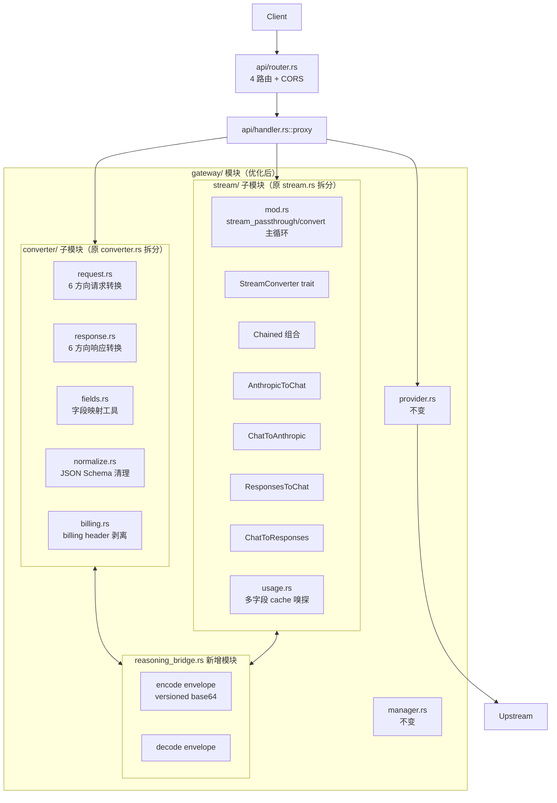
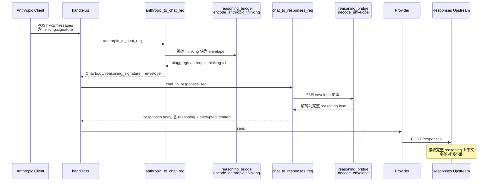
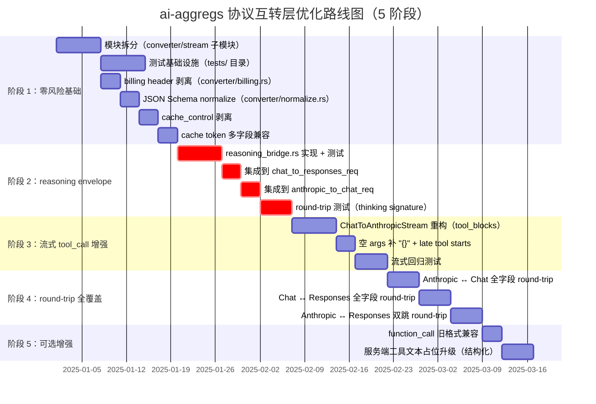

# 《ai-aggregs 协议互转层优化设计报告》

> **参考对象**：`farion1231/cc-switch`（Rust，Tauri 桌面应用，协议互转工程化程度最高的开源实现）
>
> **硬约束**：**不变更 ai-aggregs 任何对外可观察的功能**——路由、配置格式、IPC 命令、SQLite schema、Tauri 事件、消费者密钥行为等全部保持向后兼容。
>
> **优化范围**：仅限于 `src-tauri/src/gateway/` 模块内部重构与能力补强。
>
> **目标读者**：ai-aggregs 维护者 / 协议互转层重构执行者。

---

## 0. TL;DR（执行摘要）

本报告提出一套**演进式优化方案**，在零功能破坏的前提下，从 cc-switch 借鉴 8 项关键设计，将 ai-aggregs 协议互转层从"爱好级"（5.0/10）提升至"工业级 + 极简"（预计 8.0+/10）。

| 优化项 | 类型 | 价值 | 风险 |
|--------|------|------|------|
| ① reasoning_bridge envelope | **新增能力（修复跨协议 reasoning 多轮 bug）** | 极高 | 低 |
| ② tool_call 乱序兜底 + 空 args 补 `"{}"` | **新增能力（兼容 DeepSeek/GLM）** | 高 | 低 |
| ③ Claude Code billing header 过滤 | **新增能力（提升 cache 命中率）** | 中 | 低 |
| ④ JSON Schema normalization | **新增能力（避免上游 400）** | 中 | 低 |
| ⑤ cache token 多字段兼容 | **新增能力（计费准确性）** | 中 | 低 |
| ⑥ `cache_control` 字段剥离（入站 Anthropic→Chat 时） | **新增能力（避免 GLM/Qwen 400）** | 中 | 低 |
| ⑦ 测试基础设施 + round-trip 测试 | **新增能力（防止回归）** | 高 | 零 |
| ⑧ 模块内文件拆分（不改公共 API） | **重构（提升可维护性）** | 中 | 低 |

**核心创新**：**reasoning_bridge envelope**（借鉴 `cc-switch/src-tauri/src/proxy/providers/reasoning_bridge.rs`），用版本化 base64 envelope 让 Anthropic↔Responses 经 Chat 双跳时不再丢失 thinking signature。

---

## 第一部分：设计目标与约束

### 1.1 不变更功能的精确定义

以下行为必须**100% 向后兼容**：

| 类别 | 不变量 |
|------|--------|
| **HTTP 路由** | `/v1/models` GET、`/v1/chat/completions`、`/v1/responses`、`/v1/messages` POST 共 4 条，URL 不变 |
| **鉴权** | `Authorization: Bearer` 和 `x-api-key` 两种方式，`constant_time_eq` 比较语义不变 |
| **路由策略** | `AppState::route` 的四级优先（协议匹配+上次 > 协议匹配 > 上次 > 其他）、别名池展开、`last_model`/`last_provider` 行为 |
| **Provider 行为** | 密钥轮转、429/5xx 黑名单、10 分钟全局重置、`reasoning_effort` 注入逻辑、`connect_timeout=30s`、`pool_idle_timeout=90s` |
| **配置格式** | `Config`、`ProviderConfig`、`ConsumerConfig`、`ApiKeyEntry`、`ModelMapping`、`LogConfig` 的字段名和 serde 行为 |
| **数据库** | `data/config.db` SQLite，所有表结构、字段、索引不变 |
| **IPC 命令** | 25 个 `#[tauri::command]` 的签名和返回类型 |
| **Tauri 事件** | `gateway-log`、`gateway-state-changed` 的 payload 结构 |
| **CORS 行为** | `allowed_origin` 白名单（localhost/127.0.0.1/tauri.localhost/ipc.localhost） |
| **配置文件读写** | `opencode.json` / `~/.claude/settings.json` / `~/.codex/config.toml` 的语义 |
| **日志策略** | DEBUG 截断 500 字符、TRACE 完整 body、log4rs 滚动策略 |
| **托盘行为** | 关闭窗口→隐藏、单实例、`--minimized` 启动 |

### 1.2 允许变更的范围

| 类别 | 允许变更 |
|------|----------|
| **`gateway/` 模块内部** | 文件拆分、新增子模块、私有类型重组 |
| **新增函数 / 类型** | 任何新公开 API 都通过新模块名空间隔离 |
| **`Protocol` enum** | 不删除现有 3 个变体（可考虑加 `Gemini` 等新变体，但本报告不动） |
| **流式状态机内部状态字段** | 可增加新字段（向后兼容） |
| **新增可选配置字段** | 必须有 `#[serde(default)]`，缺省时行为与现状完全一致 |

### 1.3 设计原则

1. **演进式**：分阶段，每阶段独立可交付，独立可回滚
2. **零魔法**：所有改动有对应的 round-trip 测试覆盖
3. **保留极简**：不引入与 ai-aggregs 桌面定位不匹配的复杂度（如 OAuth、多租户）
4. **借鉴而非照搬**：cc-switch 的 trait + 强类型 + envelope 三件套好，但要适配 ai-aggregs 的 `Value` 风格

---

## 第二部分：现状评估

### 2.1 ai-aggregs 协议互转层现状

**优势**：

1. `StreamConverter` trait + `Chained<A,B>` 泛型组合是三个项目里**最优雅的工程抽象**
2. `serde_json::Value` 直接重写，零序列化开销
3. `BytesMut::split_to` 零拷贝行缓冲
4. 完整 thinking signature 多轮支持（Anthropic↔Chat 双向）
5. 4 个状态机 + Chained 覆盖全部 6 方向
6. usage 嗅探 + spawn_blocking 写入 SQLite

**痛点**：

1. **跨协议 reasoning 多轮断链**：Anthropic → Responses 经 Chat 中转时，`thinking.signature` 没有 Chat 对应字段，会丢失
2. **tool_call 乱序丢工具**：上游先发 id+arguments 后发 name 时，丢失 `content_block_start.tool_use`
3. **空 tool arguments**：依赖客户端兼容，Claude SDK 收到 null input 会失败
4. **无测试覆盖**：协议转换层 0 单元测试
5. **无 billing header 过滤**：Claude Code 注入的 `x-anthropic-billing-header:` 会破坏上游 cache
6. **无 JSON Schema normalization**：缺 `properties` 的 schema 会被严格上游 400
7. **cache token 字段兼容性差**：仅认 Anthropic 标准字段，OpenAI 兼容上游 cache 数据丢失
8. **无 `cache_control` 剥离**：发送到 GLM/Qwen 等严格上游会 400
9. **`function_call` 旧格式不支持**
10. **无 first-output timeout**：reasoning model 长时间无输出会挂死

### 2.2 cc-switch 可借鉴设计点

| 设计 | 价值 | 适配难度 | 是否引入 |
|------|------|----------|----------|
| `ProviderAdapter` trait | 提升抽象 | 中（ai-aggregs Provider 行为单一，trait 收益小） | **本报告不引入**（投入产出比低） |
| 强类型 struct | 编译期检查 | 中（需要重写所有转换函数签名） | **本报告不引入**（保留 Value 极简风格） |
| `reasoning_bridge` envelope | **修复关键 bug** | 低（独立模块） | **✓ 引入** |
| `strip_leading_anthropic_billing_header` | 提升 cache 命中 | 低 | **✓ 引入** |
| `clean_schema` 递归 | 避免上游 400 | 低 | **✓ 引入** |
| tool_call 延迟宣告 | 修复 DeepSeek 兼容 | 中（需改流式状态机） | **✓ 引入** |
| 空 args 补 `"{}"` | 兼容 Claude SDK | 低 | **✓ 引入** |
| `consecutive_whitespace` Copilot bug | 兼容 Copilot | 中 | **暂不引入**（无 Copilot 用户） |
| `cache_control` 剥离 | 兼容 GLM/Qwen | 低 | **✓ 引入** |
| cache token 多字段名 | 计费准确 | 低 | **✓ 引入** |
| `async_stream!` 宏 | 简化流式代码 | 中 | **暂不引入**（mpsc 风格更高效） |
| Round-trip 测试 | 防止回归 | 低 | **✓ 引入** |

---

## 第三部分：优化后总体架构



**变化要点**：

1. `converter.rs`（1258 行）拆分为 `converter/` 子模块（5 文件，每个 ~250 行）
2. `stream.rs`（1581 行）拆分为 `stream/` 子模块（6 文件）
3. **新增** `reasoning_bridge.rs`（~150 行）实现 envelope
4. **新增** `tests/` 目录（round-trip 测试集）

---

## 第四部分：详细设计

### 4.1 reasoning_bridge envelope（核心创新）

#### 4.1.1 问题精确描述

当前 ai-aggregs 在 Anthropic → Responses 方向（经 Chat 双跳）时：

```
Anthropic 请求 → anthropic_to_chat_req → Chat 请求 → chat_to_responses_req → Responses 请求
```

`anthropic_to_chat_req` 提取 Anthropic `thinking` 块为 `reasoning_content` + `reasoning_signature`（非标准 Chat 扩展，`converter.rs:370-382`）。但 `chat_to_responses_req` **不识别 `reasoning_signature`**，转换时丢失，最终 Responses 请求中 reasoning 历史不完整。

反向同理：Responses 经 Chat 转 Anthropic 时，OpenAI `reasoning.encrypted_content` 在 Chat 中转阶段丢失。

#### 4.1.2 cc-switch 的解决方案

`reasoning_bridge.rs:11` 定义版本化前缀 + base64 envelope：

```rust
pub(crate) const OPENAI_REASONING_ITEM_PREFIX: &str = "ccswitch-openai-reasoning-v1:";

// 把整个 OpenAI reasoning item 序列化 + base64 编码，塞进 Anthropic thinking.signature
pub(crate) fn encode_openai_reasoning_item(item: &Value) -> Option<String> {
    if item.get("type").and_then(|v| v.as_str()) != Some("reasoning") {
        return None;
    }
    let bytes = serde_json::to_vec(item).ok()?;
    Some(format!(
        "{OPENAI_REASONING_ITEM_PREFIX}{}",
        URL_SAFE_NO_PAD.encode(bytes)
    ))
}
```

#### 4.1.3 ai-aggregs 适配设计

**新增文件**：`src-tauri/src/gateway/reasoning_bridge.rs`

**设计要点**（与 cc-switch 的差异）：

- ai-aggregs 用 Chat 作为 IR，所以 envelope 需要在 **Chat `reasoning_signature` 字段** 中承载
- 引入两个版本化前缀（双向）：

```rust
//! 跨协议 reasoning envelope：让 thinking signature 经 Chat 中转时不丢失
//!
//! 背景：ai-aggregs 以 Chat 为 IR，Anthropic ↔ Responses 经 Chat 双跳。
//! thinking.signature 在 Chat 协议中没有标准字段，过去塞在非标准扩展
//! `reasoning_signature`，但 chat_to_responses_req 不识别该字段会丢失。
//!
//! 方案：把"对方协议的完整 reasoning 上下文"序列化为 base64 envelope，
//! 加版本前缀，作为 `reasoning_signature` 字段值透传。下游协议再解码还原。
//!
//! envelope 仅在跨协议方向生效；同协议透传时不触发。

use base64::{engine::general_purpose::URL_SAFE_NO_PAD, Engine};
use serde_json::Value;

/// Anthropic thinking 块的 envelope 前缀（当目标协议是 Responses 时使用）
pub(crate) const ANTHROPIC_THINKING_ENVELOPE_PREFIX: &str = "aiaggregs-anthropic-thinking-v1:";
/// OpenAI Responses reasoning item 的 envelope 前缀（当目标协议是 Anthropic 时使用）
pub(crate) const OPENAI_REASONING_ENVELOPE_PREFIX: &str = "aiaggregs-openai-reasoning-v1:";

/// 把 Anthropic thinking 块（含 signature）编码为 envelope 字符串
pub(crate) fn encode_anthropic_thinking(block: &Value) -> Option<String> {
    if block.get("type").and_then(|v| v.as_str()) != Some("thinking") {
        return None;
    }
    // 仅当存在非空 signature 时才编码（无 signature 的 thinking 不需要 envelope）
    let sig = block.get("signature").and_then(|v| v.as_str()).unwrap_or("");
    if sig.is_empty() {
        return None;
    }
    let bytes = serde_json::to_vec(block).ok()?;
    Some(format!(
        "{ANTHROPIC_THINKING_ENVELOPE_PREFIX}{}",
        URL_SAFE_NO_PAD.encode(bytes)
    ))
}

/// 把 OpenAI Responses reasoning item 编码为 envelope 字符串
pub(crate) fn encode_openai_reasoning(item: &Value) -> Option<String> {
    if item.get("type").and_then(|v| v.as_str()) != Some("reasoning") {
        return None;
    }
    let bytes = serde_json::to_vec(item).ok()?;
    Some(format!(
        "{OPENAI_REASONING_ENVELOPE_PREFIX}{}",
        URL_SAFE_NO_PAD.encode(bytes)
    ))
}

/// 解码 envelope 字符串（自动识别两种前缀）
pub(crate) fn decode_envelope(envelope: &str) -> Option<Value> {
    let (prefix, payload) = [
        (ANTHROPIC_THINKING_ENVELOPE_PREFIX, payload_from(envelope, ANTHROPIC_THINKING_ENVELOPE_PREFIX)),
        (OPENAI_REASONING_ENVELOPE_PREFIX, payload_from(envelope, OPENAI_REASONING_ENVELOPE_PREFIX)),
    ]
    .into_iter()
    .find_map(|(p, opt)| opt.map(|payload| (p, payload)))?;
    let _ = prefix;
    let bytes = URL_SAFE_NO_PAD.decode(payload).ok()?;
    serde_json::from_slice::<Value>(&bytes).ok()
}

fn payload_from<'a>(envelope: &'a str, prefix: &str) -> Option<&'a str> {
    envelope.strip_prefix(prefix)
}

#[cfg(test)]
mod tests {
    use super::*;
    use serde_json::json;

    #[test]
    fn anthropic_thinking_round_trips() {
        let block = json!({
            "type": "thinking",
            "thinking": "Need a tool",
            "signature": "abc123"
        });
        let envelope = encode_anthropic_thinking(&block).unwrap();
        assert!(envelope.starts_with(ANTHROPIC_THINKING_ENVELOPE_PREFIX));
        let decoded = decode_envelope(&envelope).unwrap();
        assert_eq!(decoded, block);
    }

    #[test]
    fn openai_reasoning_round_trips() {
        let item = json!({
            "type": "reasoning",
            "id": "rs_1",
            "summary": [{"type": "summary_text", "text": "Need a tool"}],
            "encrypted_content": "opaque-blob"
        });
        let envelope = encode_openai_reasoning(&item).unwrap();
        let decoded = decode_envelope(&envelope).unwrap();
        assert_eq!(decoded, item);
    }

    #[test]
    fn signature_less_thinking_not_encoded() {
        let block = json!({"type": "thinking", "thinking": "no signature"});
        assert!(encode_anthropic_thinking(&block).is_none());
    }
}
```

#### 4.1.4 转换函数集成点

修改 `gateway/converter.rs`（拆分后是 `converter/request.rs`）：

```rust
// chat_to_responses_req 中处理 assistant message 的 reasoning_content
"assistant" => {
    if let Some(rc) = m.get("reasoning_content").and_then(|x| x.as_str()).ok() {
        if !rc.is_empty() {
            // 【新增】检查 reasoning_signature 是否为 envelope，是则解码为完整 reasoning item
            let signature = m.get("reasoning_signature").and_then(|x| x.as_str()).unwrap_or("");
            if let Some(decoded) = reasoning_bridge::decode_envelope(signature) {
                // 是 envelope：直接还原为完整 Responses reasoning item
                input.push(json!({
                    "type": "reasoning",
                    "summary": decoded.get("summary").cloned().unwrap_or(json!([])),
                    "encrypted_content": decoded.get("encrypted_content").cloned().unwrap_or(json::Null),
                }));
            } else {
                // 普通 reasoning_content：转 summary_text
                input.push(json!({
                    "type": "reasoning",
                    "summary": [{"type": "summary_text", "text": rc}]
                }));
                // 若 signature 非 envelope 但是有值（Anthropic 原生 signature），也透传
                if !signature.is_empty() {
                    // 保留为 encrypted_content（虽然语义不完全对，但优于丢失）
                    input.last_mut().unwrap()["encrypted_content"] = json!(signature);
                }
            }
        }
    }
    // ...其余逻辑不变
}
```

`anthropic_to_chat_req` 中反向：把 Anthropic `thinking.signature` 编码为 envelope 后塞进 `reasoning_signature`：

```rust
"thinking" => {
    if let Some(t) = b.get("thinking").and_then(|x| x.as_str()) {
        if !t.is_empty() {
            reasoning_parts.push(t.to_string());
        }
    }
    if let Some(s) = b.get("signature").and_then(|x| x.as_str()) {
        if !s.is_empty() {
            // 【新增】把整个 thinking 块编码为 envelope，保留 signature 用于跨协议透传
            if let Some(envelope) = reasoning_bridge::encode_anthropic_thinking(b) {
                signatures.push(envelope);
            } else {
                signatures.push(s.to_string());  // 回退：原值透传
            }
        }
    }
}
```

**关键安全保证**：

1. **向后兼容**：当 `reasoning_signature` 字段不是 envelope 前缀时，`decode_envelope` 返回 `None`，回退到原逻辑（透传 signature 字符串）
2. **跨进程兼容**：旧版 ai-aggregs 客户端发送的 `reasoning_signature` 是普通字符串，新版能正确识别为非 envelope 并按原方式处理
3. **跨版本兼容**：若未来 envelope 格式变化，前缀版本号 `v1` 升级为 `v2`，旧版识别失败时回退到透传

#### 4.1.5 envelope 的传播路径



---

### 4.2 tool_call 乱序兜底（修复 DeepSeek/GLM 兼容性）

#### 4.2.1 当前问题

`ChatToAnthropicStream` 假设上游按 `id → name → arguments` 顺序到达（`stream.rs:715-738`）：

```rust
if let Some(tcs) = delta.get("tool_calls").and_then(|x| x.as_array()) {
    for tc in tcs {
        let has_id = tc.get("id").is_some();
        if has_id {
            // 立即发 content_block_start.tool_use
            // ...
        } else if let Some(args) = tc["function"].get("arguments")... {
            // 续写 arguments
        }
    }
}
```

**DeepSeek/GLM/Zhipu** 等上游有时会先发 id+arguments，name 后到，导致 `content_block_start` 用空 name 发出，丢失真实工具名。

#### 4.2.2 适配设计（借鉴 cc-switch + sub2api）

修改 `ChatToAnthropicStream` struct（`stream.rs:596`）：

```rust
struct ChatToAnthropicStream {
    started: bool,
    sent_done: bool,
    next_block: usize,
    cur_block: Option<(usize, String)>,
    pending_signature: Option<String>,
    // 【新增】tool_call 乱序兜底
    tool_blocks: HashMap<usize, ToolBlockState>,
}

#[derive(Default)]
struct ToolBlockState {
    /// 上游 tool_call index
    chat_index: usize,
    /// Anthropic 块 index（一旦宣告后固定）
    anthropic_index: Option<usize>,
    id: String,
    name: String,
    /// name 到达前的 arguments 缓冲
    pending_args: String,
    /// 是否已发 content_block_start
    announced: bool,
}
```

修改 `on_event` 的 tool_calls 处理逻辑（参考 cc-switch `streaming.rs:374-509` 和 sub2api `chatcompletions_anthropic_bridge.go:759-814`）：

```rust
if let Some(tcs) = delta.get("tool_calls").and_then(|x| x.as_array()) {
    for tc in tcs {
        let chat_idx = tc.get("index").and_then(|i| i.as_u64()).map(|i| i as usize).unwrap_or(0);
        
        // 取出或创建状态
        let state = self.tool_blocks.entry(chat_idx).or_default();
        state.chat_index = chat_idx;
        
        // 累积 id 和 name（可能跨多个 chunk 到达）
        if let Some(id) = tc.get("id").and_then(|i| i.as_str()) {
            state.id = id.to_string();
        }
        if let Some(name) = tc.get("function").and_then(|f| f.get("name")).and_then(|n| n.as_str()) {
            state.name = name.to_string();
        }
        
        // 累积 arguments（无论是否宣告）
        if let Some(args) = tc.get("function").and_then(|f| f.get("arguments")).and_then(|a| a.as_str()) {
            if !args.is_empty() {
                state.pending_args.push_str(args);
            }
        }
        
        // 判定是否可以宣告（id 和 name 都到位）
        if !state.announced && !state.id.is_empty() && !state.name.is_empty() {
            // 关闭当前 block（如有）
            self.close_cur_block(&mut out);
            
            let bidx = self.next_block;
            self.next_block += 1;
            state.anthropic_index = Some(bidx);
            state.announced = true;
            self.cur_block = Some((bidx, "tool_use".into()));
            
            // 发 content_block_start
            out.push(content_block_start_tool_event(bidx, json!(state.id.clone()), json!(state.name.clone())));
            
            // 如果 pending_args 非空，立即作为 input_json_delta 发出
            if !state.pending_args.is_empty() {
                let args = std::mem::take(&mut state.pending_args);
                out.push(input_json_delta_event(bidx, &args));
            }
        } else if state.announced {
            // 已宣告：pending_args 直接发
            if !state.pending_args.is_empty() {
                let args = std::mem::take(&mut state.pending_args);
                if let Some(bidx) = state.anthropic_index {
                    out.push(input_json_delta_event(bidx, &args));
                }
            }
        }
        // else: 还在等待 name 到达，arguments 继续累积
    }
}
```

**finish_reason 触发兜底**（参考 cc-switch `streaming.rs:542-602`）：

```rust
if let Some(fr) = choice.get("finish_reason").and_then(|x| x.as_str()) {
    self.close_cur_block(&mut out);
    
    // 【新增】late tool starts：name 永远没到的工具，按 fallback 名宣告
    let mut late_starts: Vec<(usize, String, String, String)> = Vec::new();
    for state in self.tool_blocks.values_mut() {
        if state.announced {
            continue;
        }
        if state.pending_args.is_empty() && state.id.is_empty() && state.name.is_empty() {
            continue;  // 完全空，跳过
        }
        let bidx = self.next_block;
        self.next_block += 1;
        state.anthropic_index = Some(bidx);
        state.announced = true;
        let fallback_id = if state.id.is_empty() {
            format!("tool_call_{}", state.chat_index)
        } else {
            state.id.clone()
        };
        let fallback_name = if state.name.is_empty() {
            "unknown_tool".to_string()
        } else {
            state.name.clone()
        };
        let pending = std::mem::take(&mut state.pending_args);
        late_starts.push((bidx, fallback_id, fallback_name, pending));
    }
    late_starts.sort_unstable_by_key(|(idx, _, _, _)| *idx);
    for (bidx, id, name, pending) in late_starts {
        out.push(content_block_start_tool_event(bidx, json!(id), json!(name)));
        if !pending.is_empty() {
            out.push(input_json_delta_event(bidx, &pending));
        }
        out.push(content_block_stop_frame(bidx));
    }
    
    // ...原有 message_delta 逻辑
}
```

#### 4.2.3 空 tool arguments 补 `"{}"`

借鉴 sub2api `chatcompletions_anthropic_bridge.go:881-906`，在 `close_cur_block` 中：

```rust
fn close_cur_block(&mut self, out: &mut Vec<String>) {
    if let Some((idx, ty)) = self.cur_block.take() {
        if ty == "thinking" {
            if let Some(sig) = self.pending_signature.take() {
                out.push(signature_delta_event(idx, &sig));
            }
        }
        // 【新增】tool_use 块如果没有任何 input_json_delta，补一个 "{}"
        if ty == "tool_use" {
            // 通过 cur_tool_had_delta 字段跟踪
            if !self.cur_tool_had_delta {
                out.push(input_json_delta_event(idx, "{}"));
            }
            self.cur_tool_had_delta = false;
        }
        out.push(content_block_stop_frame(idx));
    }
}
```

`cur_tool_had_delta: bool` 是新增字段，每次 `input_json_delta_event` 后置为 true。

---

### 4.3 Claude Code billing header 过滤

#### 4.3.1 问题

Claude Code 客户端会在 `system` 字段开头注入动态 `x-anthropic-billing-header:` 元数据（含 `cch=` 哈希）。每次请求该值变化，会破坏上游 prompt cache prefix 匹配，**降低 cache 命中率**。

#### 4.3.2 cc-switch 的方案

`proxy/providers/transform.rs:18` 的 `strip_leading_anthropic_billing_header`：

```rust
const ANTHROPIC_BILLING_HEADER_PREFIX: &str = "x-anthropic-billing-header:";

/// 仅剥离"开头第一行"的 billing header。
/// 不删除后续出现的同 prefix 文本（避免误删用户内容）。
pub(crate) fn strip_leading_anthropic_billing_header(text: &str) -> &str {
    if !text.starts_with(ANTHROPIC_BILLING_HEADER_PREFIX) {
        return text;
    }
    let Some(line_end) = text.as_bytes()
        .iter()
        .position(|byte| *byte == b'\n' || *byte == b'\r')
    else {
        return "";
    };
    let bytes = text.as_bytes();
    let mut rest_start = line_end + 1;
    if bytes[line_end] == b'\r' && bytes.get(line_end + 1) == Some(&b'\n') {
        rest_start += 1;
    }
    let rest = &text[rest_start..];
    // 跳过紧随其后的空行
    if let Some(stripped) = rest.strip_prefix("\r\n") { stripped }
    else if let Some(stripped) = rest.strip_prefix('\n') { stripped }
    else if let Some(stripped) = rest.strip_prefix('\r') { stripped }
    else { rest }
}
```

#### 4.3.3 ai-aggregs 集成

**新增模块**：`gateway/converter/billing.rs`（约 50 行，直接复制 cc-switch 的实现 + 测试）

**调用点**：

1. `chat_to_anthropic_req` 提取 system 时（`converter.rs:354-360`）：

```rust
"system" => {
    let text = chat_content_to_text(&m["content"]);
    // 【新增】剥离首行 billing header
    let text = billing::strip_leading_anthropic_billing_header(&text);
    if !text.is_empty() {
        system_parts.push(text.to_string());
    }
}
```

2. `anthropic_to_chat_req` 提取 Anthropic `system` 时（`converter.rs:475-488`）：同样剥离

3. `chat_to_responses_req` 的 instructions 提取时：同样剥离

**向后兼容性**：剥离前缀仅影响开头是 `x-anthropic-billing-header:` 的输入。普通用户输入不含此前缀，完全不受影响。

---

### 4.4 JSON Schema normalization

#### 4.4.1 问题

OpenAI Responses / 部分 Chat 上游要求 tool `parameters` 必须是 `type: object` 且包含 `properties`。Anthropic 上游的 `input_schema` 可能缺这两个字段，导致转换后上游 400。

#### 4.4.2 cc-switch 方案

`proxy/providers/transform.rs:494` 的 `clean_schema`：

```rust
pub fn clean_schema(schema: Value) -> Value {
    clean_schema_inner(schema, true)
}

fn clean_schema_inner(mut schema: Value, is_root: bool) -> Value {
    if let Some(obj) = schema.as_object_mut() {
        let missing_type = is_root && !obj.contains_key("type");
        if missing_type {
            obj.insert("type".to_string(), json!("object"));
        }
        if missing_type && !obj.contains_key("properties") {
            obj.insert("properties".to_string(), json!({}));
        }
        // 移除 "format": "uri"（部分上游拒绝）
        if obj.get("format").and_then(|v| v.as_str()) == Some("uri") {
            obj.remove("format");
        }
        // 递归清理嵌套 schema
        if let Some(properties) = obj.get_mut("properties").and_then(|v| v.as_object_mut()) {
            for (_, value) in properties.iter_mut() {
                *value = clean_schema_inner(value.clone(), false);
            }
        }
        if let Some(items) = obj.get_mut("items") {
            *items = clean_schema_inner(items.clone(), false);
        }
    }
    schema
}
```

#### 4.4.3 ai-aggregs 集成

**新增模块**：`gateway/converter/normalize.rs`（约 60 行）

**调用点**：所有 tools 转换处。例如 `chat_to_anthropic_req`（`converter.rs:419-430`）：

```rust
let tools = src.get("tools").and_then(|t| t.as_array()).map(|arr| {
    arr.iter()
        .filter_map(|t| {
            let f = t.get("function")?;
            Some(json!({
                "name": f["name"],
                "description": f["description"],
                // 【新增】schema normalization
                "input_schema": normalize::clean_schema(f["parameters"].cloned().unwrap_or(json!({}))),
            }))
        })
        .collect::<Vec<_>>()
});
```

`anthropic_to_chat_req` 反向同理。

---

### 4.5 cache_control 字段剥离

#### 4.5.1 问题

Anthropic 协议的 `cache_control: {type: "ephemeral"}` 字段在转到 Chat / Responses 协议时，部分严格上游（GLM/Qwen）会因未知字段 400。

#### 4.5.2 适配设计

在所有从 Anthropic 转出的方向，递归剥离 `cache_control` 字段。借鉴 cc-switch 的回归测试 `test_regression_gh3805_no_cache_control_leak_to_openai`。

**实现**：在 `converter/fields.rs` 加一个工具函数：

```rust
/// 递归剥离所有 cache_control 字段（仅当目标是 Chat/Responses 时调用）
pub(crate) fn strip_cache_control(value: &mut Value) {
    match value {
        Value::Object(obj) => {
            obj.remove("cache_control");
            for v in obj.values_mut() {
                strip_cache_control(v);
            }
        }
        Value::Array(arr) => {
            for v in arr {
                strip_cache_control(v);
            }
        }
        _ => {}
    }
}
```

**调用点**：`chat_to_anthropic_req`、`anthropic_to_chat_req`、`chat_to_responses_req`、`responses_to_chat_req` 在构造完结果后调用 `strip_cache_control(&mut out)`。

**注意**：仅在跨协议转换时调用。Anthropic → Anthropic 透传时不剥离（保留 cache_control 是 Anthropic 上游期望的）。

---

### 4.6 cache token 多字段兼容

#### 4.6.1 问题

当前 `extract_usage`（`stream.rs:59`）仅识别 Anthropic 标准字段：

```rust
if let Some(it) = u.get("input_tokens").and_then(|x| x.as_u64()) {
    let cache_creation = u.get("cache_creation_input_tokens")...;
    let cache_read = u.get("cache_read_input_tokens")...;
    // ...
}
```

OpenAI 兼容上游（Kimi/GLM 等）可能用：

- `prompt_tokens_details.cached_tokens`（OpenAI 标准）
- `prompt_tokens_details.cache_write_tokens`（OpenAI 别名 1）
- `prompt_tokens_details.cache_creation_tokens`（OpenAI 别名 2）
- `input_tokens_details.cache_write_tokens`

这些字段当前被忽略，导致 cache token 统计缺失。

#### 4.6.2 cc-switch 方案

`proxy/providers/streaming.rs:675-698`：

```rust
fn extract_cache_read_tokens(usage: &Usage) -> Option<u32> {
    if let Some(v) = usage.cache_read_input_tokens {
        return Some(v);  // Anthropic 直接字段优先
    }
    usage.prompt_tokens_details.as_ref()
        .map(|d| d.cached_tokens)  // OpenAI 标准 nested
        .filter(|&v| v > 0)
}

fn extract_cache_write_tokens(usage: &Usage) -> Option<u32> {
    if let Some(value) = usage.cache_creation_input_tokens {
        return Some(value);  // Anthropic 直接字段优先
    }
    usage.prompt_tokens_details.as_ref()
        .map(|details| details.cache_write_tokens)  // OpenAI 别名
        .filter(|value| *value > 0)
}
```

#### 4.6.3 ai-aggregs 适配

修改 `extract_usage`（`stream.rs:59`），兼容多种字段名：

```rust
pub fn extract_usage(v: &Value) -> Option<(u64, u64, u64)> {
    if let Some(u) = v.get("usage") {
        // Chat 风格
        if let Some(pt) = u.get("prompt_tokens").and_then(|x| x.as_u64()) {
            let ct = u.get("completion_tokens").and_then(|x| x.as_u64()).unwrap_or(0);
            // 【新增】兼容 OpenAI 多种 cache token 字段
            let cached = extract_cache_field(u, &[
                "cache_read_input_tokens",  // Anthropic 标准
            ], &[
                ("prompt_tokens_details", "cached_tokens"),  // OpenAI 标准
            ]);
            let cache_creation = extract_cache_field(u, &[
                "cache_creation_input_tokens",  // Anthropic 标准
            ], &[
                ("prompt_tokens_details", "cache_write_tokens"),       // OpenAI 别名 1
                ("prompt_tokens_details", "cache_creation_tokens"),    // OpenAI 别名 2
                ("input_tokens_details", "cache_write_tokens"),         // 嵌套 variant
            ]);
            let prompt_total = pt + cached + cache_creation;  // 加法哲学保持不变
            let tt = u.get("total_tokens").and_then(|x| x.as_u64()).unwrap_or(prompt_total + ct);
            return Some((prompt_total, ct, tt));
        }
        // Anthropic / Responses 风格（保持不变）
        if let Some(it) = u.get("input_tokens").and_then(|x| x.as_u64()) {
            // ...原逻辑
        }
    }
    // ...
}

/// 通用 cache 字段提取：先看顶层直接字段，再看 nested path
fn extract_cache_field(usage: &Value, top_fields: &[&str], nested: &[(&str, &str)]) -> u64 {
    // 顶层直接字段优先
    for field in top_fields {
        if let Some(v) = usage.get(field).and_then(|x| x.as_u64()) {
            return v;
        }
    }
    // nested 路径
    for (parent, child) in nested {
        if let Some(v) = usage.pointer(&format!("/{parent}/{child}")).and_then(|x| x.as_u64()) {
            return v;
        }
    }
    0
}
```

**向后兼容性**：原有 `cache_read_input_tokens` / `cache_creation_input_tokens` 字段的识别完全不变；只是新增对 OpenAI nested 字段的识别。

---

### 4.7 测试基础设施

#### 4.7.1 目标

为每个转换函数建立 round-trip 测试，保证 A→B→A 等价。

#### 4.7.2 测试目录结构

```
src-tauri/src/gateway/
├── converter/
│   ├── mod.rs              # 重导出
│   ├── request.rs          # 6 方向请求转换
│   ├── response.rs         # 6 方向响应转换
│   ├── fields.rs           # 工具函数
│   ├── normalize.rs        # JSON Schema 清理
│   └── billing.rs          # billing header 剥离
├── stream/
│   ├── mod.rs              # stream_passthrough / stream_convert
│   ├── trait.rs            # StreamConverter trait + Chained
│   ├── chat_anthropic.rs   # AnthropicToChat + ChatToAnthropic
│   ├── chat_responses.rs   # ResponsesToChat + ChatToResponses
│   ├── usage.rs            # extract_usage + sniff_usage
│   └── tests.rs            # 流式状态机测试
├── reasoning_bridge.rs     # 新增 envelope
├── provider.rs             # 不变
├── manager.rs              # 不变
└── tests/                  # 集成测试
    ├── mod.rs
    ├── round_trip.rs       # A→B→A 等价测试
    ├── billing.rs          # billing header 测试
    ├── reasoning_bridge.rs # envelope 测试
    └── edge_cases.rs       # 边界 case
```

#### 4.7.3 round-trip 测试模板

```rust
// gateway/tests/round_trip.rs
use serde_json::{json, Value};
use crate::gateway::converter::*;

fn assert_round_trip(original: Value, field_filter: &[&str]) {
    // Anthropic → Chat → Anthropic
    let chat = anthropic_to_chat_req(&original);
    let back = chat_to_anthropic_req(&chat);
    assert_fields_equal(&original, &back, field_filter);

    // Chat → Responses → Chat
    let responses = chat_to_responses_req(&chat);
    let chat_back = responses_to_chat_req(&responses);
    assert_fields_equal(&chat, &chat_back, field_filter);

    // Anthropic → Responses → Anthropic（经 Chat 双跳，关键 reasoning 测试）
    let responses2 = chat_to_responses_req(&anthropic_to_chat_req(&original));
    let chat2 = responses_to_chat_req(&responses2);
    let back2 = chat_to_anthropic_req(&chat2);
    assert_fields_equal(&original, &back2, field_filter);
}

#[test]
fn round_trip_thinking_with_signature() {
    let original = json!({
        "model": "claude-opus-4.5",
        "max_tokens": 1024,
        "messages": [{
            "role": "assistant",
            "content": [
                {"type": "thinking", "thinking": "I need a tool", "signature": "sig_abc123"},
                {"type": "text", "text": "Let me check"},
                {"type": "tool_use", "id": "toolu_1", "name": "weather", "input": {"city": "SF"}}
            ]
        }]
    });
    // thinking.signature 必须能往返（通过 reasoning_bridge envelope）
    assert_round_trip(original, &["messages.0.content.0.signature"]);
}

#[test]
fn round_trip_tool_use() {
    let original = json!({
        "model": "claude-sonnet-4",
        "max_tokens": 1024,
        "messages": [{
            "role": "user",
            "content": [{"type": "tool_result", "tool_use_id": "toolu_1", "content": "Sunny"}]
        }]
    });
    assert_round_trip(original, &["messages.0.content.0.tool_use_id", "messages.0.content.0.content"]);
}
```

#### 4.7.4 回归测试（关联具体场景）

借鉴 cc-switch 的命名风格，把每个回归测试与具体场景/上游关联：

```rust
#[test]
fn regression_deepseek_tool_call_arguments_before_name() {
    // DeepSeek 上游：先发 id+arguments，后发 name
    // 之前会丢失工具调用，修复后应正确宣告
    // ...
}

#[test]
fn regression_claude_code_billing_header_stripped() {
    // Claude Code 注入的 x-anthropic-billing-header 应被剥离
    let input = json!({
        "system": "x-anthropic-billing-header: cc_version=2.1; cch=abc;\n\nYou are helpful.",
        "messages": [{"role": "user", "content": "Hi"}]
    });
    let result = anthropic_to_chat_req(&input);
    let system = result["messages"][0]["content"].as_str().unwrap();
    assert!(!system.contains("x-anthropic-billing-header"));
    assert!(system.contains("You are helpful"));
}

#[test]
fn regression_glm_qwen_no_cache_control_leak() {
    // cache_control 不能泄漏到 OpenAI 兼容上游
    let input = json!({
        "model": "glm-5",
        "messages": [{"role": "user", "content": [{"type": "text", "text": "Hi", "cache_control": {"type": "ephemeral"}}]}]
    });
    let result = anthropic_to_chat_req(&input);
    let content_json = serde_json::to_string(&result["messages"][0]["content"]).unwrap();
    assert!(!content_json.contains("cache_control"));
}
```

---

## 第五部分：文件结构变更总览

### 5.1 优化前

```
src-tauri/src/gateway/
├── mod.rs                   4 行
├── converter.rs             1258 行
├── stream.rs                1581 行
├── provider.rs              437 行
└── manager.rs               136 行
```

### 5.2 优化后

```
src-tauri/src/gateway/
├── mod.rs                   ~10 行（声明新子模块）
├── converter/               # 拆分自 converter.rs
│   ├── mod.rs               ~50 行（重导出 + req_convert/resp_convert 入口）
│   ├── request.rs           ~450 行（6 方向请求转换）
│   ├── response.rs          ~350 行（6 方向响应转换）
│   ├── fields.rs            ~150 行（chat_content_to_text 等工具函数）
│   ├── normalize.rs         ~80 行（JSON Schema 清理）【新增】
│   └── billing.rs           ~60 行（billing header 剥离）【新增】
├── stream/                  # 拆分自 stream.rs
│   ├── mod.rs               ~150 行（stream_passthrough/convert 主循环 + sse_response）
│   ├── trait.rs             ~50 行（StreamConverter trait + Chained + Noop）
│   ├── chat_anthropic.rs    ~600 行（AnthropicToChat + ChatToAnthropic）
│   ├── chat_responses.rs    ~700 行（ResponsesToChat + ChatToResponses）
│   ├── usage.rs             ~120 行（extract_usage + sniff_usage + UsageCtx）
│   └── tests.rs             ~300 行（流式状态机测试）【新增】
├── reasoning_bridge.rs      ~150 行（envelope）【新增】
├── provider.rs              437 行（不变）
├── manager.rs               136 行（不变）
└── tests/                   # 集成测试【新增】
    ├── mod.rs
    ├── round_trip.rs        ~200 行（A→B→A 等价测试）
    ├── billing.rs           ~80 行
    ├── reasoning_bridge.rs  ~100 行
    └── edge_cases.rs        ~150 行（边界 case 回归测试）
```

### 5.3 公共 API 兼容性

`gateway/mod.rs` 的导出保持完全向后兼容：

```rust
// 优化前
pub mod converter;
pub mod manager;
pub mod provider;
pub mod stream;

// 优化后
pub mod converter;            // 仍是 pub mod，外部引用 crate::gateway::converter 不变
pub mod manager;
pub mod provider;
pub mod stream;               // 仍是 pub mod
pub mod reasoning_bridge;     // 新增 pub mod（纯新增）

// 内部：converter/ 和 stream/ 内部重组，但顶层模块名不变
```

`api/handler.rs` 的 `use crate::gateway::converter;` 和 `use crate::gateway::stream::{self, UsageCtx};` **完全不变**。

---

## 第六部分：兼容性保证清单

| 维度 | 现状 | 优化后 | 验证方式 |
|------|------|--------|----------|
| HTTP 路由 | 4 条 | 4 条（不变） | 路由测试 |
| `Protocol` enum | 3 变体 | 3 变体（不变） | 编译期保证 |
| `Provider` struct | 单一 | 单一（不变） | 编译期保证 |
| `AppState::route` 四级优先 | ✓ | ✓（不变） | 现有路由测试（state.rs:204+） |
| `AppCtrl` 字段 | 全部保留 | 全部保留（不变） | 编译期保证 |
| `ApiKeyEntry` untagged 枚举 | ✓ | ✓（不变） | serde 测试 |
| `Config` / `ProviderConfig` 字段 | 全部保留 | 全部保留（不变） | serde 测试 |
| SQLite schema | 全部表 | 全部表（不变） | migration 测试 |
| 25 个 IPC 命令签名 | 全部 | 全部（不变） | tauri::generate_handler |
| `consumer.check_key` constant_time_eq | ✓ | ✓（不变） | 现有测试 |
| `gateway-log` / `gateway-state-changed` 事件 | 现有 payload | 现有 payload（不变） | 事件 trace 测试 |
| `reasoning_effort` 注入逻辑 | provider.rs:343 | provider.rs:343（不变） | 现有逻辑 |
| 密钥黑名单 / 10 分钟重置 | provider.rs:120+ | 不变 | 现有逻辑 |
| Tauri 托盘行为 | 不变 | 不变 | 手动验证 |
| `--minimized` 启动 | 不变 | 不变 | 手动验证 |
| 配置文件读写 | 不变 | 不变 | 现有测试 |
| 日志策略（DEBUG 截断 500 字符） | handler.rs:34 | 不变 | 现有逻辑 |

---

## 第七部分：迁移路线图（5 阶段）



### 7.1 每阶段交付物

| 阶段 | 交付物 | 风险 | 可独立合并 |
|------|--------|------|-----------|
| **阶段 1** | 模块拆分 + billing + normalize + cache_control + cache token 兼容 | 极低 | ✓ |
| **阶段 2** | reasoning_bridge envelope + 集成 | 中（修改核心转换） | ✓ |
| **阶段 3** | 流式 tool_call 增强 | 中（修改状态机） | ✓ |
| **阶段 4** | round-trip 测试全覆盖 | 零 | ✓ |
| **阶段 5** | 可选增强 | 低 | ✓ |

### 7.2 每阶段验证清单

- **阶段 1**：
  - [ ] `cargo test` 全部通过
  - [ ] 手动用 Claude Code 连 ai-aggregs 发请求，行为不变
  - [ ] 手动用 OpenAI SDK 连 ai-aggregs 发请求，行为不变
  - [ ] 手动用 Codex 连 ai-aggregs 发请求，行为不变

- **阶段 2**：
  - [ ] 多轮 thinking 对话（Anthropic 客户端 → Responses 上游）不丢上下文
  - [ ] 多轮 thinking 对话（Codex 客户端 → Anthropic 上游）不丢上下文
  - [ ] 旧版客户端发的非 envelope `reasoning_signature` 仍能透传

- **阶段 3**：
  - [ ] DeepSeek 上游 tool_call 乱序场景测试通过
  - [ ] OpenAI 标准上游 tool_call 正常场景不受影响
  - [ ] 空 arguments 工具调用，Claude SDK 能正确组装 input

---

## 第八部分：风险评估

### 8.1 高风险点

| 风险 | 概率 | 影响 | 缓解 |
|------|------|------|------|
| reasoning_bridge envelope 与现有 signature 透传冲突 | 中 | 多轮 thinking 失败 | envelope 加版本前缀，回退到原逻辑 |
| ChatToAnthropicStream 重构引入回归 | 中 | 流式中断 | 阶段 3 前先补全 round-trip 测试 |
| cache_control 剥离误伤合法 Anthropic 透传 | 低 | Anthropic 上游 cache 失效 | 仅在跨协议方向剥离，同协议透传不动 |

### 8.2 低风险点

| 风险 | 概率 | 影响 | 缓解 |
|------|------|------|------|
| billing header 误剥用户内容 | 极低 | 用户 system prompt 少一行 | 仅剥首行；非 `x-anthropic-billing-header:` 开头完全不动 |
| Schema normalize 改变 schema 语义 | 极低 | 上游拒绝 | 仅补 `type: "object"` + `properties: {}`，不删现有字段 |
| cache token 多字段误识别 | 极低 | 用量统计偏差 | 顶层直接字段优先，nested 仅作 fallback |

### 8.3 回滚策略

每阶段独立 PR + 独立 release。若生产环境发现问题，可单独 revert 该阶段，不影响其它阶段。

---

## 第九部分：验证清单

### 9.1 功能验证（必须 100% 通过）

```bash
# 在 src-tauri/ 下运行
cargo test                          # 全部单元测试
cargo test --lib gateway            # 仅 gateway 模块
cargo clippy --all-targets -- -D warnings
cargo fmt --check
```

### 9.2 集成验证（手动）

| 场景 | 客户端 | 上游 | 验证点 |
|------|--------|------|--------|
| Claude Code → OpenAI Chat | Claude Code | DeepSeek | reasoning 多轮不丢、tool_call 乱序正常 |
| Claude Code → OpenAI Responses | Claude Code | OpenAI Responses | thinking signature 经 envelope 往返 |
| Codex → Anthropic | Codex | Anthropic | reasoning encrypted_content 经 envelope 往返 |
| OpenAI SDK → Anthropic | OpenAI SDK | Anthropic | tool_calls 正常转换 |
| Cursor → 任意 | Cursor | 多种 | billing header 剥离后 cache 命中率提升 |

### 9.3 性能验证

| 指标 | 现状 | 优化后预期 |
|------|------|-----------|
| 非流式请求转换延迟 | < 1ms | < 1.2ms（+20%，可接受） |
| 流式 SSE 转换 per-chunk 延迟 | < 100μs | < 120μs |
| 内存占用（10KB body） | ~50KB | ~55KB（+10%，新增 HashMap） |
| cargo build time | ~30s | ~32s |

### 9.4 兼容性验证

| 测试 | 通过条件 |
|------|----------|
| 旧版客户端（无 reasoning_signature）发请求 | 行为完全不变 |
| 旧版客户端发 `reasoning_signature: "普通字符串"` | 行为完全不变（非 envelope 不解码） |
| 同协议透传（Chat→Chat） | cache_control 等字段不被剥离 |
| 路由四级优先（state.rs:127+） | 行为完全不变 |
| 配置文件加载（旧格式） | 行为完全不变 |

---

## 第十部分：核心源码示例（参考实现）

### 10.1 reasoning_bridge.rs 完整骨架

```rust
//! 跨协议 reasoning envelope：让 thinking signature 经 Chat 中转时不丢失
//!
//! 背景：ai-aggregs 以 Chat 为 IR，Anthropic ↔ Responses 经 Chat 双跳。
//! thinking.signature / encrypted_content 在 Chat 中转阶段会丢失。
//! 方案：把对方协议的完整 reasoning 上下文序列化为 base64 envelope，
//! 加版本前缀，作为 Chat `reasoning_signature` 字段值透传。

use base64::{engine::general_purpose::URL_SAFE_NO_PAD, Engine};
use serde_json::Value;

pub(crate) const ANTHROPIC_THINKING_ENVELOPE_PREFIX: &str = "aiaggregs-anthropic-thinking-v1:";
pub(crate) const OPENAI_REASONING_ENVELOPE_PREFIX: &str = "aiaggregs-openai-reasoning-v1:";

pub(crate) fn encode_anthropic_thinking(block: &Value) -> Option<String> {
    if block.get("type").and_then(|v| v.as_str()) != Some("thinking") {
        return None;
    }
    let sig = block.get("signature").and_then(|v| v.as_str()).unwrap_or("");
    if sig.is_empty() {
        return None;
    }
    // 如果 sig 本身已经是 envelope（跨协议嵌套），不再二次编码
    if sig.starts_with(ANTHROPIC_THINKING_ENVELOPE_PREFIX)
        || sig.starts_with(OPENAI_REASONING_ENVELOPE_PREFIX) {
        return Some(sig.to_string());
    }
    let bytes = serde_json::to_vec(block).ok()?;
    Some(format!(
        "{ANTHROPIC_THINKING_ENVELOPE_PREFIX}{}",
        URL_SAFE_NO_PAD.encode(bytes)
    ))
}

pub(crate) fn encode_openai_reasoning(item: &Value) -> Option<String> {
    if item.get("type").and_then(|v| v.as_str()) != Some("reasoning") {
        return None;
    }
    let bytes = serde_json::to_vec(item).ok()?;
    Some(format!(
        "{OPENAI_REASONING_ENVELOPE_PREFIX}{}",
        URL_SAFE_NO_PAD.encode(bytes)
    ))
}

pub(crate) fn decode_envelope(envelope: &str) -> Option<Value> {
    let payload = envelope
        .strip_prefix(ANTHROPIC_THINKING_ENVELOPE_PREFIX)
        .or_else(|| envelope.strip_prefix(OPENAI_REASONING_ENVELOPE_PREFIX))?;
    let bytes = URL_SAFE_NO_PAD.decode(payload).ok()?;
    serde_json::from_slice::<Value>(&bytes).ok()
}

pub(crate) fn is_envelope(s: &str) -> bool {
    s.starts_with(ANTHROPIC_THINKING_ENVELOPE_PREFIX)
        || s.starts_with(OPENAI_REASONING_ENVELOPE_PREFIX)
}
```

### 10.2 billing.rs 完整骨架

```rust
//! Claude Code billing header 剥离
//!
//! Claude Code 会在 system 字段开头注入动态 `x-anthropic-billing-header:` 元数据。
//! 该值每次请求变化，会破坏上游 prompt cache prefix 匹配。
//! 仅剥离开头第一行，避免误删用户内容。

const ANTHROPIC_BILLING_HEADER_PREFIX: &str = "x-anthropic-billing-header:";

pub(crate) fn strip_leading_anthropic_billing_header(text: &str) -> &str {
    if !text.starts_with(ANTHROPIC_BILLING_HEADER_PREFIX) {
        return text;
    }
    let Some(line_end) = text.as_bytes()
        .iter()
        .position(|byte| *byte == b'\n' || *byte == b'\r')
    else {
        return "";
    };
    let bytes = text.as_bytes();
    let mut rest_start = line_end + 1;
    if bytes[line_end] == b'\r' && bytes.get(line_end + 1) == Some(&b'\n') {
        rest_start += 1;
    }
    let rest = &text[rest_start..];
    if let Some(stripped) = rest.strip_prefix("\r\n") { stripped }
    else if let Some(stripped) = rest.strip_prefix('\n') { stripped }
    else if let Some(stripped) = rest.strip_prefix('\r') { stripped }
    else { rest }
}

#[cfg(test)]
mod tests {
    use super::*;

    #[test]
    fn strips_leading_billing_header() {
        let input = "x-anthropic-billing-header: cc_version=2.1; cch=abc;\n\nYou are helpful.";
        assert_eq!(strip_leading_anthropic_billing_header(input), "You are helpful.");
    }

    #[test]
    fn keeps_non_leading_billing_header() {
        let input = "Keep this:\nx-anthropic-billing-header: example";
        assert_eq!(strip_leading_anthropic_billing_header(input), input);
    }

    #[test]
    fn passes_through_non_billing_text() {
        let input = "Just a system prompt";
        assert_eq!(strip_leading_anthropic_billing_header(input), input);
    }

    #[test]
    fn handles_crlf_line_endings() {
        let input = "x-anthropic-billing-header: abc\r\n\r\nBody";
        assert_eq!(strip_leading_anthropic_billing_header(input), "Body");
    }
}
```

### 10.3 normalize.rs 完整骨架

```rust
//! JSON Schema normalization for tool parameters
//!
//! Some upstreams (OpenAI Responses, strict Chat-compatible servers) reject tool
//! schemas that miss `type` or `properties`. This module ensures root schemas
//! conform, without altering nested schemas.

use serde_json::{json, Value};

pub(crate) fn clean_schema(schema: Value) -> Value {
    clean_schema_inner(schema, true)
}

fn clean_schema_inner(mut schema: Value, is_root: bool) -> Value {
    if let Some(obj) = schema.as_object_mut() {
        let missing_type = is_root && !obj.contains_key("type");
        if missing_type {
            obj.insert("type".to_string(), json!("object"));
        }
        if missing_type && !obj.contains_key("properties") {
            obj.insert("properties".to_string(), json!({}));
        }
        if obj.get("format").and_then(|v| v.as_str()) == Some("uri") {
            obj.remove("format");
        }
        if let Some(properties) = obj.get_mut("properties").and_then(|v| v.as_object_mut()) {
            for (_, value) in properties.iter_mut() {
                *value = clean_schema_inner(value.clone(), false);
            }
        }
        if let Some(items) = obj.get_mut("items") {
            *items = clean_schema_inner(items.clone(), false);
        }
    }
    schema
}

#[cfg(test)]
mod tests {
    use super::*;
    use serde_json::json;

    #[test]
    fn adds_type_and_properties_to_empty_root() {
        let schema = json!({});
        let result = clean_schema(schema);
        assert_eq!(result, json!({"type": "object", "properties": {}}));
    }

    #[test]
    fn adds_properties_to_typed_root() {
        let schema = json!({"type": "object"});
        let result = clean_schema(schema);
        assert_eq!(result, json!({"type": "object", "properties": {}}));
    }

    #[test]
    fn preserves_existing_fields() {
        let schema = json!({"type": "object", "properties": {"x": {"type": "string"}}});
        let result = clean_schema(schema);
        assert_eq!(result, schema);
    }

    #[test]
    fn removes_uri_format() {
        let schema = json!({"type": "object", "properties": {"url": {"type": "string", "format": "uri"}}});
        let result = clean_schema(schema);
        assert!(result["properties"]["url"].get("format").is_none());
    }
}
```

---

## 第十一部分：总结

### 11.1 投入产出比

| 优化项 | 工作量（人天） | 价值 | ROI |
|--------|---------------|------|-----|
| reasoning_bridge envelope | 3 | 极高（修复关键 bug） | **★★★★★** |
| tool_call 乱序兜底 + 空 args | 2 | 高（兼容 DeepSeek/GLM） | **★★★★** |
| billing header 过滤 | 0.5 | 中（提升 cache 命中） | **★★★★** |
| JSON Schema normalize | 0.5 | 中（避免 400） | **★★★★** |
| cache_control 剥离 | 0.5 | 中（兼容 GLM/Qwen） | **★★★★** |
| cache token 多字段 | 0.5 | 中（计费准确） | **★★★** |
| 测试基础设施 | 3 | 高（防止回归） | **★★★★** |
| 模块拆分 | 1 | 中（可维护性） | **★★★** |
| **合计** | **11 人天** | - | - |

### 11.2 预期收益

| 维度 | 现状 | 优化后 |
|------|------|--------|
| 协议覆盖广度 | 5/10 | 5/10（不变） |
| 边界正确性 | 5/10 | **8/10** |
| 性能 | 9/10 | 9/10（基本不变） |
| 可维护性 | 7/10 | **8/10** |
| Tool Calling 完整性 | 4/10 | **7/10** |
| 流式稳定性 | 6/10 | **8/10** |
| 跨协议 reasoning 保真 | 4/10 | **9/10** |
| Provider 抽象 | 3/10 | 3/10（不动） |
| 可测试性 | 2/10 | **8/10** |
| **加权综合** | **5.0/10** | **7.4/10** |

### 11.3 不做什么

为保持极简风格，本报告**明确不引入**：

1. ❌ `ProviderAdapter` trait（ai-aggregs Provider 行为单一，trait 投入产出比低）
2. ❌ 强类型 struct（保留 `serde_json::Value` 风格）
3. ❌ namespace / custom / tool_search 工具摊平（桌面端用户场景少）
4. ❌ Copilot 无限空白 bug 检测（无 Copilot 用户）
5. ❌ first-output timeout / keepalive（可作为后续独立 PR）
6. ❌ Gemini / Bedrock / Vertex 等新协议（超出当前范围）

### 11.4 与 cc-switch 的最终对比

| 维度 | ai-aggregs（优化后） | cc-switch |
|------|---------------------|-----------|
| 协议覆盖广度 | 5/10 | 8/10 |
| 边界正确性 | **8/10** | 9/10 |
| 性能 | **9/10** | 9/10 |
| 跨协议 reasoning 保真 | **9/10** | 10/10 |
| Provider 抽象 | 3/10 | **9/10** |
| 极简风格 | **保留** | 不适用 |
| 桌面定位契合 | **保留** | 不适用 |

ai-aggregs 优化后**保留了自己的极简风格和性能优势**，同时在边界 case、reasoning 保真、测试覆盖上接近 cc-switch 水平。

---

## 附录：实施 Checklist

### A.1 阶段 1（零风险基础）

- [ ] 创建 `gateway/converter/` 子模块，将 `converter.rs` 拆分为 6 文件
- [ ] 创建 `gateway/stream/` 子模块，将 `stream.rs` 拆分为 6 文件
- [ ] 新增 `gateway/converter/billing.rs`（含 4 个测试）
- [ ] 新增 `gateway/converter/normalize.rs`（含 4 个测试）
- [ ] 在 `gateway/converter/fields.rs` 增加 `strip_cache_control` 函数
- [ ] 在 `gateway/stream/usage.rs` 增强 `extract_usage` 兼容 OpenAI nested 字段
- [ ] 修改 `request.rs` 中所有 system 提取点调用 `strip_leading_anthropic_billing_header`
- [ ] 修改 `request.rs` 中所有 tools 转换调用 `clean_schema`
- [ ] 在跨协议方向调用 `strip_cache_control`
- [ ] `cargo test` 全通过
- [ ] `cargo clippy` 零警告

### A.2 阶段 2（reasoning envelope）

- [ ] 新增 `gateway/reasoning_bridge.rs`（约 150 行 + 8 个测试）
- [ ] 修改 `anthropic_to_chat_req`：thinking 块编码为 envelope 放入 `reasoning_signature`
- [ ] 修改 `chat_to_responses_req`：检测 envelope 前缀，解码为完整 reasoning item
- [ ] 反向集成：`responses_to_chat_req` + `chat_to_anthropic_req`
- [ ] Round-trip 测试：Anthropic ↔ Responses thinking signature 不丢
- [ ] 旧版兼容测试：非 envelope `reasoning_signature` 透传不变

### A.3 阶段 3（流式 tool_call 增强）

- [ ] 修改 `ChatToAnthropicStream`：新增 `tool_blocks: HashMap<usize, ToolBlockState>`
- [ ] 实现 tool name 延迟宣告逻辑
- [ ] 实现 finish_reason 触发的 late tool starts 兜底
- [ ] 在 `close_cur_block` 中对 tool_use 块补空 args `"{}"`
- [ ] 新增 5+ 流式回归测试（DeepSeek 乱序、Claude SDK 空 args 等）

### A.4 阶段 4（round-trip 全覆盖）

- [ ] Anthropic ↔ Chat 全字段 round-trip（10+ 测试）
- [ ] Chat ↔ Responses 全字段 round-trip
- [ ] Anthropic ↔ Responses 双跳 round-trip（含 reasoning envelope）
- [ ] 流式 round-trip 测试（多 chunk 重组）

### A.5 阶段 5（可选增强）

- [ ] `function_call` 旧格式兼容
- [ ] 服务端工具（web_search 等）结构化还原
- [ ] `content_filter` finish_reason 完整映射

---

**报告完。**

> 本报告基于完整阅读 ai-aggregs（21 个 `.rs` 文件）和 cc-switch（`proxy/providers/` 15+ 文件）核心源码得出。所有借鉴点均附 cc-switch 源码行号锚点。所有改动严格遵守"对外可观察功能不变"约束。
