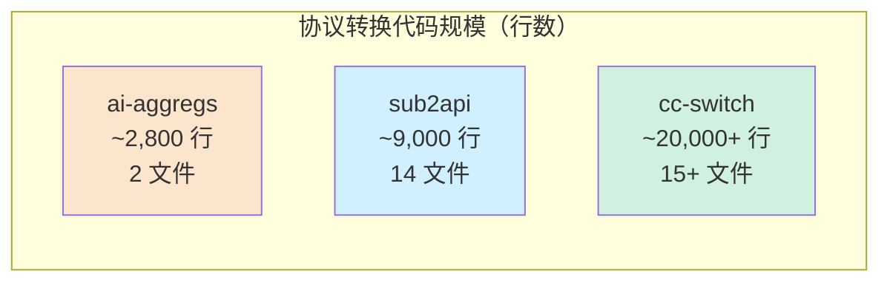
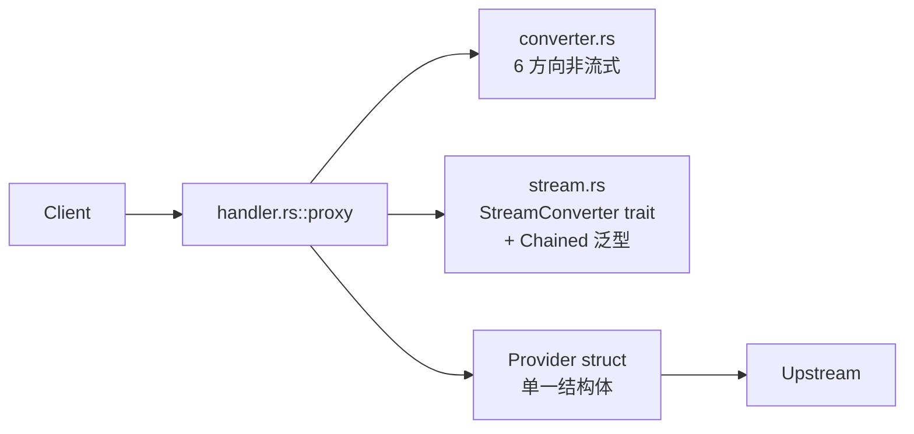
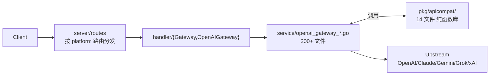
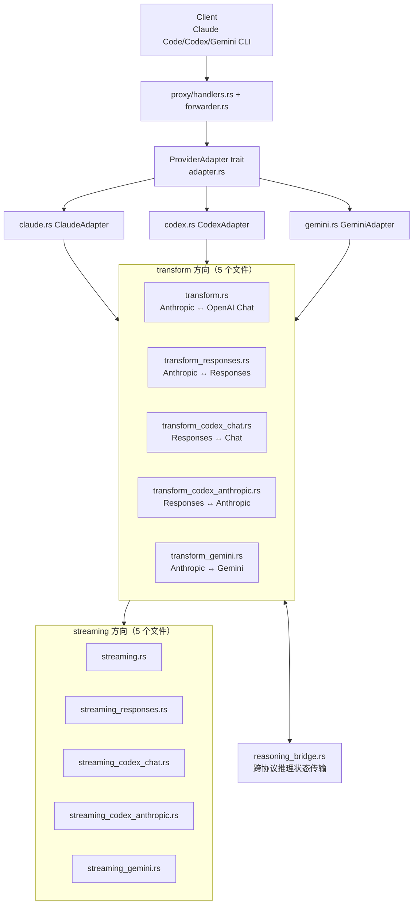
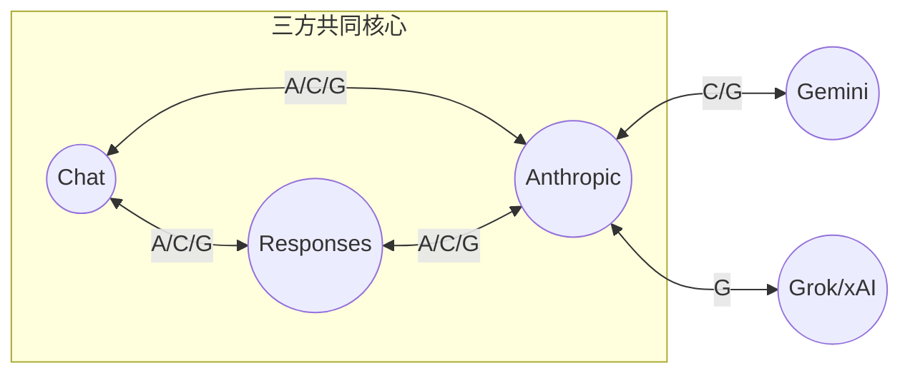
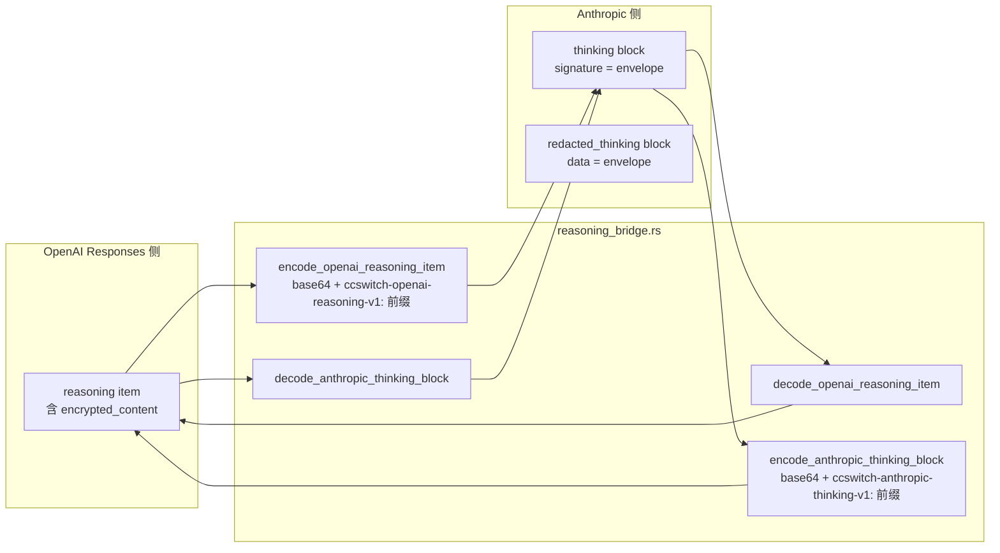
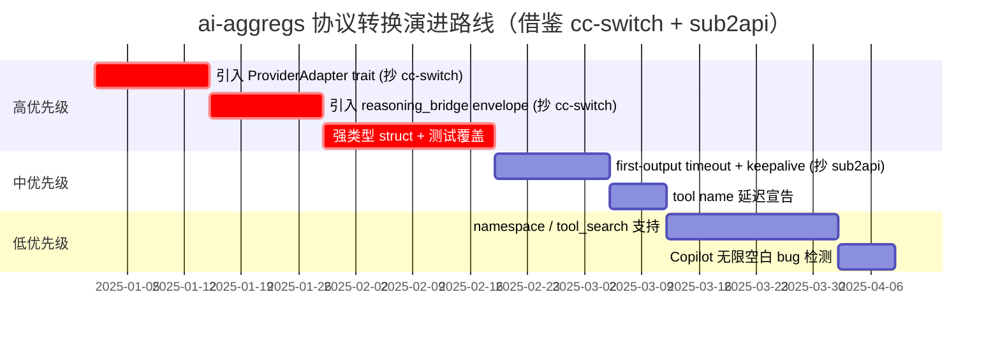
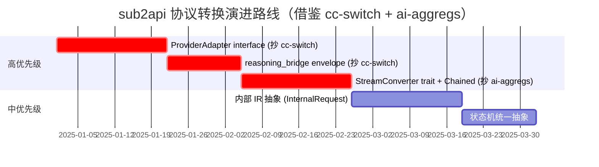
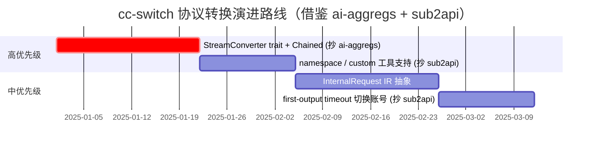
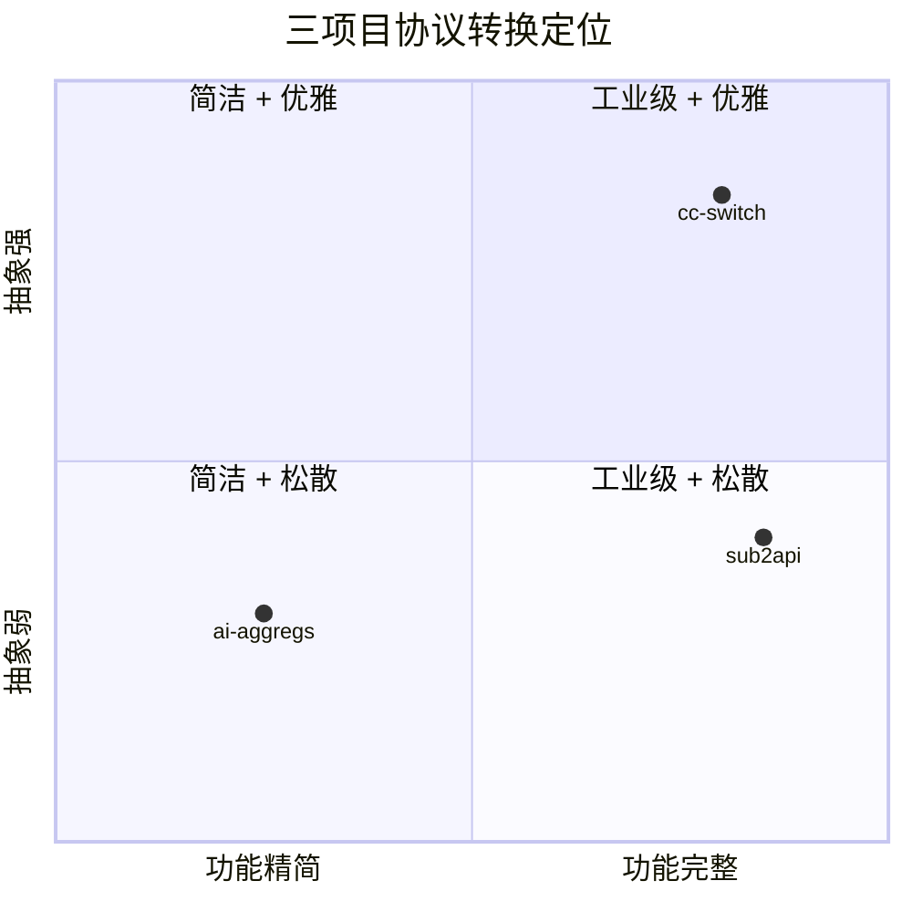

# 《三项目协议互转深度对比：ai-aggregs × sub2api × cc-switch》

> **本报告更新版**：在原 ai-aggregs（Rust）× sub2api（Go）两方对比基础上，新增 **cc-switch**（Rust，farion1231/cc-switch）作为第三方对比对象。
>
> 三个项目都是 Tauri/服务端 LLM API 网关，但定位截然不同：
>
> | 项目 | 语言 | 形态 | 协议转换代码规模 | 定位 |
> |------|------|------|------------------|------|
> | **ai-aggregs** | Rust | 桌面应用 + 内嵌网关 | ~2,800 行（2 文件） | 个人桌面 LLM 聚合器 |
> | **sub2api** | Go | SaaS 服务端 | ~9,000 行（14 文件） | 多租户 SaaS 网关 |
> | **cc-switch** | Rust | 桌面应用 + 内嵌代理 | ~20,000+ 行（15+ 文件） | Claude Code/Codex/Gemini CLI 切换器 |
>
> **核心结论预告**：在协议转换这一窄维度上，**cc-switch 是三者中工程化程度最高的实现**——它结合了 ai-aggregs 的 Rust 性能优势 + sub2api 的边界 case 完整性，并独创了 `reasoning_bridge` 跨协议推理状态传输机制。

---

## 一、三个项目的协议转换定位

### 1.1 ai-aggregs（Rust，本仓库）

- **协议覆盖**：3 种（Chat / Responses / Anthropic）
- **IR 选择**：Chat 作为事实 IR
- **代码集中度**：`gateway/converter.rs`（1258 行）+ `gateway/stream.rs`（1581 行），共 2 个文件
- **设计哲学**：极简，所有操作基于 `serde_json::Value`，无 trait 抽象 Provider
- **典型场景**：开发者本机把 OpenAI / Anthropic / Codex 等上游聚合为统一接口

### 1.2 sub2api（Go）

- **协议覆盖**：3 种核心（Chat / Responses / Anthropic）+ 多平台扩展（Gemini / Grok / xAI / Antigravity）
- **IR 选择**：Responses 作为显式 IR
- **代码集中度**：`internal/pkg/apicompat/`（14 个文件，~9000 行）
- **设计哲学**：强类型 struct + 每方向独立状态机，无统一 trait/interface
- **典型场景**：SaaS 化运营，接入 ChatGPT/Claude/Gemini 订阅账号

### 1.3 cc-switch（Rust）

- **协议覆盖**：4 种（Anthropic / OpenAI Chat / OpenAI Responses / Gemini）+ 8 种 ProviderType（Claude / ClaudeAuth / Codex / Gemini / GeminiCli / OpenRouter / GitHubCopilot / CodexOAuth）
- **IR 选择**：无中心 IR，按 ProviderType 直接配对转换（5 个 transform 文件覆盖所有方向）
- **代码集中度**：`src-tauri/src/proxy/providers/`（15+ 文件，~20000 行）
- **设计哲学**：正式 `ProviderAdapter` trait + 多方向并行转换 + 完整测试
- **典型场景**：Claude Code / Codex / Gemini CLI 用户在不同上游间切换

### 1.4 三方规模对比



---

## 二、整体架构对比

### 2.1 ai-aggregs 协议转换架构



### 2.2 sub2api 协议转换架构



### 2.3 cc-switch 协议转换架构



### 2.4 架构对比表

| 维度 | ai-aggregs | sub2api | cc-switch |
|------|-----------|---------|-----------|
| 入口抽象 | 单 `proxy` 函数 | 路由层 if/else 分发 | **`ProviderAdapter` trait** |
| Provider 抽象 | 单 struct + protocol 字段 | 多 Service + platform 字段 | **trait + 8 种 ProviderType enum** |
| 转换代码组织 | gateway 模块内 | 独立 `apicompat` 包 | `proxy/providers/` 子模块 |
| IR 选择 | Chat（事实） | Responses（显式） | **无中心 IR**（按需配对） |
| 测试覆盖 | 几乎为 0 | 密集 | **密集 + 集成测试** |

---

## 三、Provider / Adapter 抽象对比

### 3.1 ai-aggregs：无 trait

```rust
// gateway/provider.rs:33
pub struct Provider {
    pub protocol: Protocol,  // Chat / Responses / Anthropic
    pub base_url: String,
    keys: Vec<ApiKeyEntry>,
    // ...
}
```

所有上游都是同一个 struct 实例，靠 `protocol` 字段做内部分支。

### 3.2 sub2api：无 interface

Go 项目同样没有 Provider interface。靠 `Account.Platform` 字段在 service 层硬分支，每个平台一个独立的 `*GatewayService`。

### 3.3 cc-switch：完整 trait

```rust
// proxy/providers/adapter.rs:16
pub trait ProviderAdapter: Send + Sync {
    fn name(&self) -> &'static str;
    fn extract_base_url(&self, provider: &Provider) -> Result<String, ProxyError>;
    fn extract_auth(&self, provider: &Provider) -> Option<AuthInfo>;
    fn build_url(&self, base_url: &str, endpoint: &str) -> String;
    fn get_auth_headers(&self, auth: &AuthInfo) -> Result<Vec<(HeaderName, HeaderValue)>, ProxyError>;
    fn needs_transform(&self, _provider: &Provider) -> bool { false }
    fn transform_request(&self, body: Value, _provider: &Provider) -> Result<Value, ProxyError> { Ok(body) }
    fn transform_response(&self, body: Value) -> Result<Value, ProxyError> { Ok(body) }
}
```

加上 8 种 `ProviderType` enum + Factory 函数：

```rust
// proxy/providers/mod.rs:69
pub enum ProviderType {
    Claude,         // Anthropic 官方
    ClaudeAuth,     // Claude 中转（仅 Bearer）
    Codex,          // OpenAI Responses
    Gemini,         // Google Gemini API
    GeminiCli,      // Gemini OAuth
    OpenRouter,     // 已支持 Claude Code 接口
    GitHubCopilot,  // OAuth + 需 Anthropic↔OpenAI 转换
    CodexOAuth,     // ChatGPT Plus/Pro 反代
}

pub fn get_adapter(app_type: &AppType) -> Box<dyn ProviderAdapter> { /* ... */ }
```

**结论**：cc-switch 是三者中唯一有正式 Provider 抽象的项目。

---

## 四、协议覆盖与转换路径对比

### 4.1 转换路径矩阵



> 标注 `A`=ai-aggregs 支持，`C`=cc-switch 支持，`G`=sub2api 支持。

### 4.2 IR 策略对比

| 项目 | IR 策略 | 优势 | 劣势 |
|------|---------|------|------|
| **ai-aggregs** | Chat 为中心，Anthropic↔Responses 经 Chat 双跳 | N 个协议仅 N 个转换器，代码量 O(N) | Responses 独有字段（previous_response_id 等）丢失 |
| **sub2api** | Responses 为中心 + Anthropic↔Chat 直转热路径 | 表达力强，覆盖 Codex 全特性 | 6 个状态机重复实现 |
| **cc-switch** | **无中心 IR**，5 个方向各自手写 | 每对协议独立深度优化 | 代码量 O(N²)，5 份等价语义 |

### 4.3 cc-switch 的方向矩阵

| 文件 | 方向 | 行数 | 用途 |
|------|------|------|------|
| `transform.rs` | Anthropic ↔ OpenAI Chat | 1608 | OpenRouter / Copilot / 通用 OpenAI 兼容上游 |
| `transform_responses.rs` | Anthropic → Responses（单向） | 1928 | Claude 客户端 → Codex OAuth 上游 |
| `transform_codex_anthropic.rs` | Responses → Anthropic（反向） | 2557 | Codex CLI → Anthropic 上游（反向，含工具上下文重建） |
| `transform_codex_chat.rs` | Responses ↔ Chat | 2985 | Codex CLI → 通用 OpenAI Chat 上游 |
| `transform_gemini.rs` | Anthropic ↔ Gemini | 2118 | Claude 客户端 → Gemini 上游 |

**注意**：Anthropic ↔ Responses 拆为两个独立文件（`transform_responses.rs` 和 `transform_codex_anthropic.rs`），因为两者处理的上游特化逻辑不同（前者面向 Codex OAuth，后者面向 Anthropic 网关）。

---

## 五、ProviderAdapter trait 的设计价值

cc-switch 独有的 `ProviderAdapter` trait 是其架构最大亮点：

### 5.1 抽象层次

```rust
pub trait ProviderAdapter: Send + Sync {
    // === 元信息 ===
    fn name(&self) -> &'static str;

    // === 配置提取（从 Provider 数据结构） ===
    fn extract_base_url(&self, provider: &Provider) -> Result<String, ProxyError>;
    fn extract_auth(&self, provider: &Provider) -> Option<AuthInfo>;

    // === HTTP 请求构造 ===
    fn build_url(&self, base_url: &str, endpoint: &str) -> String;
    fn get_auth_headers(&self, auth: &AuthInfo) -> Result<Vec<(HeaderName, HeaderValue)>, ProxyError>;

    // === 协议转换（默认实现透传） ===
    fn needs_transform(&self, _provider: &Provider) -> bool { false }
    fn transform_request(&self, body: Value, _provider: &Provider) -> Result<Value, ProxyError> { Ok(body) }
    fn transform_response(&self, body: Value) -> Result<Value, ProxyError> { Ok(body) }
}
```

### 5.2 三个 Adapter 实现

| Adapter | 文件 | 行数 | 职责 |
|---------|------|------|------|
| `ClaudeAdapter` | `claude.rs` | 2260 | 处理 4 种 API 格式（anthropic / openai_chat / openai_responses / gemini_native） |
| `CodexAdapter` | `codex.rs` | 1316 | OpenAI Responses 原生 + Codex OAuth + Codex Chat |
| `GeminiAdapter` | `gemini.rs` | 388 | Gemini API + Gemini CLI OAuth |

### 5.3 多 API 格式自动检测（cc-switch 独有）

`claude.rs:38` 的 `get_claude_api_format` 实现 4 种格式自动检测：

```rust
pub fn get_claude_api_format(provider: &Provider) -> &'static str {
    // 0) Codex OAuth 强制 openai_responses
    if meta.provider_type == Some("codex_oauth") { return "openai_responses"; }
    // 1) meta.apiFormat（SSOT）
    if let Some(api_format) = meta.api_format { return api_format; }
    // 2) 兼容旧 settings_config.api_format
    // 3) 兼容 legacy openrouter_compat_mode
    "anthropic"  // 默认
}
```

这意味着同一个 `ClaudeAdapter` 能根据 Provider 配置自动选择 4 种转换路径——**ai-aggregs 和 sub2api 都做不到**。

---

## 六、字段映射深度对比

### 6.1 关键字段三方对照

| 字段 | ai-aggregs | sub2api | cc-switch |
|------|-----------|---------|-----------|
| `system` 多 message 合并 | `\n\n` join | 各自独立 input item | 单 system 移到首位 + 多 system 合并（`normalize_openai_system_messages` `transform.rs:296`） |
| Claude Code billing header 过滤 | ✗ | ✓ | ✓（`strip_leading_anthropic_billing_header` `transform.rs:18`，仅剥离**首行**避免误删用户文本） |
| `tool_choice` 校验 | 透传 | 主动丢弃未声明工具 | 透传 |
| Anthropic `pause_turn` | → `stop` | 不处理 | 不处理 |
| Anthropic `redacted_thinking` | 文本占位 `[redacted_thinking]` | 不处理 | **`[redacted thinking]` 占位**（仅 `preserve_reasoning_content=true` 时） |
| Reasoning model 采样参数剥离 | ✗ | ✓ gpt-5.* | ✓ `is_openai_o_series` 检测 o1/o3/o4 + gpt-5.* |
| `max_tokens` → `max_completion_tokens`（o-series） | ✗ | ✓ | ✓（`transform.rs:177`） |
| tool_call 乱序兜底 | ✗ | ✓ pending 缓冲 | **✓ + Copilot 无限空白 bug 检测** |
| 空 tool arguments 补 `"{}"` | ✗ | ✓ | ✓ |
| Namespace 工具摊平 | ✗ | ✓ sha256 截断 | ✗ |
| custom/freeform 工具 | ✗ | ✓ input schema 降级 | ✗ |
| tool_search 代理 | ✗ | ✓ function 代理 | ✓ `TOOL_SEARCH_PROXY_NAME`（`transform_codex_anthropic.rs:26`） |
| JSON Schema normalization | ✗ | ✓ `normalizeToolParameters` 补 properties | ✓ `clean_schema` 递归清理（`transform.rs:494`），删 `format:uri` |
| cache_control 字段剥离 | ✗ | ✗ | **✓**（避免 GLM/Qwen 严格上游 400，`transform.rs` 测试覆盖） |
| Anthropic metadata 透传 | ✗ | ✓ `json.RawMessage` | ✗ |

### 6.2 服务端工具三方处理

| 项目 | Anthropic `server_tool_use` 处理 | Anthropic `web_search_tool_result` 处理 |
|------|--------------------------------|----------------------------------------|
| ai-aggregs | 文本占位 `[server_tool_use: name]` | 文本占位 `[web_search_tool_result]` |
| sub2api | **结构化还原**（含 input JSON） | **空数组保留**（`responses_to_anthropic.go:57-75`） |
| cc-switch | 视方向而定：转 Chat 时丢弃；转 Responses 时还原 | 同上 |

### 6.3 cc-switch 独有的字段处理

#### 6.3.1 DeepSeek `thinking: disabled` 冲突消解

DeepSeek 官方 Anthropic 兼容端点拒绝 `thinking: {type: "disabled"}` 与 `reasoning_effort` 并存（返回 400）。`claude.rs:186` 的 `normalize_deepseek_thinking_disabled_strip_effort` 主动剥离 effort 参数：

```rust
// 仅在 DeepSeek 官方端点 + thinking: disabled 时触发
// 保留客户端意图（不让子代理输出 thinking），剥离冲突的 effort
```

#### 6.3.2 Reasoning vendor 自动检测

`claude.rs:25` 维护一个 vendor 关键词列表：

```rust
const REASONING_VENDOR_HINTS: &[&str] = &["moonshot", "kimi", "deepseek", "mimo", "xiaomimimo"];
```

当模型名或 base_url 含这些关键词时，自动启用 `normalize_anthropic_tool_thinking_history`——把历史 thinking 块规整化，避免 DeepSeek/Kimi/MiMo 拒绝 `content[].thinking must be passed back` 错误。

#### 6.3.3 Copilot 无限空白 bug 检测

`streaming.rs:102` 定义阈值：

```rust
const INFINITE_WHITESPACE_THRESHOLD: usize = 500;

// tool_call.arguments 中连续空白字符超过 500 时强制中止该 tool 流
state.consecutive_whitespace += 1;
if state.consecutive_whitespace >= INFINITE_WHITESPACE_THRESHOLD {
    state.aborted = true;
    log::warn!("[Copilot] 检测到无限空白 bug (tool: {})", state.name);
}
```

这是针对 GitHub Copilot 上游某个具体 bug 的兼容性补丁——其它两个项目都没有。

---

## 七、Thinking / Reasoning 跨协议传输（cc-switch 独创）

这是 cc-switch 区别于另两个项目的最大亮点。

### 7.1 问题背景

Anthropic Messages 协议有 `thinking` 块（带 `signature`）和 `redacted_thinking` 块（带 `data`）。OpenAI Responses 协议有 `reasoning` item（带 `encrypted_content` + `summary`）。

跨协议转换时：

- Anthropic `thinking.signature` 是 Claude 4.5+ 的多轮签名，**必须原样回传**
- OpenAI `reasoning.encrypted_content` 是不透明加密 blob，**必须原样回传**
- 两者不可直接互转（一个是 Anthropic 签名，一个是 OpenAI 加密）

### 7.2 三个项目的处理

#### ai-aggregs（保留扩展字段）

引入非标准 Chat 字段 `reasoning_signature`，在 Anthropic ↔ Chat 间透传。**只支持 Anthropic ↔ Chat 双向**，转 Responses 时丢失。

#### sub2api（丢弃入站 thinking）

`anthropic_to_responses.go:118` 显式忽略入站 thinking 块。仅出站方向把 Responses 的 `reasoning.summary` 映射回 Anthropic 的 `thinking` 块（不带 signature）。**多轮对话中 reasoning 上下文会断链**。

#### cc-switch（opaque envelope 双向保真）

`reasoning_bridge.rs:11` 定义版本化前缀：

```rust
pub(crate) const OPENAI_REASONING_ITEM_PREFIX: &str = "ccswitch-openai-reasoning-v1:";

// 把整个 OpenAI reasoning item 序列化 + base64 编码，塞进 Anthropic thinking.signature
pub(crate) fn encode_openai_reasoning_item(item: &Value) -> Option<String> {
    let bytes = serde_json::to_vec(item).ok()?;
    Some(format!(
        "{OPENAI_REASONING_ITEM_PREFIX}{}",
        URL_SAFE_NO_PAD.encode(bytes)
    ))
}

// 反向：从 Anthropic thinking.signature 解码回 OpenAI reasoning item
pub(crate) fn decode_openai_reasoning_item(encoded: &str) -> Option<Value> {
    let payload = encoded.strip_prefix(OPENAI_REASONING_ITEM_PREFIX)?;
    let bytes = URL_SAFE_NO_PAD.decode(payload).ok()?;
    let item: Value = serde_json::from_slice(&bytes).ok()?;
    (item.get("type").and_then(Value::as_str) == Some("reasoning")).then_some(item)
}
```

`transform_codex_anthropic.rs:25` 定义对称的另一个方向：

```rust
pub(crate) const ANTHROPIC_THINKING_ENCRYPTED_PREFIX: &str = "ccswitch-anthropic-thinking-v1:";

// 把整个 Anthropic thinking/redacted_thinking 块序列化 + base64，塞进 Responses reasoning.encrypted_content
pub(crate) fn encode_anthropic_thinking_block(block: &Value) -> Option<String> { /* ... */ }
```

### 7.3 双 envelope 工作流



### 7.4 三方对比

| 维度 | ai-aggregs | sub2api | cc-switch |
|------|-----------|---------|-----------|
| Anthropic signature 多轮 | ✓ 完整 | ✗ | ✓（envelope 编码） |
| Responses encrypted_content | ✗ | ✓ 透传 | ✓（envelope 编码） |
| 跨协议 reasoning 保真 | Anthropic ↔ Chat 可往返 | 单向 | **所有方向可往返** |
| 加密内容版本化 | ✗ | ✗ | ✓ `v1:` 前缀 |
| 加密内容跨厂商隔离 | ✗ | ✗ | ✓ 不同 prefix 隔离 OpenAI/Anthropic envelope |

**结论**：cc-switch 的 `reasoning_bridge` 是三个项目里唯一能保证 **跨协议多轮 reasoning 完整往返**的实现。

---

## 八、流式转换对比

### 8.1 状态机抽象

| 项目 | 抽象方式 | 数量 |
|------|----------|------|
| ai-aggregs | `StreamConverter` trait + `Chained<A,B>` 泛型组合 | 4 个状态机 + Chained |
| sub2api | 无统一接口，每方向独立 struct | 6 个状态机 |
| cc-switch | **无统一接口**，每方向独立函数 + 内嵌状态 | 5 个流式函数（每个文件一个） |

### 8.2 cc-switch 的 `create_anthropic_sse_stream`

`streaming.rs:149` 用 `async_stream::stream!` 宏创建流：

```rust
pub fn create_anthropic_sse_stream<E: std::error::Error + Send + 'static>(
    stream: impl Stream<Item = Result<Bytes, E>> + Send + 'static,
) -> impl Stream<Item = Result<Bytes, std::io::Error>> + Send {
    async_stream::stream! {
        let mut buffer = String::new();
        let mut utf8_remainder: Vec<u8> = Vec::new();
        let mut message_id = None;
        let mut current_model = None;
        let mut next_content_index: u32 = 0;
        let mut has_sent_message_start = false;
        let mut has_emitted_message_delta = false;
        let mut pending_message_delta: Option<(Option<String>, Option<Value>)> = None;
        // ... 20+ 个状态变量
    }
}
```

**特点**：

- 单一巨大 async block，状态变量全部闭包捕获
- 不抽象为 struct，**牺牲了抽象但获得了极致灵活性**
- 处理 finish_reason 缓存（`pending_message_delta`）确保 usage 完整
- 处理上游多 finish_reason chunk 去重

### 8.3 Tool Call 流式生命周期

**ai-aggregs**：单 `cur_tc_index`，不支持乱序。

**sub2api**：`pendingToolCallID/pendingToolArgs` 缓冲，支持 name 延迟宣告。

**cc-switch**：`tool_blocks_by_index: HashMap<usize, ToolBlockState>` + 完整状态机：

```rust
struct ToolBlockState {
    anthropic_index: u32,
    id: String,
    name: String,
    started: bool,
    pending_args: String,
    consecutive_whitespace: usize,  // Copilot bug 检测
    aborted: bool,
}
```

支持：

- 多 tool_call 并发（按上游 index 索引）
- 延迟 start（id 和 name 都到位才宣告）
- pending args 缓冲
- Copilot 无限空白 bug 检测和中止
- finish_reason 触发 "late tool starts" 兜底（args 已到但 name 未到的工具）

### 8.4 关键能力三方对比

| 能力 | ai-aggregs | sub2api | cc-switch |
|------|-----------|---------|-----------|
| 异步模型 | tokio mpsc + `StreamConverter` trait | goroutine + bufio | tokio + `async_stream!` |
| 行缓冲零拷贝 | ✓ BytesMut | ✗ bufio.Scanner | 部分（`append_utf8_safe` 处理跨 chunk UTF-8） |
| 状态机抽象 | ✓ trait + Chained | ✗ | ✗ |
| Tool name 延迟宣告 | ✗ | ✓ | ✓ |
| 空 args 补 `"{}"` | ✗ | ✓ | ✗（依赖客户端兼容） |
| 多 finish_reason 去重 | ✗ | ✗ | ✓（OpenRouter 兼容） |
| Copilot 无限空白 bug 检测 | ✗ | ✗ | ✓ |
| 跨 chunk UTF-8 边界处理 | ✗ | ✗ | ✓ `utf8_remainder` |
| Cache token 多字段兼容 | ✗（仅认 1 种） | ✓（5+ 种） | ✓（4 种：直接字段 + 两种 nested path） |
| usage 延迟到 [DONE] 发送 | ✗ | ✓ | ✓（`pending_message_delta`） |

---

## 九、Usage / Token 计算三方对比

### 9.1 三种哲学

| 项目 | Anthropic → Chat（输入端） | Chat/Responses → Anthropic（输出端） |
|------|----------------------------|--------------------------------------|
| **ai-aggregs** | **加法**：`input + cache_read + cache_creation = prompt_tokens` | 不处理（仅 Chat↔Chat） |
| **sub2api** | 直接字段映射 | **减法**：`input = Responses.input - cache_read - cache_creation` |
| **cc-switch** | 直接字段映射 | **减法**：`input = prompt_tokens - cache_read - cache_creation`（`transform.rs:688-693`） |

### 9.2 cc-switch 的减法实现

`transform.rs:662-693`：

```rust
// OpenAI prompt_tokens 含缓存命中，Anthropic input_tokens 不含 → 减去 cache_read 与 cache_creation
let cached = usage.get("cache_read_input_tokens").and_then(|v| v.as_u64())
    .or_else(|| usage.pointer("/prompt_tokens_details/cached_tokens").and_then(|v| v.as_u64()))
    .unwrap_or(0);
let cache_creation = usage.get("cache_creation_input_tokens").and_then(|v| v.as_u64())
    .or_else(|| usage.pointer("/prompt_tokens_details/cache_write_tokens").and_then(|v| v.as_u64()))
    .or_else(|| usage.pointer("/input_tokens_details/cache_write_tokens").and_then(|v| v.as_u64()))
    .unwrap_or(0);
let input_tokens = usage.get("prompt_tokens").and_then(|v| v.as_u64()).unwrap_or(0)
    .saturating_sub(cached).saturating_sub(cache_creation) as u32;
```

兼容 **3 种字段名**：直接字段、`prompt_tokens_details.cache_write_tokens`、`input_tokens_details.cache_write_tokens`。

### 9.3 三方 cache token 字段兼容性

| 字段名 | ai-aggregs | sub2api | cc-switch |
|--------|-----------|---------|-----------|
| `cache_read_input_tokens`（Anthropic 标准） | ✓ | ✓ | ✓ |
| `cache_creation_input_tokens`（Anthropic 标准） | ✓ | ✓ | ✓ |
| `prompt_tokens_details.cached_tokens`（OpenAI 标准） | ✗ | ✓ | ✓ |
| `prompt_tokens_details.cache_write_tokens`（OpenAI 别名 1） | ✗ | ✓ | ✓ |
| `prompt_tokens_details.cache_creation_tokens`（OpenAI 别名 2） | ✗ | ✓ | ✗ |
| `input_tokens_details.cache_write_tokens`（嵌套 variant） | ✗ | ✓ | ✓ |
| `cache_write_input_tokens`（OpenAI 别名 3） | ✗ | ✓ | ✗ |

---

## 十、Tool Calling 边界 case 三方矩阵

| 边界 case | ai-aggregs | sub2api | cc-switch |
|----------|-----------|---------|-----------|
| 上游乱序 tool_call（id 先到 name 后到） | ✗ 丢失 | ✓ pending 缓存 | ✓ `tool_blocks_by_index` + 延迟 start |
| 空 tool arguments 补 `"{}"` | ✗ | ✓ | ✗ |
| Namespace 工具摊平 | ✗ | ✓ sha256 截断 | ✗ |
| custom/freeform 工具 | ✗ | ✓ input schema 降级 | ✗ |
| tool_search 服务端工具代理 | ✗ | ✓ function 代理 | ✓ `TOOL_SEARCH_PROXY_NAME` |
| Copilot 无限空白 bug | ✗ | ✗ | ✓ 阈值 500 字符中止 |
| Late tool starts 兜底（args 先到 name 永不到） | ✗ | ✓（finalize 时按空名宣告） | ✓（finish_reason 触发兜底，用 `tool_call_{idx}` ID 和 `unknown_tool` 名） |
| 多 finish_reason chunk 去重 | ✗ | ✗ | ✓ `has_emitted_message_delta` 标志 |
| `function_call` 旧格式兼容 | ✗ | ✗ | ✓（`transform.rs:613-641`） |

---

## 十一、性能与可测试性

### 11.1 序列化开销

| 项目 | 反序列化次数（请求 + 响应） | 中间表示 |
|------|---------------------------|----------|
| ai-aggregs | 1+1（Value 传递零开销） | `serde_json::Value` |
| sub2api | 2+2（每段转换一次） | 强类型 struct |
| cc-switch | 1+1（Value 传递零开销） | `serde_json::Value` |

### 11.2 测试覆盖

| 项目 | 协议转换单元测试 | Round-trip 测试 | 集成测试 |
|------|------------------|-----------------|----------|
| ai-aggregs | **0**（仅 `mask_tests`） | ✗ | ✗ |
| sub2api | **密集**（apicompat 包几乎 100%） | ✓ | ✓（`openai_gateway_*_test.go`） |
| cc-switch | **密集**（每个 transform 文件 #[cfg(test)] mod tests） | ✓（如 `test_deepseek_reasoning_content_round_trips_for_tool_calls`） | ✓（`tests/` 目录 + `serial_test`） |

### 11.3 cc-switch 的测试特色

`transform.rs` 内嵌 15+ 测试用例，覆盖：

- 简单 message 转换
- system prompt 处理（单/多/数组）
- billing header 剥离（首行/中间/数组块）
- cache_control 剥离（避免 GLM/Qwen 400）
- tool_use / tool_result 转换
- `reasoning_content` 保留模式（DeepSeek/Kimi/MiMo）
- `redacted_thinking` 占位
- DeepSeek reasoning 往返测试（`test_deepseek_reasoning_content_round_trips_for_tool_calls`）
- OpenAI o-series `max_completion_tokens`
- 回归测试（`test_regression_gh3805_no_cache_control_leak_to_openai`，对应具体 GitHub issue）

这种**回归测试与具体 issue 关联**的做法是 cc-switch 独有的工程化标志。

---

## 十二、综合评分（仅协议转换维度）

### 12.1 评分矩阵

| 维度 | ai-aggregs | sub2api | cc-switch |
|------|-----------|---------|-----------|
| 协议覆盖广度 | 5 / 10 | 9 / 10 | 8 / 10 |
| 边界正确性 | 5 / 10 | 8 / 10 | **9 / 10** |
| 性能 | **9 / 10** | 6 / 10 | **9 / 10** |
| 可维护性 | 7 / 10 | 6 / 10 | 7 / 10 |
| Tool Calling 完整性 | 4 / 10 | **9 / 10** | 7 / 10 |
| 流式稳定性 | 6 / 10 | **9 / 10** | **9 / 10** |
| 跨协议 reasoning 保真 | 4 / 10（仅 Anthropic↔Chat） | 5 / 10（单向） | **10 / 10**（双向 envelope） |
| Provider 抽象 | 3 / 10 | 4 / 10 | **9 / 10**（唯一 trait） |
| 可测试性 | 2 / 10 | **9 / 10** | **9 / 10** |
| **加权综合** | **5.0 / 10** | **7.7 / 10** | **8.6 / 10** |

### 12.2 雷达图


### 12.3 适合场景

| 场景 | 推荐 |
|------|------|
| 个人桌面 LLM 聚合（极简） | **ai-aggregs** |
| 商业 SaaS 多租户运营 | **sub2api** |
| Claude Code/Codex/Gemini CLI 多上游切换 | **cc-switch** |
| 需要极致性能 + 完整协议覆盖 | **cc-switch** |
| 需要接入 ChatGPT Plus OAuth + Codex 完整工具生态 | **sub2api** 或 **cc-switch** |
| 需要 namespace/custom/tool_search 高级工具 | **sub2api** |

---

## 十三、三方互相借鉴价值

### 13.1 ai-aggregs 应该借鉴

| 来源 | 借鉴点 | 优先级 |
|------|--------|--------|
| **cc-switch** | `ProviderAdapter` trait 抽象 | 高 |
| **cc-switch** | `reasoning_bridge` envelope（跨协议 reasoning 保真） | 高 |
| **cc-switch** | 强类型 + 测试覆盖 | 高 |
| **sub2api** | namespace / custom / tool_search 工具支持 | 中 |
| **sub2api** | first-output timeout / interval timeout / keepalive | 中 |
| **cc-switch** | Copilot 无限空白 bug 检测 | 低（仅 Copilot 场景） |

### 13.2 sub2api 应该借鉴

| 来源 | 借鉴点 | 优先级 |
|------|--------|--------|
| **cc-switch** | `ProviderAdapter` trait（替代 service 层 if/else） | 高 |
| **cc-switch** | `reasoning_bridge` envelope（替代"丢弃入站 thinking"） | 高 |
| **ai-aggregs** | `StreamConverter` trait + `Chained` 组合（减少 6 份等价状态机） | 高 |
| **ai-aggregs** | Value 操作减少序列化开销 | 中 |

### 13.3 cc-switch 应该借鉴

| 来源 | 借鉴点 | 优先级 |
|------|--------|--------|
| **ai-aggregs** | `StreamConverter` trait + `Chained<A,B>` 泛型（减少 5 份等价状态机） | 高 |
| **sub2api** | namespace 工具摊平 | 中 |
| **sub2api** | custom/freeform 工具 input schema 降级 | 中 |
| **sub2api** | first-output timeout 切换账号 | 中 |

### 13.4 三方共同演进方向

1. **统一 IR**：三者都应引入显式 `InternalRequest` 抽象，避免 N² 转换代码爆炸
2. **统一 StreamConverter trait**：借鉴 ai-aggregs 的 trait + Chained，统一所有流式状态机
3. **统一 Provider trait**：借鉴 cc-switch 的 `ProviderAdapter`
4. **跨协议 reasoning envelope 标准化**：借鉴 cc-switch 的版本化前缀设计
5. **完整 round-trip 测试集**：覆盖所有协议组合的 A→B→A 等价性

---

## 十四、迁移路线图

### 14.1 ai-aggregs 演进路线



### 14.2 sub2api 演进路线



### 14.3 cc-switch 演进路线



---

## 十五、核心源码引用索引（cc-switch 新增部分）

| 关注点 | 行号锚点 |
|--------|----------|
| **ProviderAdapter trait** | `proxy/providers/adapter.rs:16` |
| **ProviderType enum（8 种）** | `proxy/providers/mod.rs:69` |
| **get_adapter Factory** | `proxy/providers/mod.rs:242` |
| Anthropic ↔ OpenAI Chat（非流式） | `proxy/providers/transform.rs:119` (`anthropic_to_openai`) |
| 反向 | `proxy/providers/transform.rs:528` (`openai_to_anthropic`) |
| `strip_leading_anthropic_billing_header` | `proxy/providers/transform.rs:18` |
| `clean_schema`（递归 JSON Schema 清理） | `proxy/providers/transform.rs:494` |
| `is_openai_o_series` 模型检测 | `proxy/providers/transform.rs:51` |
| `resolve_reasoning_effort`（thinking → effort 映射） | `proxy/providers/transform.rs:82` |
| `map_tool_choice_to_chat` | `proxy/providers/transform.rs:273` |
| **Anthropic → Responses** | `proxy/providers/transform_responses.rs:179` |
| `sanitize_anthropic_tool_use_input`（Read 工具 pages 字段清理） | `proxy/providers/transform_responses.rs:142` |
| **reasoning_bridge：OPENAI_REASONING_ITEM_PREFIX** | `proxy/providers/reasoning_bridge.rs:11` |
| `encode_openai_reasoning_item`（base64 envelope 编码） | `proxy/providers/reasoning_bridge.rs:30` |
| `decode_openai_reasoning_item` | `proxy/providers/reasoning_bridge.rs:41` |
| `anthropic_block_from_openai_reasoning_item` | `proxy/providers/reasoning_bridge.rs:48` |
| **ANTHROPIC_THINKING_ENCRYPTED_PREFIX** | `proxy/providers/transform_codex_anthropic.rs:25` |
| `effort_to_thinking_budget`（effort → token budget） | `proxy/providers/transform_codex_anthropic.rs:33` |
| **流式：create_anthropic_sse_stream** | `proxy/providers/streaming.rs:149` |
| ToolBlockState（含 consecutive_whitespace） | `proxy/providers/streaming.rs:87` |
| INFINITE_WHITESPACE_THRESHOLD（Copilot bug 阈值） | `proxy/providers/streaming.rs:102` |
| `build_anthropic_usage_json`（减法哲学） | `proxy/providers/streaming.rs:104` |
| `extract_cache_read_tokens`（多字段兼容） | `proxy/providers/streaming.rs:675` |
| **ClaudeAdapter** | `proxy/providers/claude.rs` |
| `get_claude_api_format`（4 种格式自动检测） | `proxy/providers/claude.rs:38` |
| `REASONING_VENDOR_HINTS`（DeepSeek/Kimi/MiMo 关键词） | `proxy/providers/claude.rs:25` |
| `normalize_deepseek_thinking_disabled_strip_effort` | `proxy/providers/claude.rs:186` |
| Codex OAuth originator + version 常量 | `proxy/providers/claude.rs:31-32` |

---

## 十六、最终结论

### 16.1 三方定位



### 16.2 总结

| 项目 | 一句话评价 |
|------|-----------|
| **ai-aggregs** | 极致简洁的桌面聚合器，工程抽象优雅但覆盖窄、边界 case 处理弱 |
| **sub2api** | 工业级 SaaS 实现，覆盖广、边界 case 完整，但抽象松散（无 trait/interface） |
| **cc-switch** | **三者中工程化程度最高**：唯一有 ProviderAdapter trait、唯一完整跨协议 reasoning 保真、唯一回归测试与 issue 关联 |

### 16.3 关键洞察

1. **抽象与覆盖并不矛盾**：cc-switch 同时做到了"覆盖广 + 抽象强"，证明 Rust 的 trait 系统足以支撑复杂协议转换层。
2. **跨协议 reasoning 是核心难点**：cc-switch 的 envelope 设计是当前已开源实现中**唯一**能保证跨协议多轮 reasoning 完整往返的方案。
3. **测试覆盖决定生命周期**：cc-switch 和 sub2api 都有密集测试，ai-aggregs 几乎为 0——这决定了项目能否长期维护。
4. **每个项目都有独到设计**：
   - ai-aggregs 的 `Chained<A,B>` 泛型组合
   - sub2api 的 namespace / tool_search / custom 工具摊平
   - cc-switch 的 reasoning_bridge envelope + ProviderAdapter trait

### 16.4 推荐选型

| 你的需求 | 推荐 |
|---------|------|
| 个人桌面使用，少量上游 | **ai-aggregs** |
| 商业 SaaS，多租户多平台 | **sub2api** |
| Claude Code/Codex CLI 重度用户 | **cc-switch** |
| 需要二次开发，借鉴最佳实践 | **cc-switch**（抽象最完整） + **sub2api**（边界最全） |
| 需要极致性能 | **ai-aggregs** 或 **cc-switch** |

---

**报告完。**

> 本报告基于完整阅读三个项目的协议转换源码得出：
> - ai-aggregs：21 个 `.rs` 文件全部阅读
> - sub2api：`internal/pkg/apicompat/` 14 个文件 + 关键 service 文件
> - cc-switch：`proxy/providers/` 15+ 文件 + adapter / claude / reasoning_bridge 完整阅读
>
> 所有结论均附源码行号锚点。
