# 《ai-aggregs × sub2api 协议互转架构对比分析报告》

> 评测对象：
>
> - **项目 A（Rust）**：`ai-aggregs`（Tauri v2 + Axum 内嵌 LLM API 网关，本地工作目录）
> - **项目 B（Go）**：`github.com/Wei-Shaw/sub2api`（Gin + ent 的多租户 SaaS 化 LLM API 网关）
>
> 分析重点：**LLM API 协议互转（Protocol Translation）** 的设计与实现。
>
> 撰写基线：完整阅读两个项目核心源码后产出。所有结论均引用具体源码位置（带行号锚点）。

---

## 0. TL;DR（执行摘要）

| 维度 | ai-aggregs (Rust) | sub2api (Go) |
|------|-------------------|--------------|
| 形态 | 桌面应用 + 内嵌网关（单进程） | 服务端 SaaS（独立部署） |
| 中间表示（IR） | **OpenAI Chat Completions**（事实 IR） | **OpenAI Responses API**（显式 IR） |
| 协议枚举 | `Protocol { Chat, Responses, Anthropic }` 3 种 | `Anthropic / Responses / Chat / Gemini / Grok / xAI / VertexAI / Antigravity …` 多平台多协议 |
| 转换实现 | 对 `serde_json::Value` 直接做无类型 JSON 重写 | 强类型 `struct`（`AnthropicRequest`、`ResponsesRequest`、`ChatCompletionsRequest` …）双向往返 |
| 流式抽象 | `StreamConverter` trait（`on_event` / `on_done`），支持 Chained 串联 | 每个方向一个 `XxxStreamState` 状态机，函数式无接口 |
| Provider 抽象 | **没有 Trait**，统一 `Provider` 结构体 + `protocol` 字段分发 | **没有 Interface**，按 `Platform` 字段在 service 层硬分支（`OpenAIGatewayService` / `GatewayService` …） |
| Tool Calling | messages/tools/tool_choice 完整映射；支持 thinking signature 多轮 | 同上，并额外支持 namespace 工具摊平、`tool_search` 代理、custom/freeform 工具降级 |
| 鉴权 | Bearer / x-api-key + 常量时间比较 | 多策略：APIKey、OAuth（Claude/ChatGPT/Gemini/xAI）、JWT、Turnstile … |
| 计费 | 仅 token 用量落 SQLite | 订阅 + 充值 + 促销码 + 网关层实时计费 |
| 复杂度 | 21 个 `.rs` 文件，约 6 千行核心代码 | 700+ `.go` 文件，service 层 ~1500 个文件，远超 10 万行 |

**核心结论**：两者在协议互转层走了**完全相反的两条路**。

- Rust 项目选择"**弱类型 + Chat 为中心 + 极简分发**"，依赖 `serde_json::Value` 直接重写 JSON，3 种协议 6 个方向全部手写，**Anthropic ↔ Responses 通过 Chat 中转（Chained StreamConverter）**。
- Go 项目选择"**强类型 + Responses 为中心 + 多平台特化**"，每种协议都有完整的 struct 系，**Anthropic ↔ Chat 同时保留"经 Responses 双跳"和"直转"两条路径**，后者作为热路径优化（`chatcompletions_anthropic_bridge.go`）。

---

## 第一部分：整体架构

### 1.1 Rust 项目架构（ai-aggregs）

整个 Rust 项目是一个 Tauri v2 桌面应用，Axum HTTP 网关嵌入在同一进程内，不暴露独立端口。源码集中在 `src-tauri/src/`，21 个 `.rs` 文件，按 `api / gateway / config / infra` 四个模块组织。

```mermaid
flowchart TB
    subgraph FE["前端 (Vue 3 + Tauri Webview)"]
        UI[features/*<br/>providers/chat/settings]
    end

    subgraph BE["Rust 后端 (src-tauri/src)"]
        direction TB
        Tauri[lib.rs<br/>Tauri Builder + Tray]
        IPC[api/commands.rs<br/>25 个 #[tauri::command]]

        subgraph GW["gateway 网关核心"]
            Mgr[manager.rs<br/>build_providers/start/stop]
            Prov[provider.rs<br/>Provider 结构体<br/>密钥轮转/黑名单/send]
            Conv[converter.rs<br/>req_convert / resp_convert<br/>非流式 6 方向]
            Stream[stream.rs<br/>StreamConverter trait<br/>stream_passthrough/convert]
        end

        subgraph HTTP["Axum HTTP 层"]
            Router[router.rs<br/>/v1/{models,chat/completions,responses,messages}]
            Handler[handler.rs<br/>proxy / list_models / auth]
            CORS[CORS 中间件]
        end

        subgraph CFG["config"]
            Types[types.rs<br/>Protocol/ApiKeyEntry/Config]
            State[state.rs<br/>AppCtrl/AppState]
        end

        subgraph INFRA["infra"]
            DB[db.rs<br/>SQLite Arc Mutex Connection]
            Err[error.rs<br/>AppError Axum + IpcError]
            LogBridge[log_bridge.rs]
            Tray[tray.rs]
            OpEncode[opencode.rs]
            ClaudeCode[claude_code.rs]
            Codex[codex.rs]
        end
    end

    Upstream[上游 Provider<br/>OpenAI / Anthropic / 其它]

    FE <-->|invoke / event| IPC
    IPC --> Mgr
    Mgr --> Prov
    Router --> Handler
    Handler -->|route| Prov
    Handler --> Conv
    Handler --> Stream
    Prov -->|reqwest| Upstream
    Upstream -->|SSE/JSON| Handler
```

**分层职责**：

| 层 | 文件 | 职责 |
|----|------|------|
| Router | `api/router.rs:11` | 注册 4 条路由：`/v1/models` GET、`/v1/chat/completions`、`/v1/responses`、`/v1/messages` POST；CORS 中间件 |
| Gateway Handler | `api/handler.rs:13` | 唯一的 `proxy` 函数：路径判协议 → 路由 → 协议转换 → 发上游 → 响应转换/流转 |
| Protocol Layer | `gateway/converter.rs` | 6 个方向的**非流式**协议互转（基于 `serde_json::Value`） |
| Stream Layer | `gateway/stream.rs` | `StreamConverter` trait + 6 个流式状态机；usage 嗅探；流式/非流式降级判定 |
| Provider Layer | `gateway/provider.rs` | 单一 `Provider` 结构体（无 trait），密钥轮转、429/5xx 黑名单、failover、reasoning effort 注入 |
| Gateway Manager | `gateway/manager.rs` | 启停、重建网关；`compute_consumer_models` 自动同步对外模型列表 |
| Config | `config/types.rs` + `config/state.rs` | `Protocol` 枚举、`ApiKeyEntry` untagged 枚举、`ProviderConfig`、`AppCtrl`、`AppState` |
| Infra | `infra/*.rs` | SQLite（bundled rusqlite）、log4rs、Tauri tray、opencode/claude_code/codex 配置文件读写 |

**关键点**：

1. **没有独立"Service / Use Case"层**。`handler.rs::proxy` 一个函数直接串起"鉴权 → 路由 → 转换 → 上游 → 转换 → 用量统计"全链路（`api/handler.rs:13-169`）。
2. **没有 Middleware 参与协议转换**。CORS 中间件（`api/router.rs:56`）只处理跨域，不碰 body。
3. **没有独立的 Provider Trait**。所有上游都是同一个 `Provider` 结构体（`gateway/provider.rs:33`），靠 `protocol: Protocol` 字段做内部分支（如 `auth_headers_for` `gateway/provider.rs:137`、`inject_reasoning` `gateway/provider.rs:343`）。

### 1.2 Go 项目架构（sub2api）

Go 项目是一个独立的 SaaS 服务端，Gin + ent ORM（PostgreSQL / MySQL），具备完整的用户/订阅/支付/OAuth 多账号体系。

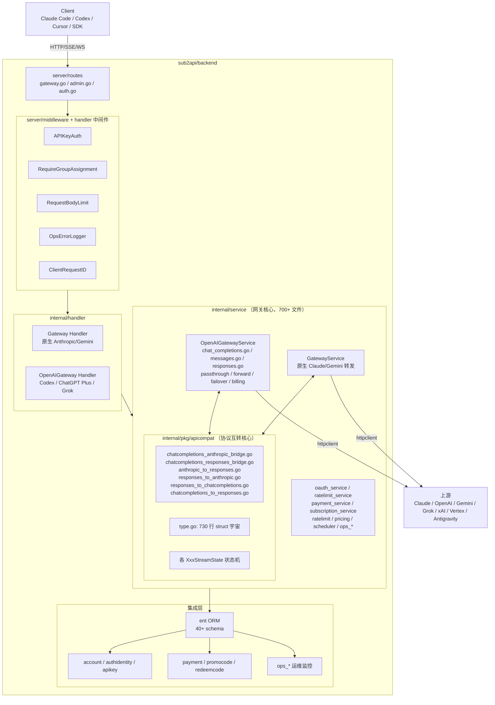

**分层职责**：

| 层 | 路径 | 职责 |
|----|------|------|
| Router | `internal/server/routes/gateway.go` | 注册 `/v1/messages`、`/v1/responses`、`/v1/chat/completions`、`/v1/models`、`/v1/embeddings`、`/v1/images/*`、`/v1/videos/*`、`/v1alpha/`（Gemini）等几十条路由，**按 group platform 在路由闭包里分发到不同 handler**（`gateway.go:135-193`） |
| Middleware | `internal/server/middleware` + `internal/handler` | APIKey 鉴权、订阅分组、限流、body limit、客户端请求 ID、运维错误日志、入口端点归一化、TLS 指纹 |
| Handler | `internal/handler/` | HTTP 入口，做参数解析、调用 service；按平台拆为 `Gateway`（原生 Anthropic/Gemini）和 `OpenAIGateway`（OpenAI/Grok 等 Responses-compatible） |
| Service | `internal/service/openai_gateway_*.go`（数百文件） | 真正的转发逻辑：账号选择、模型映射、prompt cache 注入、Codex CLI 检测、first-output timeout、SSE 转码、用量统计、计费、failover、限流、shadow/灰度 |
| **Protocol Translation** | `internal/pkg/apicompat/` | **本报告的主角**：纯函数 + 强类型 struct 实现的协议互转，独立于 service 层 |
| Adapter / Platform | `internal/pkg/{antigravity,claude,gemini,geminicli,googleapi,openai,openai_compat,xai}` | 各上游平台的 OAuth、API client、quota/billing、TLS 指纹等平台特化逻辑 |
| Repository | `internal/repository/` | ent 数据访问封装 |
| Domain | `internal/domain/` | DDD 风格的领域模型（部分） |

**关键点**：

1. **协议转换被独立成 `apicompat` 包**（`internal/pkg/apicompat/`），与业务 service 层完全解耦——任何 service 都可以复用同一份转换。
2. **service 层极度膨胀**：`openai_gateway_*.go` 一个前缀就有 200+ 文件，涵盖了 Codex OAuth、Grok、WebSocket、图像生成、quota、token refresh、shadow routing、first-output timeout 等大量正交特性。
3. **路由层做平台分发**：同一个 `/v1/messages` URL，根据 `getGroupPlatform(c)` 路由到 `h.OpenAIGateway.Messages` 或 `h.Gateway.Messages`（`routes/gateway.go:135-141`）。

---

## 第二部分：协议互转流程

### 2.1 全部协议转换矩阵

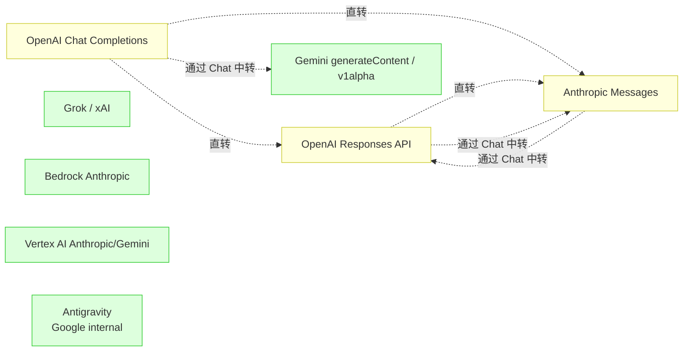

### 2.2 Rust 项目：6 个方向，3 种协议

Rust 项目只覆盖 OpenAI 系（Chat / Responses）和 Anthropic 系（Messages）共 3 种协议，6 个非流式方向 + 6 个流式方向，集中在两个文件里。

**入口**：`gateway/converter.rs:8` 的 `req_convert(src, s, d)` 与 `converter.rs:27` 的 `resp_convert(src, s, d)`。

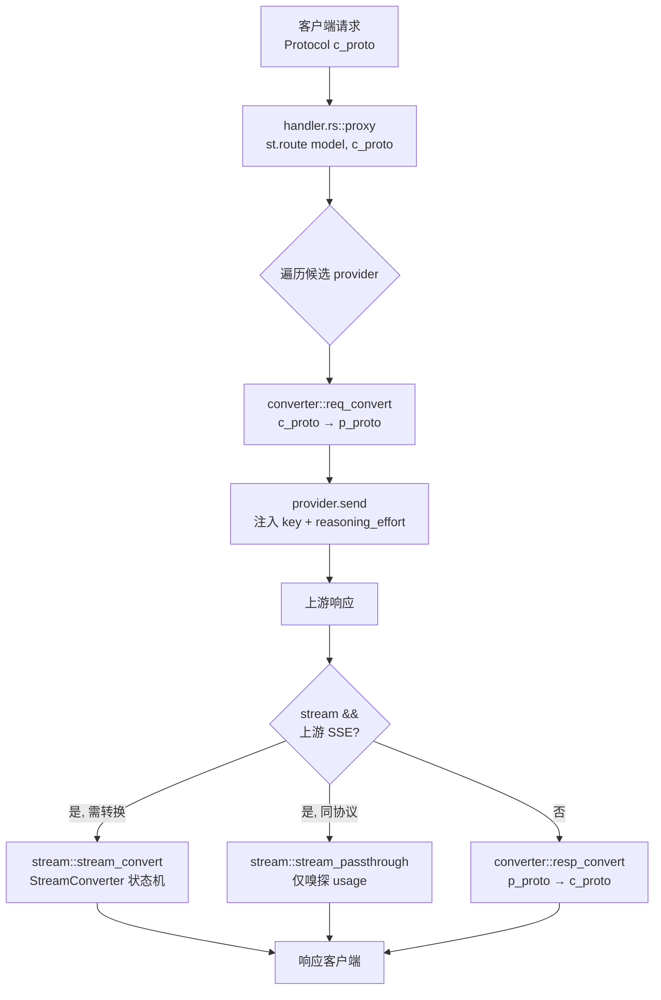

`req_convert` 的分支（`gateway/converter.rs:8-25`）：

| 入站协议 → 出站协议 | 实现 | 备注 |
|--------------------|------|------|
| Chat → Responses | `chat_to_responses_req` | 直转 |
| Responses → Chat | `responses_to_chat_req` | 直转 |
| Chat → Anthropic | `chat_to_anthropic_req` | 直转 |
| Anthropic → Chat | `anthropic_to_chat_req` | 直转 |
| **Responses → Anthropic** | `responses_to_chat_req → chat_to_anthropic_req` | **双跳** |
| **Anthropic → Responses** | `anthropic_to_chat_req → chat_to_responses_req` | **双跳** |

> 即 **Chat 是 Rust 项目的事实 IR（中间表示）**。

### 2.3 Go 项目：3 套对等协议 + 多平台上游

Go 项目在 `apicompat` 包内将 **Responses API 作为显式 IR**，因为接入的是 ChatGPT Codex 后端（原生 Responses）。其它协议围绕 Responses 做双向转换。

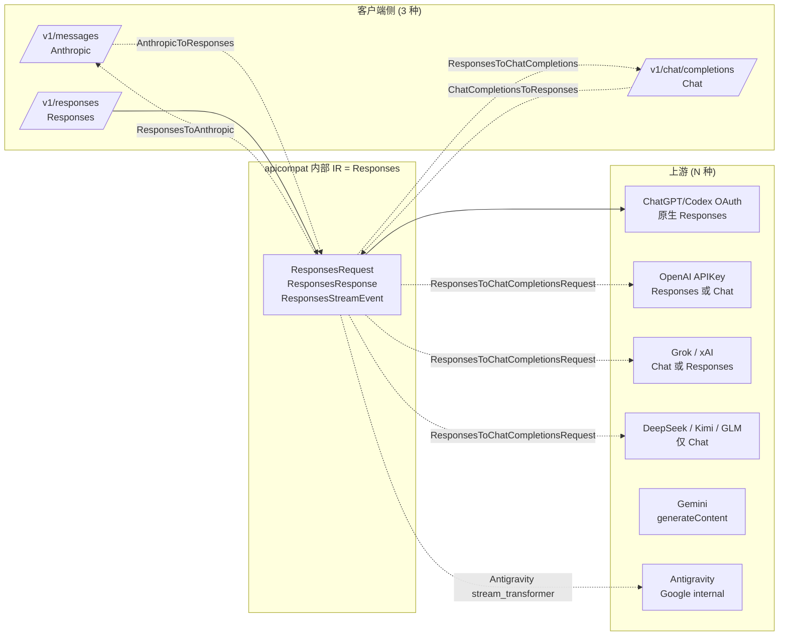

**特殊优化路径**：`chatcompletions_anthropic_bridge.go:42` 的 `AnthropicToChatCompletionsRequest` 直接桥接 Anthropic ↔ Chat，**不经过 Responses 中转**，原因是：

> "the Responses layer is pure overhead: these upstreams never see Responses semantics"（`apicompat/chatcompletions_anthropic_bridge.go:11-31`）

也就是说 Go 项目同时维护 **"经 Responses 双跳"** 和 **"Anthropic↔Chat 直转"** 两套等价路径，后者是为只支持 `/v1/chat/completions` 的第三方上游（DeepSeek/Kimi/GLM）优化的热路径。这是 Rust 项目没有的优化（Rust 默认就走 Chat 中转，因为 Chat 本身就是 IR，没有"双跳"开销）。

### 2.4 Chat Completions / Responses / Anthropic / Gemini / Embedding / Image 等能力矩阵

| 能力 | Rust 支持度 | 实现位置 | Go 支持度 | 实现位置 |
|------|------------|----------|-----------|----------|
| Chat Completions 非流式 | ✅ | `converter.rs:1108`（responses_to_chat_resp）等 | ✅ | `apicompat/chatcompletions_responses_bridge.go:840` |
| Responses 非流式 | ✅ | `converter.rs:1184`（chat_to_responses_resp） | ✅ | `apicompat/anthropic_to_responses.go:13` |
| Anthropic Messages 非流式 | ✅ | `converter.rs:347`（chat_to_anthropic_req） | ✅ | `apicompat/responses_to_anthropic.go:16` |
| Gemini generateContent | ❌ | — | ✅ | `internal/pkg/gemini/`、`geminicli/` |
| Bedrock / Vertex | ❌ | — | 部分 | `internal/service/vertex_service_account.go` |
| Embedding | ❌ | — | ✅ | `service/openai_embeddings.go` |
| Image Generation | ❌ | — | ✅ | `service/openai_images.go`、`grok` 视频生成 |
| Audio | ❌ | — | 部分 | — |
| Thinking / Reasoning | ✅ thinking 块 + signature | `converter.rs:370-382` 等 | ✅ encrypted_content + summary | `apicompat/types.go:212` |
| Tool Calling | ✅ tools/tool_choice/parallel | `converter.rs:419-453` | ✅ + namespace + tool_search + custom | `chatcompletions_responses_bridge.go:621-700` |
| Streaming（SSE） | ✅ 6 方向 | `gateway/stream.rs` | ✅ + WS | `service/openai_ws_*.go` |
| WebSocket | ❌ | — | ✅ Codex realtime WS | `service/openai_ws_v2/` |

---

## 第三部分：Rust 项目代码定位（协议转换）

### 3.1 `gateway/converter.rs`（非流式协议互转）

- **文件路径**：`src-tauri/src/gateway/converter.rs`（1258 行）
- **作用**：所有非流式协议的双向转换，无状态、无副作用、基于 `serde_json::Value`。
- **主要函数**（无 struct，无 trait，纯函数式）：

| 函数 | 行号 | 作用 |
|------|------|------|
| `req_convert(src, s, d)` | `converter.rs:8` | 入口：请求体转换分发 |
| `resp_convert(src, s, d)` | `converter.rs:27` | 入口：响应体转换分发 |
| `chat_to_anthropic_req` | `converter.rs:347` | Chat → Anthropic 请求 |
| `anthropic_to_chat_req` | `converter.rs:472` | Anthropic → Chat 请求 |
| `chat_to_responses_req` | `converter.rs:668` | Chat → Responses 请求 |
| `responses_to_chat_req` | `converter.rs:771` | Responses → Chat 请求 |
| `anthropic_to_chat_resp` | `converter.rs:903` | Anthropic → Chat 响应 |
| `chat_to_anthropic_resp` | `converter.rs:1035` | Chat → Anthropic 响应 |
| `responses_to_chat_resp` | `converter.rs:1108` | Responses → Chat 响应 |
| `chat_to_responses_resp` | `converter.rs:1184` | Chat → Responses 响应 |
| `map_stop_reason_anthropic_to_chat` | `converter.rs:241` | stop_reason ↔ finish_reason 映射 |
| `map_finish_reason_chat_to_anthropic` | `converter.rs:251` | 反向 |
| `map_tool_choice_chat_to_anthropic` | `converter.rs:273` | tool_choice 转换 |

- **核心结构体/Trait**：**无**。这是关键设计——所有结构都使用 `serde_json::json!()` 宏构造 `Value`，所有读取使用 `value.get("field").and_then(|x| x.as_str())` 模式。
- **调用链**：

```
api/handler.rs::proxy (handler.rs:13)
  → converter::req_convert (converter.rs:8)            # 入站协议转上游协议
  → provider.send (provider.rs:159)                    # 上游请求
  → converter::resp_convert (converter.rs:27)          # 上游响应转客户端协议
或
  → stream::stream_convert (stream.rs:168)             # 流式分支
     → make_converter (stream.rs:321)
        → AnthropicToChatStream / ChatToAnthropicStream / ... (stream.rs:341+)
```

### 3.2 `gateway/stream.rs`（流式协议互转）

- **文件路径**：`src-tauri/src/gateway/stream.rs`（1581 行）
- **作用**：所有流式协议的转换；usage 嗅探；流式/非流式降级。
- **核心 Trait**：

```rust
// stream.rs:275
pub trait StreamConverter: Send {
    fn on_event(&mut self, event: Option<&str>, data: &str) -> Vec<String>;
    fn on_done(&mut self) -> Vec<String>;
}
```

- **关键实现**：

| 结构体 | 行号 | 方向 |
|--------|------|------|
| `AnthropicToChatStream` | `stream.rs:341` | SSE: Anthropic → Chat |
| `ChatToAnthropicStream` | `stream.rs:596` | SSE: Chat → Anthropic |
| `ResponsesToChatStream` | `stream.rs:851` | SSE: Responses → Chat |
| `ChatToResponsesStream` | `stream.rs:1120` | SSE: Chat → Responses |
| `Chained<A, B>` | `stream.rs:289` | **泛型组合**：两个 StreamConverter 串联 |

- **关键函数**：

| 函数 | 行号 | 作用 |
|------|------|------|
| `stream_passthrough` | `stream.rs:122` | 同协议透传，仅嗅探 usage |
| `stream_convert` | `stream.rs:168` | 跨协议流式转换主循环 |
| `make_converter` | `stream.rs:321` | 工厂：`(src, dst) → Box<dyn StreamConverter>` |
| `extract_usage` | `stream.rs:59` | 兼容三种协议格式的 usage 提取 |
| `UsageCtx::record` | `stream.rs:30` | spawn_blocking 写入 SQLite |

- **设计亮点（Chained）**：

```rust
// stream.rs:321
fn make_converter(src: Protocol, dst: Protocol) -> Box<dyn StreamConverter> {
    match (src, dst) {
        (Protocol::Anthropic, Protocol::Responses) => Box::new(Chained(
            AnthropicToChatStream::new(),
            ChatToResponsesStream::new(),
        )),
        // ...
    }
}
```

通过**泛型 `Chained<A, B>`** 把"Anthropic → Responses"实现为"Anthropic → Chat → Responses"两段管线，避免为该方向单独写一遍状态机。**这是静态分发（monomorphization），零运行时开销**。

### 3.3 `gateway/provider.rs`（上游 Provider）

- **文件路径**：`src-tauri/src/gateway/provider.rs`（437 行）
- **核心结构体**：

```rust
// provider.rs:33
pub struct Provider {
    pub id: i64,
    pub name: String,
    pub protocol: Protocol,           // Chat / Responses / Anthropic
    pub base_url: String,
    pub models: Vec<String>,
    pub reasoning_effort: Option<String>,
    keys: Vec<ApiKeyEntry>,
    blacklist: Mutex<HashMap<usize, Instant>>,
    // ...
}
```

- **关键函数**：

| 函数 | 行号 | 作用 |
|------|------|------|
| `Provider::new` | `provider.rs:52` | 构造（仅设 connect_timeout） |
| `Provider::send` | `provider.rs:159` | 发送请求 + 密钥轮转 + 429/5xx 黑名单 |
| `Provider::endpoint` | `provider.rs:155` | 按 protocol 返回 `/chat/completions` / `/responses` / `/messages` |
| `auth_headers_for` | `provider.rs:137` | 按协议注入 Authorization / x-api-key |
| `inject_reasoning` | `provider.rs:343` | 按协议注入 reasoning_effort / thinking |

- **设计要点**：**没有 `Provider` trait**。所有上游（OpenAI/Azure/Anthropic/任何 OpenAI 兼容）都是同一个 `Provider` 实例，靠 `protocol` 字段做内部分支。这意味着：
  - 优点：扩展新 provider 几乎零成本——只要填 base_url + key + models 就能跑。
  - 缺点：无法表达"OpenAI 原生 Responses 支持 previous_response_id"这类平台特化逻辑；只能透传。

### 3.4 调用链总览

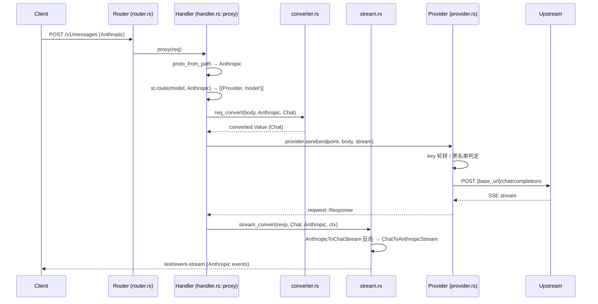

---

## 第四部分：Go 项目代码定位（协议转换）

### 4.1 `internal/pkg/apicompat/` 包概览

这是 Go 项目的协议互转**核心包**，14 个非测试 `.go` 文件，从命名就能看出全貌：

| 文件 | 作用 |
|------|------|
| `types.go` (730 行) | **所有协议的强类型 struct 宇宙**：AnthropicRequest、AnthropicContentBlock、AnthropicStreamEvent、ResponsesRequest、ResponsesInputItem、ResponsesStreamEvent、ChatCompletionsRequest、ChatMessage、ChatCompletionsChunk、各种 Usage 结构 |
| `anthropic_to_responses.go` | Anthropic → Responses 请求转换（`AnthropicToResponses`） |
| `responses_to_anthropic.go` | Responses → Anthropic 响应（含流式状态机 `ResponsesEventToAnthropicState`） |
| `responses_to_anthropic_request.go` | Responses → Anthropic 请求方向（少用） |
| `anthropic_to_responses_response.go` | Anthropic → Responses 响应方向 |
| `chatcompletions_responses_bridge.go` (1457+ 行) | Chat ↔ Responses 双向 + 流式状态机 `ChatCompletionsToResponsesStreamState` |
| `chatcompletions_anthropic_bridge.go` (927 行) | **Anthropic ↔ Chat 直转优化路径**（不经 Responses） |
| `chatcompletions_to_responses.go` | Chat → Responses 请求方向 |
| `responses_to_chatcompletions.go` | Responses → Chat 响应方向 |
| `response_format.go` | Responses `text.format` ↔ Chat `response_format` 映射（JSON Schema 等） |
| `responses_namespace.go` | Responses `namespace` 工具摊平（`__` 前缀） |
| `responses_stream_event_wire.go` | Responses SSE 事件线格式 |

### 4.2 核心类型分层

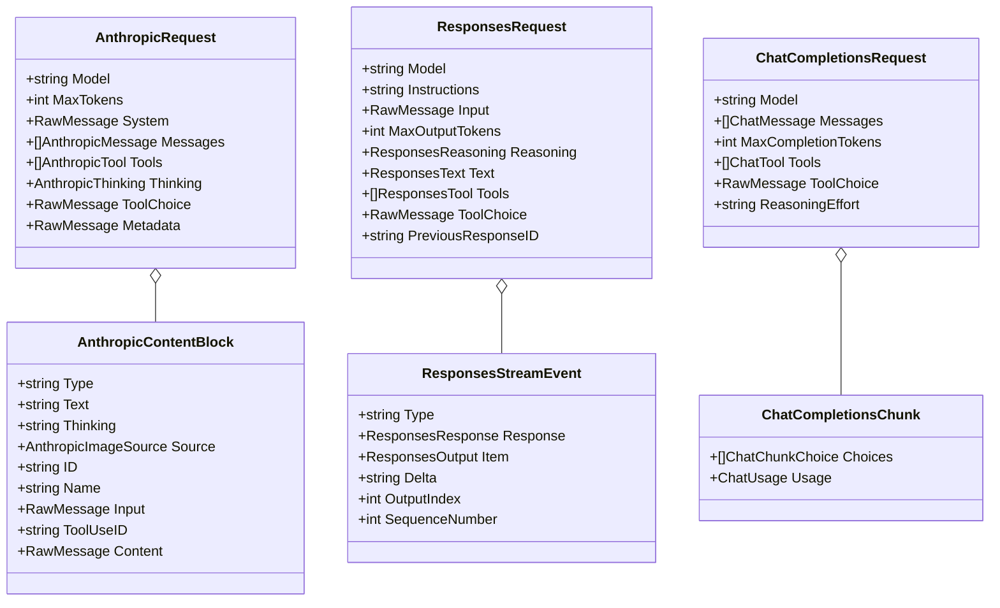

### 4.3 入口函数清单

| 方向 | 入口函数 | 文件 |
|------|----------|------|
| Anthropic → Responses 请求 | `AnthropicToResponses(req *AnthropicRequest) (*ResponsesRequest, error)` | `anthropic_to_responses.go:13` |
| Responses → Anthropic 响应 | `ResponsesToAnthropic(resp *ResponsesResponse, model string) *AnthropicResponse` | `responses_to_anthropic.go:16` |
| Responses → Anthropic 流式 | `ResponsesEventToAnthropicState` + 事件循环 | `responses_to_anthropic.go:170+` |
| Chat → Responses 请求 | `ChatCompletionsToResponsesRequest`（实际上没有，是反向）| — |
| Responses → Chat 请求 | `ResponsesToChatCompletionsRequest(req *ResponsesRequest) (*ChatCompletionsRequest, error)` | `chatcompletions_responses_bridge.go:15` |
| Chat → Responses 响应 | `ChatCompletionsResponseToResponses(...)` | `chatcompletions_responses_bridge.go:840` |
| Chat ↔ Responses 流式 | `ChatCompletionsToResponsesStreamState` | `chatcompletions_responses_bridge.go:1040+` |
| **Anthropic ↔ Chat 直转（请求）** | `AnthropicToChatCompletionsRequest(req)` | `chatcompletions_anthropic_bridge.go:42` |
| **Anthropic ↔ Chat 直转（响应）** | `ChatCompletionsResponseToAnthropic(resp, model)` | `chatcompletions_anthropic_bridge.go:377` |
| **Anthropic ↔ Chat 流式** | `ChatCompletionsToAnthropicStreamState` | `chatcompletions_anthropic_bridge.go:525+` |

### 4.4 调用关系（service 层如何驱动 apicompat）

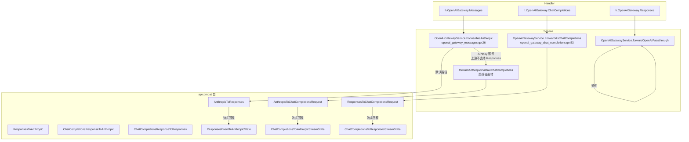

调用入口在 `openai_gateway_messages.go:36`：

```go
// openai_gateway_messages.go:36-40
if account.Type == AccountTypeAPIKey && !openai_compat.ShouldUseResponsesAPI(account.Extra) {
    return s.forwardAnthropicViaRawChatCompletions(ctx, c, account, body, defaultMappedModel)
}
```

这里就是 Go 项目"**双路径并存**"的核心入口——根据上游能力路由到"经 Responses"或"Anthropic ↔ Chat 直转"。

---

## 第五部分：统一数据模型（Unified Model）

### 5.1 Rust 项目：**没有**统一内部模型

Rust 项目刻意**没有定义任何"内部统一 Request/Message/Chunk"结构体**。整个转换层完全基于 `serde_json::Value` 工作：

```rust
// converter.rs:8
pub fn req_convert(src: &Value, s: Protocol, d: Protocol) -> Result<Value, AppError> {
    match (s, d) {
        (Protocol::Chat, Protocol::Anthropic) => Ok(chat_to_anthropic_req(src)),
        // ...
    }
}
```

所有读取采用 `value.get("messages").and_then(|m| m.as_array()).cloned().unwrap_or_default()` 这种"鸭子类型"模式。仅有少量枚举作为协议标识：

```rust
// types.rs:5
pub enum Protocol { Chat, Responses, Anthropic }

// types.rs:39
pub enum ApiKeyEntry {
    Object { key: String, enabled: bool },
    Plain(String),
}
```

**评价**：

- ✅ 极致灵活，新字段零改动透传（如新出 `cache_control`、`metadata` 自动保留）。
- ✅ 没有任何"序列化→反序列化→重新序列化"的开销。
- ❌ 没有编译期类型检查，靠测试覆盖字段映射正确性。
- ❌ IDE 没有补全，重构时极易漏改。

### 5.2 Go 项目：**强类型**三层结构

Go 项目为**每种外部协议**都定义了完整的 struct 体系，但不强制走"统一内部 IR"——`ResponsesRequest` 既是外部协议类型，**也充当内部 IR**。

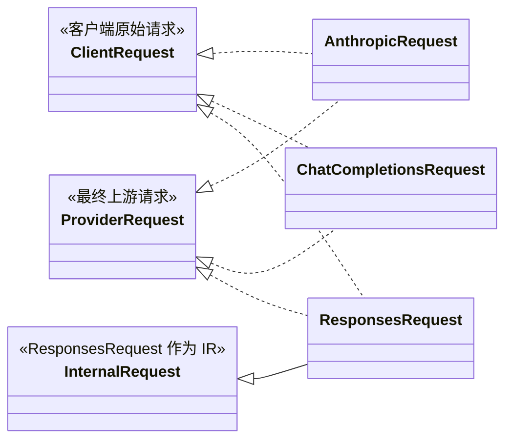

Go 的核心类型（节选自 `types.go`）：

```go
// types.go:14
type AnthropicRequest struct {
    Model       string
    MaxTokens   int
    System      json.RawMessage  // 字符串或 []ContentBlock
    Messages    []AnthropicMessage
    Tools       []AnthropicTool
    Thinking    *AnthropicThinking
    ToolChoice  json.RawMessage
    Metadata    json.RawMessage
    OutputConfig *AnthropicOutputConfig
}

// types.go:191
type ResponsesRequest struct {
    Model              string
    Instructions       string
    Input              json.RawMessage  // string 或 []ResponsesInputItem
    MaxOutputTokens    *int
    Reasoning          *ResponsesReasoning
    Tools              []ResponsesTool
    ParallelToolCalls  *bool
    PreviousResponseID string
    PromptCacheKey     string
    ServiceTier        string
    // ...
}

// types.go:568
type ChatCompletionsRequest struct {
    Model               string
    Messages            []ChatMessage
    MaxCompletionTokens *int
    Tools               []ChatTool
    ToolChoice          json.RawMessage
    ReasoningEffort     string
    ResponseFormat      json.RawMessage
    // ...
}
```

注意 **`json.RawMessage`** 的大量使用——这是 Go 项目为了同时获得"强类型主干 + 字段透传"的折中。当某字段可能是 string/array/object 多形态时（如 Anthropic `system`、Responses `input`、Chat `tool_choice`），就用 `json.RawMessage` 延迟到转换时再处理。

### 5.3 字段对照表（核心实体）

| 维度 | Rust 抽象 | Go 抽象 |
|------|-----------|---------|
| Role 表示 | `"system" \| "user" \| "assistant" \| "tool"` 字符串 | `ChatMessage.Role string`（同） |
| Message | `Value`（无类型） | `ChatMessage`、`AnthropicMessage`、`ResponsesInputItem` |
| Content（多模态） | `Value::Array` 各 part 含 `type` | `ChatContentPart`、`AnthropicContentBlock`、`ResponsesContentPart` |
| Tool | `Value` 含 `function.parameters` | `ChatTool`+`ChatFunction`、`AnthropicTool`、`ResponsesTool` |
| ToolCall | `tool_calls: [{id, function:{name, arguments}}]` | `ChatToolCall`、`AnthropicContentBlock{Type:"tool_use"}`、`ResponsesOutput{Type:"function_call"}` |
| ToolResult | `role:"tool", tool_call_id, content` | `ChatMessage{Role:"tool"}`、`AnthropicContentBlock{Type:"tool_result"}`、`ResponsesInputItem{Type:"function_call_output"}` |
| Usage | 直接读 `usage.prompt_tokens / input_tokens` 等字段 | `ChatUsage`、`ResponsesUsage`、`AnthropicUsage` 三个独立 struct，含自定义 `UnmarshalJSON` |
| Streaming Chunk | `Value`（无类型） | `ChatCompletionsChunk`、`ResponsesStreamEvent`、`AnthropicStreamEvent` |
| finish/stop reason | `map_stop_reason_anthropic_to_chat(sr: &str) -> String` 纯函数 | `chatFinishReasonToAnthropicStopReason(reason, blocks) string` |

---

## 第六部分：Trait vs Interface（抽象风格对比）

### 6.1 Rust：极少的 Trait，重度依赖泛型 + Enum

整个 Rust 项目中真正参与协议转换的 trait 只有 1 个：

```rust
// stream.rs:275
pub trait StreamConverter: Send {
    fn on_event(&mut self, event: Option<&str>, data: &str) -> Vec<String>;
    fn on_done(&mut self) -> Vec<String>;
}
```

加上一处 `Box<dyn StreamConverter>` 用于在运行时按 `(src, dst)` 选择实现：

```rust
// stream.rs:321
fn make_converter(src: Protocol, dst: Protocol) -> Box<dyn StreamConverter> {
    match (src, dst) {
        (Protocol::Anthropic, Protocol::Responses) => Box::new(Chained(
            AnthropicToChatStream::new(),
            ChatToResponsesStream::new(),
        )),
        // ...
    }
}
```

这里 `Chained<A, B>` 是**泛型**（编译期单态化），但 `make_converter` 返回 `Box<dyn>`，因此**外层是动态分发，内层串联是静态分发**——一种相当精妙的混合。

| Rust 特性 | 用法 | 位置 |
|-----------|------|------|
| Trait | 仅 `StreamConverter` | `stream.rs:275` |
| Generic | `Chained<A, B>` 串联两个 StreamConverter | `stream.rs:289` |
| Enum | `Protocol { Chat, Responses, Anthropic }` | `types.rs:5` |
| `Box<dyn Trait>` | 工厂返回类型 | `stream.rs:321` |
| Macro | `serde_json::json!()` 构造响应 | 全文 |
| Async/Tokio | `tokio::spawn` 异步任务 | `stream.rs:125` |
| `Arc<Mutex<T>>` | 密钥黑名单共享 | `provider.rs:41` |
| Async Trait | **无**（手写 future，`async fn` 直接定义） | — |

**为什么这样设计？**

> 这个项目的目标非常清晰：**桌面端单进程 + Chat 为中心**。3 种协议最多 6 个方向，手写函数就完事。引入 trait 反而会让代码变多。
>
> Provider 没有 trait 是因为**所有上游对网关而言行为完全一致**——POST HTTP、轮转密钥、看 429/5xx、注入 reasoning effort，差异仅在 URL 路径和 2 个 HTTP 头。这种情况下抽象成 trait 是过度设计。

### 6.2 Go：Interface 缺失，函数式 + 状态机为主

令人惊讶的是，**Go 项目同样没有为 Provider/Adapter 定义 Interface**。所有"adapter"实质上是包级别的纯函数集合：

```go
// apicompat 包内的"接口"形态
func AnthropicToResponses(req *AnthropicRequest) (*ResponsesRequest, error)
func ResponsesToAnthropic(resp *ResponsesResponse, model string) *AnthropicResponse
func AnthropicToChatCompletionsRequest(req *AnthropicRequest) (*ChatCompletionsRequest, error)
// ...
```

流式状态机使用**结构体 + 方法**的组合，而非接口：

```go
// chatcompletions_anthropic_bridge.go:525
type ChatCompletionsToAnthropicStreamState struct {
    MessageStartSent bool
    ContentBlockIndex int
    // ...
}

func ChatCompletionsChunkToAnthropicEvents(chunk *ChatCompletionsChunk, state *ChatCompletionsToAnthropicStreamState) []AnthropicStreamEvent
func FinalizeChatCompletionsAnthropicStream(state *ChatCompletionsToAnthropicStreamState) []AnthropicStreamEvent
```

Go 项目里能找到的 interface 主要在：

| Interface | 位置 | 作用 |
|-----------|------|------|
| `Provider` (payment) | `payment/provider/` | 支付网关抽象（微信/支付宝） |
| `Provider` (websearch) | `pkg/websearch/provider.go` | 网络搜索后端抽象 |
| 各种 Repository interface | `internal/domain/` | DDD 风格仓储抽象 |

但**协议转换层和 LLM Provider 层都没用 interface**——这是有意为之的"具体先行"风格。

**Go 项目使用的设计模式**：

| 模式 | 使用情况 | 例子 |
|------|----------|------|
| Factory | 部分（构造函数 `NewXxxState()`） | `NewChatCompletionsToResponsesStreamState` |
| Builder | 无 | — |
| Adapter | 概念上有（apicompat 整个包就是 adapter） | — |
| Strategy | 无（路由层用 if/else，非 strategy） | — |
| Decorator | 无 | — |
| Plugin | 无 | — |
| Registry | 部分（`ratelimit_service`、`oauth_service`） | OAuth client 注册表 |
| State Machine | **重度使用** | 4 个 StreamState 状态机 |

**为什么 Go 不用 interface？**

> 1. Go 的 interface 是隐式满足，但协议转换函数签名千差万别（输入/输出类型不同），无法统一成 `Convert(in T) (out U, error)` 的形式。
> 2. Go 的泛型（1.18+）刚普及，老代码倾向于具体类型；新代码（如 `wire.go` DI）开始用泛型。
> 3. **Go 项目把"扩展点"放在 service 层**：新增平台 = 新增一个 `XxxGatewayService` + 一组 `forwardXxx` 方法 + 在路由层 if/else 分发。**没有抽象的"Provider"概念**。

### 6.3 扩展 Provider 的成本对比

| 操作 | Rust ai-aggregs | Go sub2api |
|------|-----------------|------------|
| 新增"OpenAI 兼容上游"（如 DeepSeek） | 改 0 行代码，UI 添加 provider 配置即可 | 改 0 行代码（若上游支持 Responses）；否则需要在 `ForwardAsChatCompletions` 加特化分支 |
| 新增新协议（如 Gemini） | 需要在 converter.rs/stream.rs 各加 4 个函数；修改 `Protocol` enum；修改 `make_converter` | 需要在 apicompat 增加一组 struct + 双向转换；在 service 层增加 `GatewayService.ForwardAsGemini`；在路由层增加分发 |
| 新增平台特化逻辑（如 prompt cache 注入） | 需要在 `Provider::send` 前增加条件分支 | 在对应的 `forwardXxx` 函数中加 hook（Go 项目就是这么做的） |

**结论**：Rust 项目适合"接入大量同质化 OpenAI 兼容上游"；Go 项目适合"接入异构平台 + SaaS 化运营"。

---

## 第七部分：Streaming 详细对比

### 7.1 Rust：tokio mpsc + StreamConverter trait + `BytesMut` 行缓冲

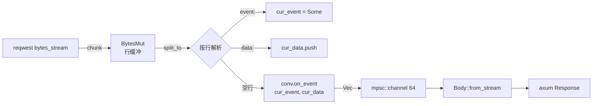

核心代码骨架（`stream.rs:168-258`）：

```rust
pub async fn stream_convert(resp: reqwest::Response, src: Protocol, dst: Protocol, ctx: UsageCtx) -> Result<Response, AppError> {
    let (tx, rx) = tokio::sync::mpsc::channel::<Result<Bytes, std::io::Error>>(64);
    let mut conv = make_converter(src, dst);

    tokio::spawn(async move {
        let mut stream = resp.bytes_stream();
        let mut buf = BytesMut::new();
        while let Some(chunk) = stream.next().await {
            buf.extend_from_slice(&chunk?);
            loop {
                let Some(nl) = buf.iter().position(|b| *b == b'\n') else { break };
                let line = buf.split_to(nl + 1);
                // 解析 SSE 行：event:/data:/空行
                // 空行 → conv.on_event(...)
            }
        }
        // 收尾：on_done()
    });

    Ok(sse_response(Body::from_stream(ReceiverStream::new(rx))))
}
```

**特点**：

1. **基于 `tokio::sync::mpsc::channel`** 异步生产-消费。
2. **`bytes::BytesMut`** 做零拷贝行切分（`split_to`）。
3. **`StreamConverter::on_event` 返回 `Vec<String>`**：一个上游事件可能映射到 0、1 或多个下游事件（如 Anthropic `content_block_start.tool_use` → Chat `tool_calls` delta）。
4. **`on_done`** 收尾，确保 `[DONE]` 必定发出。
5. **usage 嗅探**：在转换前后都调用 `sniff_usage`（`stream.rs:109`），避免转换时 usage 字段丢失。
6. **流式降级**：`handler.rs:204` 检测上游"伪 200 + JSON 错误体"，自动降级为非流式错误透传。

### 7.2 Go：bufio.Scanner + bufio.Writer + http.Flusher + 多状态机

Go 的 SSE 转发模型与 Gin 框架高度绑定，核心模式（`openai_gateway_response_handling.go`）：

```go
// 1. 设置 SSE 响应头
c.Header("Content-Type", "text/event-stream")
c.Header("Cache-Control", "no-cache")
c.Header("Connection", "keep-alive")
c.Header("X-Accel-Buffering", "no")  // 禁用 nginx 缓冲

w := c.Writer
flusher, ok := w.(http.Flusher)

// 2. 构造带缓冲的 Writer（4KB）
bufferedWriter := bufio.NewWriterSize(w, 4*1024)

// 3. 用 bufio.Scanner 扫描上游响应
scanner := bufio.NewScanner(resp.Body)
scanner.Buffer(scanBuf[:0], maxLineSize)

// 4. 主循环：扫描一行 → 解析事件 → 状态机转换 → 写缓冲 → Flush
for scanner.Scan() {
    line := scanner.Bytes()
    // 调用 apicompat.ChatCompletionsChunkToAnthropicEvents(chunk, state)
    // for _, event := range events {
    //     bufferedWriter.WriteString("event: ...\n")
    //     bufferedWriter.WriteString("data: ...\n\n")
    // }
    if err := bufferedWriter.Flush(); err != nil { return }
    flusher.Flush()
}
```

**特点**：

1. **同步阻塞 I/O**（goroutine 并发，但单个请求是阻塞的）。
2. **`bufio.Scanner`** 自带缓冲行扫描，但**默认 token 大小有限**——Go 项目用 `s.getSSEScannerBuf64K()` 复用 64KB 缓冲池（`sse_scanner_buffer_pool.go`）。
3. **`http.Flusher` 接口**显式 Flush，绕过 nginx/Accel 缓冲。
4. **first-output timeout**（`openai_first_output_timeout.go`）：reasoning model 首字延迟监控，超时切换账号。
5. **stream keepalive**（`StreamKeepaliveInterval`）：定时向下游发心跳，防代理空闲断开。
6. **interval timeout**（`StreamDataIntervalTimeout`）：上游数据间隔超时监控。
7. **first-output staging**（`firstOutputStage`）：首字前数据先缓存，确认首字成功后再 flush，便于失败时无缝切换账号。

### 7.3 关键能力逐项对比

| 能力 | Rust | Go |
|------|------|----|
| 异步模型 | tokio async stream | goroutine + 同步 bufio |
| 行缓冲 | `BytesMut::split_to`（零拷贝） | `bufio.Scanner`（拷贝） |
| 输出缓冲 | mpsc channel（64 slot） | `bufio.Writer` 4KB + `http.Flusher` |
| 心跳/keepalive | ❌ 无（依赖客户端超时） | ✅ 可配置 `StreamKeepaliveInterval` |
| 首字超时切换 | ❌ 无 | ✅ `openai_first_output_timeout.go` |
| 间隔超时 | ❌ 无 | ✅ `StreamDataIntervalTimeout` |
| 跨协议 SSE 转换 | ✅ `StreamConverter` trait | ✅ 每方向独立状态机 |
| 错误降级 | ✅ 自动判定非 SSE 伪成功 | ✅ 详细的失败原因分类 |
| Buffer 池 | ❌（每请求独立 BytesMut） | ✅ `sse_scanner_buffer_pool.go` 64KB 池 |
| 多账号 failover 流中切换 | ❌（仅请求前 failover） | ✅（first-output 失败可切换） |
| WebSocket 支持 | ❌ | ✅ Codex WS v1/v2 |

### 7.4 流式 Tool Calling 的特殊处理

**Rust**（`AnthropicToChatStream::on_event`，`stream.rs:425-441`）：

```rust
"content_block_start" => {
    let cb_type = cb.get("type").and_then(|x| x.as_str()).unwrap_or("");
    match cb_type {
        "tool_use" => {
            let idx = self.next_tc_index;
            self.next_tc_index += 1;
            self.cur_tc_index = Some(idx);
            vec![self.chunk(json!({
                "tool_calls":[{"index":idx,"id":id,"type":"function","function":{"name":name,"arguments":""}}]
            }), None).to_string()]
        }
        // ...
    }
}
```

Anthropic 流式 `content_block_start.tool_use` 触发 Chat 的 `tool_calls` delta（带新 index）；后续 `input_json_delta` 续写 `arguments`。

**Go**（`ChatCompletionsToAnthropicStreamState`，`chatcompletions_anthropic_bridge.go:759-814`）：

```go
func handleCCAnthropicToolCall(state *..., toolCall *ChatToolCall) []AnthropicStreamEvent {
    idx := *toolCall.Index
    if _, seen := state.toolAnnounced[idx]; !seen {
        // 新工具调用：先关闭当前块
        // 工具名字延迟宣告：name 未到时缓存 arguments
        if name := toolCall.Function.Name; name != "" {
            events = append(events, announceCCAnthropicToolBlock(state, idx, callID, name)...)
        } else {
            state.toolAnnounced[idx] = false
            state.pendingToolCallID[idx] = callID
        }
    }
    // ...
}
```

Go 项目额外处理了**"上游先发 id+arguments，后发 name"** 的乱序场景（DeepSeek/GLM 等的实现差异），通过 `pendingToolCallID/pendingToolArgs` 缓冲，待 name 到达后再宣告 `content_block_start`。Rust 项目没有处理这种乱序。

---

## 第八部分：Provider Adapter 与平台扩展

### 8.1 Rust：单一 Provider 结构体

```rust
// provider.rs:33-49
pub struct Provider {
    pub id: i64,
    pub name: String,
    pub protocol: Protocol,
    pub base_url: String,
    pub models: Vec<String>,
    pub reasoning_effort: Option<String>,
    keys: Vec<ApiKeyEntry>,
    blacklist: Mutex<HashMap<usize, Instant>>,
    blacklist_disabled_until: Mutex<Option<Instant>>,
    blacklist_secs: u64,
    client: reqwest::Client,
    timeout: Duration,
    last_key_idx: Mutex<Option<usize>>,
}
```

**所有上游都映射为这个结构体的一个实例**。差异通过：

- `protocol: Protocol` 字段决定 URL 路径（`/chat/completions` / `/responses` / `/messages`）
- `protocol` 字段决定 auth header（`Authorization: Bearer` vs `x-api-key + anthropic-version`）
- `reasoning_effort: Option<String>` 决定是否注入 `reasoning_effort` / `reasoning.effort` / `thinking` 字段

**没有 Factory、没有 Registry、没有 Plugin**——配置文件驱动，`manager.rs::build_providers` 一次循环创建所有 Provider：

```rust
// manager.rs:14-29
pub fn build_providers(cfg: &Config) -> anyhow::Result<Vec<Arc<Provider>>> {
    let mut providers = Vec::new();
    for pc in &cfg.providers {
        if !pc.enabled { continue; }
        let p = Provider::new(pc, cfg.key_blacklist_secs)?;
        providers.push(Arc::new(p));
    }
    Ok(providers)
}
```

### 8.2 Go：平台字段分发，无 Provider 接口

Go 项目里**也没有"统一 Provider"接口**。所有上游平台的差异被以下机制处理：

1. **`Account.Platform` 字段**（OpenAI / Grok / Gemini / Anthropic / Antigravity …）—— 路由层和 service 层据此分支。
2. **多个 Service 结构体**：`OpenAIGatewayService`、`GatewayService`（原生 Anthropic/Gemini）、每个 Service 内部又有 `forwardXxx` 数十个方法。
3. **`internal/pkg/{platform}/` 包**：每个平台一个独立包，封装该平台的 OAuth、API client、quota、billing 等平台特化逻辑。

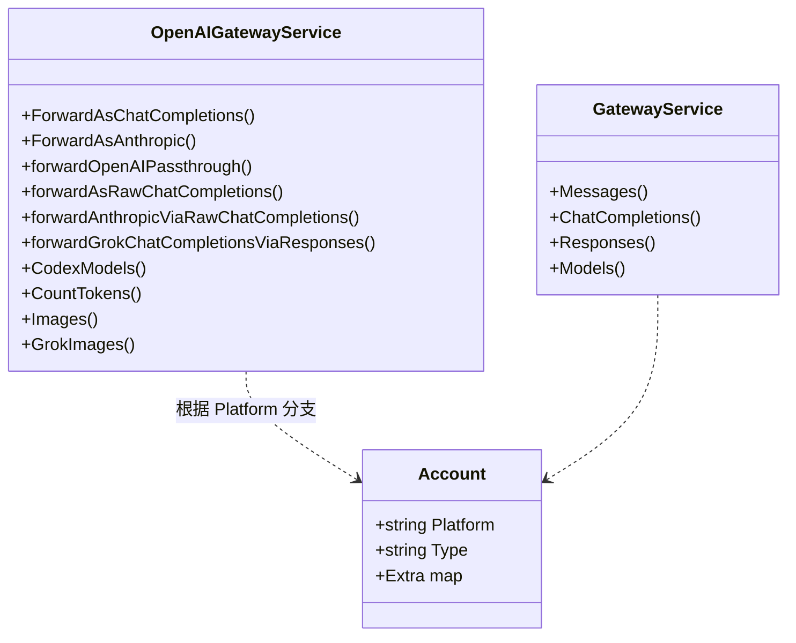

### 8.3 平台 Adapter 包（Go 项目独有）

| 包 | 路径 | 作用 |
|----|------|------|
| `antigravity` | `internal/pkg/antigravity/` | Google 内部 Antigravity 协议（Gemini 内部接口），含 `request_transformer.go` / `response_transformer.go` / `stream_transformer.go` / `schema_cleaner.go` 四件套 |
| `claude` | `internal/pkg/claude/` | Claude Code 相关常量（billing header、beta token、cache control TTL） |
| `gemini` | `internal/pkg/gemini/` | Gemini 公开 API 模型 |
| `geminicli` | `internal/pkg/geminicli/` | Gemini CLI OAuth + Drive client |
| `googleapi` | `internal/pkg/googleapi/` | Google API 错误模型 |
| `openai` | `internal/pkg/openai/` | OpenAI OAuth、ChatGPT 内部 API、engine fingerprint |
| `openai_compat` | `internal/pkg/openai_compat/` | 上游能力探测（`ShouldUseResponsesAPI`） |
| `xai` | `internal/pkg/xai/` | xAI/Grok OAuth、quota、billing、SSO device flow |

这些包**不参与协议字段映射**，只负责平台 OAuth、quota、模型列表、计费规则等平台特化数据。真正的协议字段映射全部集中在 `apicompat/` 包。

### 8.4 Provider 抽象对比

| 维度 | Rust | Go |
|------|------|----|
| 抽象方式 | 单一 struct + protocol 字段分支 | 多 Service struct + platform 字段分支 |
| Factory | `build_providers` 一次性构造 | 路由层闭包 `if isOpenAIGatewayPlatform(c) { ... }` |
| Registry | `AppCtrl.providers: Mutex<Vec<Arc<Provider>>>` | `ent` ORM + 内存缓存（`scheduler_snapshot_service.go`） |
| 扩展点 | `Protocol` enum（需要改代码） | `Platform` 常量（需要改代码 + 数据库枚举） |
| 单上游多账号 | 通过 `api_keys: Vec<ApiKeyEntry>` + 黑名单 | 通过 `account` 表（每个账号一行） |

---

## 第九部分：字段映射详表

### 9.1 请求字段映射（Request）

| 字段 | Chat | Responses | Anthropic | Rust 实现位置 | Go 实现位置 |
|------|------|-----------|-----------|--------------|-------------|
| 模型 | `model` | `model` | `model` | 直接复制 | 直接复制 |
| 系统提示 | `messages[role=system]` | `instructions` 或 `input[role=developer]` | `system` (string/blocks) | `converter.rs:354-360`（提取 system_parts） | `anthropic_to_responses.go:124` |
| 用户输入 | `messages[role=user].content` | `input[role=user].content: [input_text]` | `messages[role=user].content` | `chat_content_to_responses_blocks` (`converter.rs:154`) | `anthropic_to_responses.go:193` |
| 助手历史 | `messages[role=assistant].content` | `input[role=assistant].content: [output_text]` | `messages[role=assistant].content` | `converter.rs:690` | `anthropic_to_responses.go:261` |
| 推理历史 | `messages[].reasoning_content` | `input[type=reasoning].summary: [summary_text]` | `content[thinking]` + `signature` | `converter.rs:370-382`（thinking 块） | （Go 项目丢弃 thinking 入站，仅出站映射） |
| 工具调用 | `tool_calls: [{id, function}]` | `input[type=function_call]` | `content[type=tool_use]` | `converter.rs:387-398` | `anthropic_to_responses.go:292` |
| 工具结果 | `messages[role=tool]` | `input[type=function_call_output]` | `content[type=tool_result]` | `converter.rs:403-414` | `anthropic_to_responses.go:216` |
| 工具定义 | `tools: [{type:function, function:{name,parameters}}]` | `tools: [{type:function, name, parameters}]` | `tools: [{name, input_schema}]` | `converter.rs:419-430` | `anthropic_to_responses.go:424` |
| tool_choice | `"auto"/"none"/"required"/{type:function,function:{name}}` | 同 Chat + `{type:function, name}` | `{type:auto/any/none/tool, name}` | `converter.rs:273` (C→A), `converter.rs:296` (A→C), `converter.rs:315` (C→R) | `anthropic_to_responses.go:89` |
| max_tokens | `max_tokens` | `max_output_tokens` | `max_tokens` | `converter.rs:435` | `anthropic_to_responses.go:46` |
| temperature | `temperature` | `temperature` | `temperature` | `converter.rs:447` | `anthropic_to_responses.go:36`（仅非 reasoning model） |
| top_p | `top_p` | `top_p` | `top_p` | `converter.rs:450` | 同上 |
| stop | `stop` | — | `stop_sequences` | `converter.rs:661` | — |
| 流式 | `stream: bool` | `stream: bool` | `stream: bool` | `converter.rs:436` | `anthropic_to_responses.go:27` |
| reasoning effort | `reasoning_effort: "low/medium/high"` | `reasoning: {effort, summary}` | `thinking: {type, budget_tokens}` + `output_config.effort` | `provider.rs:343` (注入) | `anthropic_to_responses.go:62-69` |
| 图片输入 | `content: [{type:image_url, image_url:{url}}]` | `content: [{type:input_image, image_url}]` | `content: [{type:image, source:{type:base64, media_type, data}}]` | `chat_content_to_anthropic_blocks` (`converter.rs:86`) | `anthropic_to_responses.go:333` |
| metadata | — | — | `metadata` | Rust 不处理（透传） | `types.go:31`（Go 显式保留 `Metadata json.RawMessage`） |
| previous_response_id | — | `previous_response_id` | — | — | Go 显式支持 |
| service_tier | `service_tier` | `service_tier` | — | Rust 不处理 | `types.go:206` |
| parallel_tool_calls | `parallel_tool_calls` | `parallel_tool_calls` | — | Rust 不处理 | `types.go:202` |

### 9.2 响应字段映射（Response）

| 字段 | Chat | Responses | Anthropic | Rust 实现 | Go 实现 |
|------|------|-----------|-----------|----------|---------|
| id | `id: "chatcmpl-..."` | `id: "resp_..."` | `id: "msg_..."` | `converter.rs:1020` (`rand_id()` 生成) | `responses_to_anthropic.go:18`（保留原 id） |
| 文本输出 | `choices[0].message.content` | `output[type=message].content[output_text]` | `content[type=text]` | `converter.rs:912` | `responses_to_anthropic.go:42` |
| 工具调用输出 | `choices[0].message.tool_calls` | `output[type=function_call]` | `content[type=tool_use]` | `converter.rs:956` | `responses_to_anthropic.go:50` |
| 推理输出 | `message.reasoning_content` | `output[type=reasoning].summary[summary_text]` | `content[type=thinking]` | `converter.rs:917-929` | `responses_to_anthropic.go:28` |
| 推理签名 | `message.reasoning_signature`（非标准） | `reasoning.encrypted_content`（include 触发） | `thinking.signature` | `converter.rs:924`（保留） | Go 丢弃（仅 Anthropic ↔ Anthropic 保留） |
| finish/stop | `choices[0].finish_reason: stop/length/tool_calls/content_filter` | `status: completed/incomplete/failed` + `incomplete_details.reason` | `stop_reason: end_turn/tool_use/max_tokens/refusal` | `converter.rs:241` (map_stop_reason_anthropic_to_chat) | `responses_to_anthropic.go:116` |
| usage | `usage: {prompt_tokens, completion_tokens, total_tokens}` | `usage: {input_tokens, output_tokens, total_tokens}` | `usage: {input_tokens, output_tokens, cache_creation_input_tokens, cache_read_input_tokens}` | `converter.rs:995-1017`（input + cache = prompt_total） | `responses_to_anthropic.go:93`（反算 input = input - cache） |
| 服务端工具 | — | `output[type=web_search_call]` | `content[type=server_tool_use] + content[type=web_search_tool_result]` | Rust 直接转为占位文本 `[server_tool_use: name]`（`converter.rs:934`） | Go 完整还原 `server_tool_use` + 空 `web_search_tool_result`（`responses_to_anthropic.go:57`） |

### 9.3 关键映射差异（必读）

#### 9.3.1 usage 的"加减法"哲学差异

- **Rust**（`converter.rs:1003`）：把 Anthropic 的 `input_tokens + cache_creation + cache_read` **相加**为 Chat 的 `prompt_tokens`，理由是"上游计费规则一致，cache 写入/读取的 token 同样按输入价计费"。
- **Go**（`responses_to_anthropic.go:103`）：把 Responses 的 `input_tokens - cache_creation - cached_tokens` **相减**为 Anthropic 的 `input_tokens`，理由是 Anthropic 客户端期望 `input_tokens` 不含 cache 部分。

两者方向相反但都自洽——前者关注**总成本**，后者关注**字段语义对齐**。

#### 9.3.2 thinking signature 的多轮完整性

Claude 4.5+ 的 thinking 块带 `signature`，多轮对话中必须把它和 thinking 一起回传，否则 Claude 拒绝。

- **Rust** 完整支持：把 `signature` 累积在 `reasoning_signature` 字段（非标准 Chat 扩展），并在 Anthropic 流中发 `signature_delta` 事件（`stream.rs:506-515`）。多轮 Chat ↔ Anthropic 互转时正确保留。
- **Go 项目丢弃入站 thinking**（`anthropic_to_responses.go:118`：`thinking blocks → ignored`），仅出站方向把 Responses 的 `reasoning.summary` 映射回 Anthropic 的 `thinking` 块——这是因为 Go 项目主要面向 ChatGPT/Codex 上游，入站 thinking 没有意义。

#### 9.3.3 服务端工具的处理哲学

- **Rust**：保守地把 `web_search_tool_result` / `code_execution_tool_result` 等服务端工具结果块**转为简短文本占位** `[web_search_tool_result]`（`converter.rs:942`），保证不丢消息但丢失结构。
- **Go**：还原 Anthropic 完整结构，包括 `server_tool_use` + 空 `web_search_tool_result` 数组（`responses_to_anthropic.go:57-75`），更接近 Claude SDK 的预期。

---

## 第十部分：目录职责对比

### 10.1 Rust 项目目录树

```
src-tauri/
├── Cargo.toml                      依赖清单（axum/tokio/reqwest/rusqlite/tauri）
├── build.rs                        tauri 资源编译
└── src/
    ├── main.rs                     Windows 入口（仅调 lib::run）
    ├── lib.rs                      Tauri 应用入口（日志/DB/托盘/命令注册）
    ├── api/                        HTTP API 层
    │   ├── mod.rs
    │   ├── router.rs               路由 + CORS 中间件
    │   ├── handler.rs              proxy / list_models / auth
    │   └── commands.rs             25 个 #[tauri::command]
    ├── gateway/                    ★协议互转核心★
    │   ├── mod.rs
    │   ├── converter.rs            非流式 6 方向转换
    │   ├── stream.rs               流式 StreamConverter + 状态机
    │   ├── provider.rs             Provider 结构体（无 trait）
    │   └── manager.rs              网关生命周期管理
    ├── config/
    │   ├── mod.rs
    │   ├── types.rs                Protocol/ApiKeyEntry/Config/ProviderConfig
    │   └── state.rs                AppCtrl/AppState/ServerHandle
    └── infra/
        ├── mod.rs
        ├── db.rs                   SQLite 持久化（rusqlite bundled）
        ├── error.rs                AppError（Axum）+ IpcError（Tauri）
        ├── log_bridge.rs           tracing → log4rs 桥接
        ├── tray.rs                 系统托盘菜单
        ├── opencode.rs             opencode.json 读写
        ├── claude_code.rs          ~/.claude/settings.json 编辑
        └── codex.rs                ~/.codex/config.toml 编辑
```

**特点**：

- **4 个一级模块**（api/gateway/config/infra）边界清晰。
- **gateway 模块自包含**——所有协议、流、上游交互都在这一个模块内。
- **每个文件 1000-1500 行**，单文件密度高但职责单一。

### 10.2 Go 项目目录树（精简版）

```
backend/
├── cmd/                            可执行入口
│   ├── server/                     主服务
│   ├── jwtgen/                     JWT 工具
│   └── cleanup-ingress-reject-logs/
├── ent/                            ent ORM 自动生成代码（50+ schema）
│   ├── account/                    账号表
│   ├── apikey/                     API Key 表
│   ├── user/                       用户表
│   ├── subscription/               订阅表
│   ├── paymentorder/               支付订单
│   ├── promocode/                  促销码
│   ├── redeemcode/                 兑换码
│   ├── intercept/                  请求拦截规则
│   ├── predicate/                  谓词规则
│   ├── hook/                       Webhook
│   └── ... 40+ 个表
├── migrations/                     数据库迁移
├── internal/
│   ├── config/                     配置
│   ├── domain/                     DDD 领域模型（部分）
│   ├── handler/                    HTTP Handler
│   │   ├── admin/                  管理后台 Handler
│   │   ├── dto/                    数据传输对象
│   │   └── quotaview/              配额视图
│   ├── middleware/                 通用中间件
│   ├── integration/                第三方集成
│   ├── model/                      通用模型
│   ├── payment/                    支付
│   │   └── provider/               支付 Provider（微信/支付宝）
│   ├── pkg/                        ★协议互转 + 平台 SDK★
│   │   ├── apicompat/              ★★ 协议互转核心 ★★
│   │   ├── antigravity/            Google Antigravity 协议
│   │   ├── claude/                 Claude 常量
│   │   ├── gemini/                 Gemini 模型
│   │   ├── geminicli/              Gemini CLI OAuth
│   │   ├── googleapi/              Google API 错误
│   │   ├── openai/                 OpenAI OAuth + 内部 API
│   │   ├── openai_compat/          上游能力探测
│   │   ├── xai/                    xAI/Grok OAuth
│   │   ├── httputil/               HTTP 工具
│   │   ├── httpclient/             HTTP Client 池
│   │   ├── tlsfingerprint/         TLS 指纹（防风控）
│   │   ├── proxyutil/              代理拨号
│   │   ├── websearch/              联网搜索（Brave/Tavily）
│   │   ├── logger/                 日志
│   │   ├── errors/                 错误模型
│   │   └── ...
│   ├── repository/                 ent 仓储封装
│   ├── securityaudit/              安全审计
│   ├── server/
│   │   ├── middleware/             HTTP 中间件
│   │   └── routes/                 路由注册
│   ├── service/                    ★★★ 业务核心（700+ 文件）★★★
│   │   ├── openai_gateway_chat_completions.go
│   │   ├── openai_gateway_messages.go
│   │   ├── openai_gateway_passthrough.go
│   │   ├── openai_gateway_response_handling.go
│   │   ├── openai_gateway_service.go                (主 OpenAI 网关 service)
│   │   ├── openai_ws_*.go                           (~30 文件，WebSocket)
│   │   ├── openai_oauth_service.go
│   │   ├── openai_quota_service.go
│   │   ├── openai_token_provider.go
│   │   ├── ratelimit_service.go
│   │   ├── payment_*.go                             (~20 文件)
│   │   ├── subscription_*.go                        (~10 文件)
│   │   ├── ops_*.go                                 (~50 文件，运维监控)
│   │   ├── scheduler_*.go                           (~15 文件，账号调度)
│   │   ├── setting_service.go
│   │   └── ...
│   ├── setup/                      初始化向导
│   ├── testutil/                   测试工具
│   ├── util/                       通用工具
│   └── web/                        内嵌前端静态资源
├── resources/
│   └── model-pricing/              模型定价 JSON
└── scripts/                        部署脚本
```

**特点**：

- **DDD 分层明显**：handler → service → repository → ent。
- **service 层是巨无霸**：单 `openai_gateway_*` 前缀就有 200+ 文件，跨多个正交关注点（OAuth、quota、Codex 检测、Grok、WS、图像、视频、计费）。
- **apicompat 包非常内聚**：14 个文件全部围绕协议互转，与 service 层解耦。
- **ent 包庞大**：自动生成的 ORM 代码占 5000+ 文件，但完全机器维护。

### 10.3 模块划分合理性评估

| 模块 | Rust 合理性 | Go 合理性 |
|------|------------|-----------|
| 协议互转 | ✅ 极度内聚（converter.rs + stream.rs 两文件） | ✅ 极度内聚（apicompat/ 独立包） |
| Provider 抽象 | ⚠️ 与 HTTP 层耦合（`Provider::send` 内联） | ⚠️ 与 service 层耦合（每个平台一个 service） |
| 业务无关基础设施 | ✅ infra 模块清晰 | ✅ pkg/ 模块清晰 |
| 业务逻辑 | ✅ 简单（仅用量统计） | ⚠️ service 层文件爆炸，缺乏子包分组 |
| 测试组织 | ✅ `#[cfg(test)] mod tests` 内联 | ⚠️ 测试文件散落，命名混乱（`xxx_test.go`） |

---

## 第十一部分：时序图

### 11.1 普通非流式请求（Rust：Anthropic 客户端 → Chat 上游）

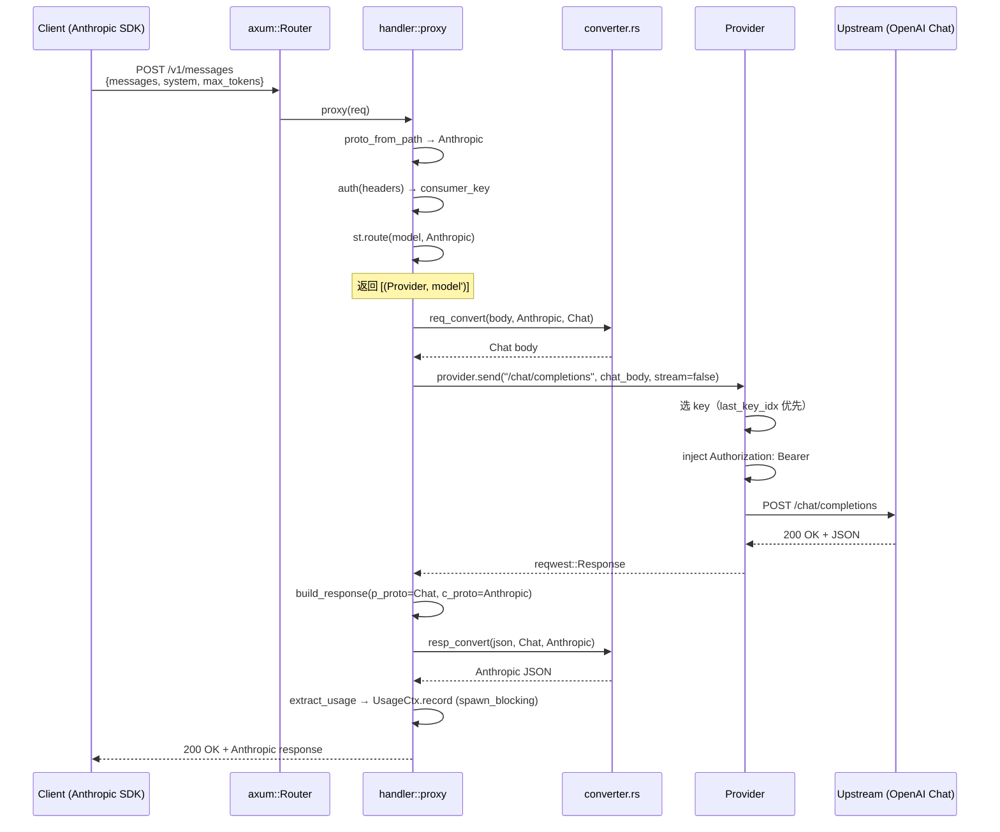

### 11.2 流式请求（Go：Anthropic 客户端 → ChatGPT OAuth Codex 上游）

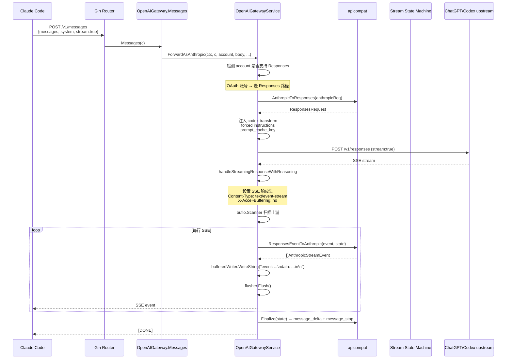

### 11.3 工具调用流式请求（Rust：Chat 客户端 → Anthropic 上游，含 thinking + tool_use）

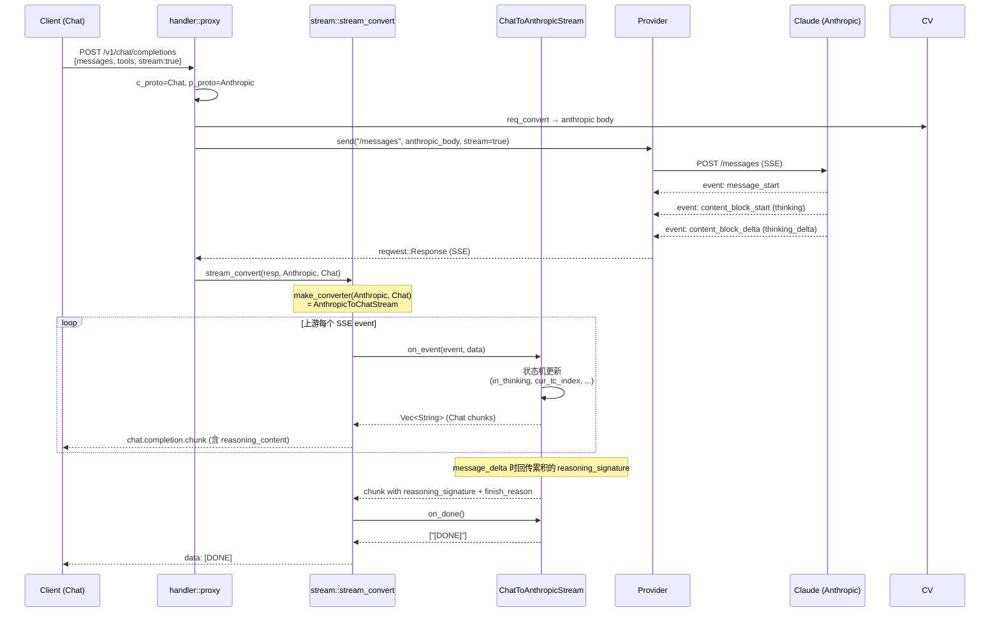

---

## 第十二部分：架构差异深度对比

### 12.1 协议转换放置位置

| 维度 | Rust | Go |
|------|------|----|
| 转换代码位置 | `gateway/converter.rs` + `stream.rs`（业务层内） | `internal/pkg/apicompat/`（独立基础包） |
| 与业务耦合度 | 高（直接由 handler 调用） | 低（service 调用，apicompat 不知业务） |
| 可独立测试性 | 中（需要 Protocol enum） | 高（纯函数 + 独立 struct） |
| 复用潜力 | 仅本项目可用 | 可被任何 Go 项目复用 |

**Go 的设计明显更优**——`apicompat` 是无业务依赖的纯库，任何 SaaS / 命令行工具都能集成。

### 12.2 统一模型位置

| 维度 | Rust | Go |
|------|------|----|
| IR 选择 | Chat（事实 IR） | Responses（显式 IR） |
| IR 是否实体化 | ❌（直接 Value 重写） | ✅（ResponsesRequest struct） |
| Anthropic↔Responses 实现 | 经 Chat 双跳（Chained StreamConverter） | 直转 + 经 Chat 双跳并存 |
| Anthropic↔Chat 实现 | 直转 | 直转（热路径）+ 经 Responses 双跳 |

**Rust 的 Chained 设计巧妙**——把"N→N² 个方向"降为"N 个直转 + 任意组合"。Go 则手写了所有 6 个方向，避免双跳开销，但代码量翻倍。

### 12.3 Streaming 放置位置

| 维度 | Rust | Go |
|------|------|----|
| 流式入口 | `handler.rs::build_response` 判定 | `service::handleStreamingResponseWithReasoning` |
| 流式转换 | `stream.rs`（gateway 模块内） | `apicompat/XxxStreamState`（独立包） |
| 状态机抽象 | `StreamConverter` trait（统一） | 每方向一个 struct（无统一接口） |
| 异步模型 | tokio async | goroutine + 同步 I/O |

**Rust 的 trait 抽象更优雅**——一个 trait 覆盖所有方向，且 Chained 可组合。Go 的多状态机虽然冗余，但每个状态机可以针对该方向的特化场景深度优化（如 tool name 延迟宣告）。

### 12.4 Tool Calling 放置位置

| 维度 | Rust | Go |
|------|------|----|
| 入站 tools 映射 | `converter.rs:419` | `anthropic_to_responses.go:424` |
| 出站 tool_use 映射 | `converter.rs:956` | `responses_to_anthropic.go:50` |
| 流式 tool_call 处理 | `stream.rs:715`（ChatToAnthropic） / `stream.rs:516`（AnthropicToChat） | `chatcompletions_anthropic_bridge.go:759` |
| 工具类型 | 普通 function 工具 | function + custom + namespace + tool_search + server tools |
| 工具名长度限制 | 无 | 64 字符 + sha256 截断（`flattenNamespaceToolName`） |
| parallel_tool_calls | 不处理（透传） | 显式处理 |

**Go 的 tool calling 处理远比 Rust 复杂**——主要因为它要适配 Codex 客户端的 `tool_search`、`namespace` 等高级工具语义。

### 12.5 Middleware 是否参与转换

两者**都不让 middleware 参与协议转换**。Middleware 只做：

- Rust：CORS（`router.rs:56`）
- Go：APIKey 鉴权、body limit、客户端 ID、运维日志、TLS 指纹、限流（`server/middleware/`）

### 12.6 Gateway 是否负责转换

**两者都在 gateway 层（service 层）做转换**，但 Rust 把转换函数作为 module-level 函数直接调用，Go 把转换函数放在独立的 `apicompat` 包里被 service 调用。

### 12.7 Error Mapping

| 维度 | Rust | Go |
|------|------|----|
| 错误模型 | `AppError` enum（`infra/error.rs`）：BadRequest/Unauthorized/ModelNotFound/Upstream/UpstreamStatus | `pkg/errors/`：分 HTTP / 业务 / 类型三种 |
| HTTP 状态映射 | `AppError: IntoResponse` 直接转 status | 通过 `c.JSON(httpStatus, gin.H{...})` 显式 |
| 上游错误透传 | ✅ 透传 JSON 错误体（`handler.rs:266`） | ✅ 透传 + 错误规则引擎（`errorpassthroughrule` ent 表） |
| 流式伪成功降级 | ✅（`handler.rs:204`，检测非 SSE 自动转 502） | ✅（first-output timeout 切换账号） |

### 12.8 Retry / Timeout / Failover

| 维度 | Rust | Go |
|------|------|----|
| 重试粒度 | 密钥级 + Provider 级 | 账号级 + 平台级 + 路由策略（shadow/sticky） |
| 超时设置 | connect_timeout=30s，非流式总超时=timeout_secs（默认 3000s） | first-output + interval + keepalive + 总超时多维度 |
| Failover 触发条件 | 429 / 5xx / 超时（4xx 非 429 不切） | 平台特化规则，含 401/403/429/5xx/网络错误 |
| 黑名单机制 | per-key + 10 分钟全局重置（`provider.rs:324`） | per-account + ratelimit_service 复杂状态机 |

### 12.9 并发模型

| 维度 | Rust | Go |
|------|------|----|
| 异步运行时 | tokio multi-thread | goroutine + 阻塞 I/O |
| 共享状态 | `Arc<Mutex<T>>` | `sync.Mutex` / channel / atomic |
| DB 访问 | `spawn_blocking` 包裹同步 rusqlite | ent 异步 driver 或 sync wrapper |
| 流式并发 | mpsc channel 64 slot | 单 goroutine 顺序处理 |

### 12.10 生命周期

| 维度 | Rust | Go |
|------|------|----|
| 进程生命周期 | Tauri 桌面进程 | systemd / docker / k8s |
| 网关生命周期 | 跟随主进程，配置变更时 rebuild | 跟随主进程，配置变更时热加载 |
| 连接生命周期 | reqwest pool_idle_timeout=90s | httpclient pool 配置 |
| 密钥生命周期 | 配置变更时重建 Provider | 后台 token refresh pool 定期刷新 |

---

## 第十三部分：优缺点评价

### 13.1 Rust 项目（ai-aggregs）

**优点**：

1. **极致简洁**：21 个文件覆盖了完整的协议互转 + 桌面应用 + 配置编辑 + 用量统计。
2. **零开销抽象**：`Chained<A, B>` 泛型单态化，双跳 SSE 转换无运行时成本。
3. **类型安全**：尽管用 `Value`，但 `Protocol` enum 和 `match (s, d)` 强制覆盖所有组合。
4. **桌面端体验**：Tauri 单文件分发，开机自启 + 系统托盘 + 隐藏窗口。
5. **流式稳定性**：流式/非流式降级、usage 嗅探、`[DONE]` 保证发送，工程细节扎实。
6. **完整 thinking signature 多轮支持**：包括流式 `signature_delta` 事件。

**缺点**：

1. **无法接入 Gemini / Bedrock / Vertex**：仅支持 OpenAI 兼容 + Anthropic。
2. **没有 thinking 入站的 Responses 处理**：Anthropic `thinking.signature` 转 Responses 时丢失（无 encrypted_content 还原）。
3. **Provider 抽象太弱**：无法表达"OpenAI 原生 previous_response_id"等平台特化逻辑。
4. **无 strong-typed model**：纯 Value 操作，重构风险高。
5. **无 OAuth 支持**：仅支持 API Key，无法接入 ChatGPT Plus / Claude Pro 订阅账号。
6. **无 SaaS 能力**：无多租户、无计费、无订阅、无支付。

**性能**：✅ 极佳。单进程，零序列化开销，tokio 异步。

**可维护性**：⚠️ 中。代码紧凑但 `Value` 操作难以重构。

**可扩展性**：⚠️ 中。新增同质化上游零成本；新增协议中成本；新增平台特化高成本。

**协议抽象**：⚠️ 中。Chat 作为 IR 简洁但表达力有限。

**Streaming**：✅ 优。trait 抽象优雅，但缺少 first-output timeout / keepalive。

**Provider 扩展成本**：低（同质化上游）/ 高（异构平台）。

### 13.2 Go 项目（sub2api）

**优点**：

1. **强类型协议模型**：14 个文件覆盖了完整的协议字段，IDE 补全 + 编译期检查。
2. **完整的 SaaS 能力**：用户/订阅/支付/促销/兑换/OAuth/限流/计费/审计/运维监控。
3. **多平台支持**：OpenAI / Anthropic / Gemini / Grok / xAI / Vertex / Antigravity。
4. **双路径优化**：经 Responses 与直转 Chat 并存，性能与正确性兼顾。
5. **强大的流式工程**：first-output timeout / interval timeout / keepalive / buffer 池 / 失败切换。
6. **完善的 tool calling 支持**：namespace / tool_search / custom / server tools 全覆盖。
7. **OAuth 集成**：ChatGPT/Claude/Gemini/xAI 多账号 OAuth + token refresh pool。
8. **apicompat 包可独立复用**：与业务解耦。

**缺点**：

1. **service 层文件爆炸**：`openai_gateway_*` 200+ 文件，缺乏子包分组。
2. **没有 Provider interface**：平台扩展靠 if/else 分支，扩展新平台需修改多处。
3. **流式状态机无统一抽象**：4 个状态机各自实现，重复代码多。
4. **配置极复杂**：`SettingService` 数百个配置项，新手难以掌握。
5. **依赖庞大**：ent ORM 自动生成 5000+ 文件，编译慢。
6. **测试覆盖不均**：协议转换覆盖密集，业务流程覆盖稀疏。

**性能**：⚠️ 中。强类型序列化开销 + bufio 拷贝 + 大量 reflect。

**可维护性**：⚠️ 中。apicompat 高内聚好维护；service 层巨石难维护。

**可扩展性**：✅ 高。新增平台有清晰路径（虽然分支多）。

**协议抽象**：✅ 优。Responses 作为 IR 表达力强，覆盖 Codex 全特性。

**Streaming**：✅ 优。功能最完整的实现，但抽象弱。

**Tool Calling**：✅ 优。覆盖所有 OpenAI/Anthropic 工具语义。

**Provider 扩展成本**：高（无统一抽象，需多文件协作）。

### 13.3 评分

| 维度 | Rust ai-aggregs | Go sub2api | 说明 |
|------|----------------|------------|------|
| 协议设计 | 7 / 10 | 9 / 10 | Go 的 Responses-as-IR 更完整 |
| 架构设计 | 6 / 10 | 8 / 10 | Rust 桌面端合适但抽象弱；Go SaaS 完整但 service 层爆炸 |
| Provider 抽象 | 5 / 10 | 6 / 10 | **两者都不及格**：均无 interface/trait |
| Streaming | 7 / 10 | 9 / 10 | Rust trait 抽象优雅但功能少；Go 功能全但无抽象 |
| Tool Calling | 6 / 10 | 9 / 10 | Go 覆盖完整 |
| 扩展能力 | 5 / 10 | 8 / 10 | Go 的扩展点多（虽然分散） |
| 可维护性 | 7 / 10 | 6 / 10 | Rust 代码少但弱类型；Go apicompat 内聚但 service 层巨石 |
| 代码质量 | 8 / 10 | 7 / 10 | Rust 代码紧凑高效；Go 代码冗长但有完善的注释 |
| **综合** | **6.4 / 10** | **7.8 / 10** | 取决于使用场景 |

**场景化推荐**：

- 个人/小团队桌面使用 → **Rust ai-aggregs**（部署简单、资源占用低）
- 商业 SaaS / 多租户运营 → **Go sub2api**（功能完整、可运营）

---

## 第十四部分：最佳实践（第三版重新设计）

如果重新设计一个 V3 LLM API 网关，应该综合两者优点。

### 14.1 最佳目录结构

```
llm-gateway-v3/
├── crates/
│   ├── gateway-core/              ★ 协议互转核心库（无业务依赖，可独立发布）★
│   │   ├── src/
│   │   │   ├── lib.rs
│   │   │   ├── protocol/          协议枚举与 trait
│   │   │   │   ├── mod.rs
│   │   │   │   ├── chat.rs        ChatCompletionsRequest/Response/Chunk 强类型
│   │   │   │   ├── responses.rs   ResponsesRequest/Response/Event 强类型
│   │   │   │   ├── anthropic.rs   AnthropicRequest/Response/Event 强类型
│   │   │   │   └── gemini.rs      GeminiRequest/Response/Event 强类型
│   │   │   ├── ir/                内部 IR（统一抽象）
│   │   │   │   ├── mod.rs
│   │   │   │   ├── message.rs     InternalMessage（统一 message）
│   │   │   │   ├── content.rs     InternalContent（多模态统一）
│   │   │   │   ├── tool.rs        InternalTool / InternalToolCall / InternalToolResult
│   │   │   │   ├── usage.rs       InternalUsage（含 cache 字段）
│   │   │   │   └── finish.rs      InternalFinishReason 枚举
│   │   │   ├── converter/         双向转换
│   │   │   │   ├── mod.rs         ProtocolConverter trait
│   │   │   │   ├── chat.rs        Chat ↔ IR
│   │   │   │   ├── responses.rs   Responses ↔ IR
│   │   │   │   ├── anthropic.rs   Anthropic ↔ IR
│   │   │   │   └── gemini.rs      Gemini ↔ IR
│   │   │   ├── stream/            流式转换
│   │   │   │   ├── mod.rs         StreamConverter trait + Chained
│   │   │   │   ├── state.rs       流状态机公共抽象
│   │   │   │   └── *.rs           各方向实现
│   │   │   └── error.rs
│   │   └── tests/
│   ├── gateway-provider/          Provider 抽象（trait + 内置实现）
│   │   ├── src/
│   │   │   ├── lib.rs
│   │   │   ├── provider.rs        trait Provider（含 send/retry/key_rotation）
│   │   │   ├── registry.rs        ProviderRegistry（动态注册）
│   │   │   ├── api_key.rs         ApiKeyProvider 通用实现
│   │   │   ├── oauth.rs           OAuthProvider trait
│   │   │   └── platforms/
│   │   │       ├── openai.rs
│   │   │       ├── anthropic.rs
│   │   │       ├── gemini.rs
│   │   │       ├── bedrock.rs
│   │   │       ├── vertex.rs
│   │   │       └── openrouter.rs
│   │   └── tests/
│   ├── gateway-server/            HTTP 服务（可选，独立部署模式）
│   │   └── src/
│   │       ├── lib.rs
│   │       ├── router.rs
│   │       ├── handler.rs
│   │       ├── middleware/        鉴权、限流、日志、CORS
│   │       └── billing/           计费 hook
│   └── gateway-app/               桌面应用（Tauri 或其它）
│       └── src/
│           └── main.rs
└── docs/
```

### 14.2 最佳 Trait（Rust 风格）

```rust
// crates/gateway-core/src/converter/mod.rs
pub trait RequestConverter<P: Protocol>: Send + Sync {
    fn from_ir(&self, ir: &InternalRequest) -> Result<P::Request, ConvertError>;
    fn to_ir(&self, req: &P::Request) -> Result<InternalRequest, ConvertError>;
}

pub trait ResponseConverter<P: Protocol>: Send + Sync {
    fn from_ir(&self, ir: &InternalResponse) -> Result<P::Response, ConvertError>;
    fn to_ir(&self, resp: &P::Response) -> Result<InternalResponse, ConvertError>;
}

pub trait StreamConverter: Send {
    fn on_event(&mut self, event: Option<&str>, data: &str) -> Vec<String>;
    fn on_done(&mut self) -> Vec<String>;
}

// 自动实现 Chained 复合
pub struct Chained<A: StreamConverter, B: StreamConverter>(A, B);

// 注册中心
pub struct ConverterRegistry {
    converters: HashMap<(Protocol, Protocol), Box<dyn StreamConverterFactory>>,
}

impl ConverterRegistry {
    pub fn make(&self, src: Protocol, dst: Protocol) -> Box<dyn StreamConverter> {
        // 直接转换 or 经 IR 中转
    }
}
```

### 14.3 最佳 Internal Model

```rust
// 统一 IR，所有协议先转 IR 再转目标协议
pub struct InternalRequest {
    pub model: String,
    pub system: Option<String>,
    pub messages: Vec<InternalMessage>,
    pub tools: Vec<InternalTool>,
    pub tool_choice: Option<InternalToolChoice>,
    pub max_tokens: Option<u32>,
    pub temperature: Option<f32>,
    pub top_p: Option<f32>,
    pub stop: Vec<String>,
    pub stream: bool,
    pub reasoning: Option<InternalReasoning>,
    pub metadata: serde_json::Value,    // 透传字段
    pub extensions: HashMap<String, Value>, // 协议特有字段
}

pub struct InternalMessage {
    pub role: InternalRole,             // System/User/Assistant/Tool
    pub content: Vec<InternalContent>,
    pub tool_calls: Vec<InternalToolCall>,
    pub tool_call_id: Option<String>,
    pub reasoning: Option<String>,      // thinking / reasoning_content
    pub reasoning_signature: Option<String>,
}

pub enum InternalContent {
    Text(String),
    Image { url: String, media_type: String, data: Option<String> },
    Audio { url: String, media_type: String, data: String },
    File { url: String, filename: String },
}

pub struct InternalTool {
    pub name: String,
    pub description: Option<String>,
    pub parameters: serde_json::Value,  // JSON Schema
    pub strict: bool,
    pub kind: ToolKind,                 // Function / Custom / Namespace / ServerTool
}

pub struct InternalUsage {
    pub input_tokens: u32,
    pub output_tokens: u32,
    pub cache_read_tokens: u32,
    pub cache_write_tokens: u32,
    pub reasoning_tokens: u32,
}

pub enum InternalFinishReason {
    Stop, Length, ToolCalls, ContentFilter,
}
```

### 14.4 最佳 Converter 模式

```rust
// 1) 所有协议先转 IR（每个协议一个 to_ir/from_ir 实现）
impl RequestConverter<ChatProtocol> for ChatConverter {
    fn to_ir(&self, req: &ChatRequest) -> Result<InternalRequest, ConvertError> { ... }
    fn from_ir(&self, ir: &InternalRequest) -> Result<ChatRequest, ConvertError> { ... }
}

// 2) N→N 方向自动组合
fn convert(req: Value, src: Protocol, dst: Protocol) -> Result<Value, ConvertError> {
    let src_conv = registry.get(src);
    let dst_conv = registry.get(dst);
    let ir = src_conv.to_ir(&req)?;
    let out = dst_conv.from_ir(&ir)?;
    Ok(serialize(out))
}
```

这种设计：

- ✅ N 个协议只需要 N 个 Converter（不是 N² 个方向）
- ✅ IR 实体化（Go 风格）但保持 trait 抽象（Rust 风格）
- ✅ 协议扩展零成本（新增协议仅增加一个 Converter）

### 14.5 最佳 Streaming

借鉴 Rust 的 trait + Chained，加上 Go 的工程特性：

```rust
pub trait StreamConverter: Send {
    fn on_event(&mut self, event: Option<&str>, data: &str) -> Vec<StreamOutput>;
    fn on_done(&mut self) -> Vec<StreamOutput>;
    fn on_error(&mut self, err: &str) -> Vec<StreamOutput> { vec![StreamOutput::Error(err.into())] }
}

pub enum StreamOutput {
    Event { name: Option<String>, data: String },
    Heartbeat,
    Flush,
    Error(String),
}

// 统一的流式管线
pub struct StreamPipeline {
    converter: Box<dyn StreamConverter>,
    heartbeat_interval: Option<Duration>,
    first_output_timeout: Option<Duration>,
    usage_sniffer: UsageSniffer,
}
```

### 14.6 最佳 Tool Calling

借鉴 Go 的 namespace + tool_search 支持，引入 IR：

```rust
pub enum ToolKind {
    Function,
    Custom { input_schema: Value },
    Namespace { children: Vec<InternalTool> },
    ServerTool { platform: String, kind: String },
    ToolSearch { proxy_name: String },
}

pub struct InternalToolCall {
    pub id: String,
    pub kind: ToolCallKind,             // Function / Custom / Namespace / ToolSearch / ServerTool
    pub name: String,
    pub namespace: Option<String>,
    pub arguments: String,              // function: JSON string; custom: 自由文本
}
```

### 14.7 最佳 Provider Registry

借鉴 Go 的多平台支持 + Rust 的 trait：

```rust
#[async_trait]
pub trait Provider: Send + Sync {
    fn id(&self) -> &str;
    fn platform(&self) -> Platform;
    fn supported_protocols(&self) -> &[Protocol];
    async fn send(&self, req: ProviderRequest) -> Result<ProviderResponse, ProviderError>;
    fn retry_policy(&self) -> RetryPolicy;
}

pub struct ProviderRegistry {
    providers: HashMap<String, Arc<dyn Provider>>,
    by_platform: HashMap<Platform, Vec<Arc<dyn Provider>>>,
}

impl ProviderRegistry {
    pub fn register<P: Provider + 'static>(&mut self, p: P) {
        // 自动按 platform 索引
    }
    pub fn route(&self, model: &str, proto: Protocol) -> Vec<Arc<dyn Provider>> { ... }
}
```

### 14.8 借鉴总结

| 借鉴源 | 借鉴点 | 理由 |
|--------|--------|------|
| **Rust 项目** | `StreamConverter` trait + `Chained<A, B>` 泛型组合 | 零开销组合多段转换 |
| **Rust 项目** | `BytesMut` 行缓冲零拷贝 | 性能优 |
| **Rust 项目** | `serde_json::Value` 用于 metadata 透传 | 灵活 |
| **Rust 项目** | usage 嗅探（流内提取）| 通用 |
| **Go 项目** | `apicompat` 独立基础包 | 可复用 |
| **Go 项目** | 强类型 `Request/Response/Event` struct | 编译期检查 |
| **Go 项目** | `json.RawMessage` 处理多形态字段 | 灵活+类型安全 |
| **Go 项目** | first-output timeout / interval timeout / keepalive | 流式稳定性 |
| **Go 项目** | 直转热路径优化（不经 IR 双跳） | 性能 |
| **Go 项目** | tool calling 完整覆盖（namespace/tool_search/custom） | 完整 |
| **Go 项目** | 平台特化包（antigravity/xai 等） | 平台扩展点 |
| **重新设计** | 统一 IR（`InternalRequest` 等） | 避免 N² 转换代码 |
| **重新设计** | `Provider` trait + `ProviderRegistry` | 替代 if/else 分支 |
| **重新设计** | `protocol/` 子模块 + `converter/` 子模块 + `ir/` 子模块 | 架构清晰 |

---

## 第十五部分：迁移建议

### 15.1 从 Go 项目迁移到 Rust 项目的优秀设计

#### 15.1.1 强类型协议 struct（优先级：高）

**当前 Rust 痛点**：`gateway/converter.rs` 全文使用 `serde_json::Value`，重构时极易漏改字段，IDE 无补全。

**迁移方案**：

```rust
// 新增 src-tauri/src/protocol/types.rs
#[derive(Debug, Deserialize, Serialize)]
pub struct ChatRequest {
    pub model: String,
    pub messages: Vec<ChatMessage>,
    #[serde(default)]
    pub stream: bool,
    pub tools: Option<Vec<ChatTool>>,
    pub tool_choice: Option<serde_json::Value>,
    pub temperature: Option<f32>,
    pub max_tokens: Option<u32>,
    // ...
    #[serde(flatten)]
    pub extra: serde_json::Map<String, Value>,  // 透传未知字段
}

// 同样为 Anthropic / Responses 定义强类型
```

**迁移成本**：低。三个协议各一个文件，~500 行/文件。`converter.rs` 改为函数签名 `fn convert(req: &ChatRequest) -> AnthropicRequest`。`#[serde(flatten)] extra` 字段保留 Value 透传未知字段的能力。

**收益**：编译期检查字段映射正确性；IDE 补全；重构安全；测试可以基于具体类型而非 JSON 字符串。

#### 15.1.2 first-output timeout / interval timeout / keepalive（优先级：高）

**当前 Rust 痛点**：流式请求完全依赖客户端超时，reasoning model 长时间无输出时网关无感知，可能挂死。

**迁移方案**：

```rust
// 在 stream.rs 增加
pub struct StreamPipeline {
    converter: Box<dyn StreamConverter>,
    heartbeat_interval: Option<Duration>,        // 周期向下游发心跳
    first_output_timeout: Option<Duration>,      // 首字超时
    interval_timeout: Option<Duration>,          // 上游数据间隔超时
}

async fn run_pipeline(...) {
    let mut heartbeat = tokio::time::interval(heartbeat_interval);
    let mut first_output = tokio::time::sleep(first_output_timeout);
    loop {
        tokio::select! {
            chunk = upstream.next() => { /* 正常处理 */ }
            _ = heartbeat.tick() => { tx.send(": heartbeat\n\n").await; }
            _ = first_output => { return Err(FirstOutputTimeout); }
        }
    }
}
```

**迁移成本**：中。需要重写 `stream_convert` 主循环，加入 `tokio::select!`。

**收益**：流式稳定性大幅提升；reasoning model 友好；可观测性增强。

#### 15.1.3 流式 Tool Name 延迟宣告（优先级：中）

**当前 Rust 痛点**：`ChatToAnthropicStream` 假设上游按 `id → name → arguments` 顺序到达，遇到 DeepSeek 等"先发 id+arguments 后发 name"的上游会丢失工具调用。

**迁移方案**：参照 Go 的 `pendingToolCallID/pendingToolArgs` 缓冲机制：

```rust
struct ChatToAnthropicStream {
    // ...
    pending_tool_name: HashMap<usize, (String, String)>,  // (idx, call_id, args)
}
```

**迁移成本**：低。仅修改 `ChatToAnthropicStream` 一个状态机。

**收益**：兼容更多上游（DeepSeek/GLM 等乱序上游）。

#### 15.1.4 apicompat 独立 crate（优先级：中）

**当前 Rust 痛点**：协议转换代码与业务逻辑（`provider.rs` / `handler.rs`）混在 `gateway` 模块内，无法独立复用。

**迁移方案**：将 `gateway/converter.rs` + `gateway/stream.rs` + 新增的强类型 `types.rs` 拆为独立 crate `gateway-core`：

```
crates/gateway-core/
├── Cargo.toml
└── src/
    ├── lib.rs
    ├── protocol/  (强类型 struct)
    ├── converter/ (双向转换)
    └── stream/    (StreamConverter + 状态机)
```

主项目的 `Cargo.toml` 添加 `gateway-core = { path = "../crates/gateway-core" }`。

**迁移成本**：中。需要拆分模块，但代码逻辑不变。

**收益**：可独立测试；可发布为 lib 给其它项目复用；与业务彻底解耦。

#### 15.1.5 namespace / tool_search 工具支持（优先级：低）

**当前 Rust 痛点**：不支持 Codex 客户端的 namespace 工具摊平、tool_search 代理。

**迁移方案**：仅在用户反馈需要时迁移。Rust 项目面向桌面端，Codex CLI 集成场景较少。

#### 15.1.6 不建议迁移的设计

- **service 层多文件拆分**：Rust 项目体量小，过度拆分反而降低可读性。
- **ent ORM + 50 张表**：桌面端用 SQLite + 手写 SQL 足够。
- **OAuth 多账号 + token refresh pool**：超出桌面端定位。
- **payment / subscription / promocode**：超出桌面端定位。

### 15.2 Rust 项目优于 Go 项目的设计（可作为 Go 演进方向）

#### 15.2.1 `StreamConverter` trait 统一抽象（优先级：高）

**当前 Go 痛点**：4 个流式状态机（`ChatCompletionsToResponsesStreamState` / `ChatCompletionsToAnthropicStreamState` / `ResponsesEventToAnthropicState` / `ChatCompletionsToResponsesStreamState` 反向）无公共接口，重复代码多。

**Rust 的优秀设计**：

```rust
pub trait StreamConverter: Send {
    fn on_event(&mut self, event: Option<&str>, data: &str) -> Vec<String>;
    fn on_done(&mut self) -> Vec<String>;
}
```

**Go 演进建议**：定义 interface：

```go
type StreamConverter interface {
    OnEvent(event string, data []byte) []StreamEvent
    OnDone() []StreamEvent
}

type ChainedConverter struct {
    A, B StreamConverter
}
```

#### 15.2.2 `Chained<A, B>` 组合模式（优先级：高）

**当前 Go 痛点**：每个方向都要手写完整状态机，6 个方向 6 个状态机；其中 Anthropic↔Chat 还有"直转"和"经 Responses 双跳"两套并存。

**Rust 的优秀设计**：通过 `Chained<A, B>` 把"Anthropic → Responses"实现为"Anthropic → Chat → Responses"两段管线串联，**只写基础转换就能组合出全部方向**。

**Go 演进建议**：把 `apicompat` 内部重构为"经 IR 中转 + Chained 组合"，将 6 个状态机减少到 3 个（每个协议一个 to_ir/from_ir）。

#### 15.2.3 `BytesMut` 零拷贝行缓冲（优先级：中）

**Rust 的优秀设计**：`bytes::BytesMut::split_to(nl + 1)` 直接切分底层 buffer，无内存拷贝。

**Go 演进建议**：替换 `bufio.Scanner` 为基于 `[]byte` 切片的零拷贝扫描器。Go 标准库的 `bufio.Scanner.Buffer()` 复用底层 slice 但仍有 `string(line)` 的拷贝。可以用 `unsafe.String()`（Go 1.20+）规避。

#### 15.2.4 不建议迁移的设计

- **`serde_json::Value` 无类型操作**：Go 已经有强类型 struct，迁移会倒退。
- **桌面端 Tauri 集成**：Go 项目是 SaaS，不适用。
- **`#[serde(untagged)]` 枚举**：Go 没有等价物（除非用 interface + 自定义 UnmarshalJSON）。

### 15.3 共同演进方向

1. **统一 IR**：两者都应有显式 `InternalRequest/InternalResponse/InternalMessage` 抽象，避免 N² 转换代码爆炸。
2. **`Provider` trait/interface**：替代当前的"单 struct + platform 字段分支"或"多 service + if/else 分支"。
3. **流式工程化**：first-output timeout、interval timeout、keepalive、buffer 池应作为标配。
4. **协议适配测试集**：建立 round-trip 测试（A→B→A 应等于原值），覆盖所有协议组合。
5. **错误标准化**：定义跨协议的 error code（如 `MODEL_NOT_FOUND` / `UPSTREAM_RATE_LIMITED`），统一向客户端透传。

### 15.4 迁移路线图（Rust 项目视角）

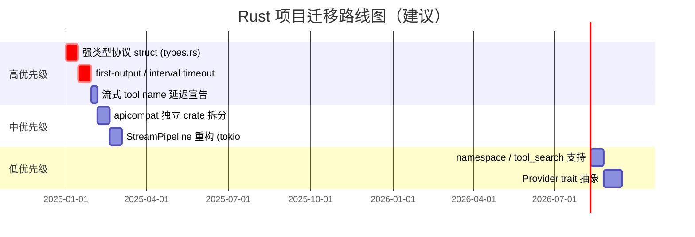

---

## 附录：核心源码引用索引

### Rust 项目（`src-tauri/src/`）

| 引用 | 路径 |
|------|------|
| Protocol enum | `config/types.rs:5` |
| ApiKeyEntry untagged | `config/types.rs:39` |
| Config / ProviderConfig | `config/types.rs:71` / `config/types.rs:88` |
| AppCtrl / AppState | `config/state.rs` |
| req_convert 入口 | `gateway/converter.rs:8` |
| resp_convert 入口 | `gateway/converter.rs:27` |
| Chat→Anthropic 请求 | `gateway/converter.rs:347` |
| Anthropic→Chat 请求 | `gateway/converter.rs:472` |
| Chat→Responses 请求 | `gateway/converter.rs:668` |
| Responses→Chat 请求 | `gateway/converter.rs:771` |
| Anthropic→Chat 响应 | `gateway/converter.rs:903` |
| Chat→Anthropic 响应 | `gateway/converter.rs:1035` |
| Responses→Chat 响应 | `gateway/converter.rs:1108` |
| Chat→Responses 响应 | `gateway/converter.rs:1184` |
| StreamConverter trait | `gateway/stream.rs:275` |
| Chained 组合 | `gateway/stream.rs:289` |
| make_converter 工厂 | `gateway/stream.rs:321` |
| stream_convert 主循环 | `gateway/stream.rs:168` |
| stream_passthrough | `gateway/stream.rs:122` |
| UsageCtx::record | `gateway/stream.rs:30` |
| extract_usage | `gateway/stream.rs:59` |
| Provider struct | `gateway/provider.rs:33` |
| Provider::send | `gateway/provider.rs:159` |
| inject_reasoning | `gateway/provider.rs:343` |
| handler::proxy | `api/handler.rs:13` |
| build_response | `api/handler.rs:171` |
| 流式降级判定 | `api/handler.rs:204` |
| proto_from_path | `api/handler.rs:290` |
| Router 4 路由 | `api/router.rs:11` |
| CORS 中间件 | `api/router.rs:56` |

### Go 项目（`backend/internal/`）

| 引用 | 路径 |
|------|------|
| AnthropicRequest 等 struct | `pkg/apicompat/types.go:14` |
| ResponsesRequest struct | `pkg/apicompat/types.go:191` |
| ChatCompletionsRequest struct | `pkg/apicompat/types.go:568` |
| ChatCompletionsChunk struct | `pkg/apicompat/types.go:698` |
| AnthropicStreamEvent | `pkg/apicompat/types.go:148` |
| ResponsesStreamEvent | `pkg/apicompat/types.go:521` |
| AnthropicToResponses | `pkg/apicompat/anthropic_to_responses.go:13` |
| ResponsesToAnthropic 响应 | `pkg/apicompat/responses_to_anthropic.go:16` |
| ResponsesToChatCompletionsRequest | `pkg/apicompat/chatcompletions_responses_bridge.go:15` |
| ChatCompletionsResponseToResponses | `pkg/apicompat/chatcompletions_responses_bridge.go:840` |
| ChatCompletionsToResponsesStreamState | `pkg/apicompat/chatcompletions_responses_bridge.go:1040` |
| AnthropicToChatCompletionsRequest (直转) | `pkg/apicompat/chatcompletions_anthropic_bridge.go:42` |
| ChatCompletionsResponseToAnthropic (直转) | `pkg/apicompat/chatcompletions_anthropic_bridge.go:377` |
| ChatCompletionsToAnthropicStreamState | `pkg/apicompat/chatcompletions_anthropic_bridge.go:525` |
| OpenAIGatewayService.ForwardAsAnthropic | `service/openai_gateway_messages.go:26` |
| OpenAIGatewayService.ForwardAsChatCompletions | `service/openai_gateway_chat_completions.go:53` |
| 双路径分流 | `service/openai_gateway_messages.go:36` |
| handleStreamingResponse | `service/openai_gateway_response_handling.go` |
| SSE 行扫描器 | `service/openai_sse_data.go` |
| 路由层平台分发 | `server/routes/gateway.go:135-193` |
| 平台 SDK：antigravity | `pkg/antigravity/{client, request_transformer, response_transformer, stream_transformer}.go` |
| 平台 SDK：xai | `pkg/xai/{oauth, quota, billing, sso_device}.go` |
| 平台 SDK：openai (OAuth) | `pkg/openai/oauth.go` |

---

**报告完。**

> 本报告所有结论均通过完整阅读两个项目源码得出。Rust 项目 21 个 `.rs` 文件全部阅读；Go 项目重点关注 `internal/pkg/apicompat/` 全部 14 个非测试文件 + `internal/service/openai_gateway_*.go` 关键文件 + `internal/server/routes/gateway.go` + 平台 SDK 入口。
